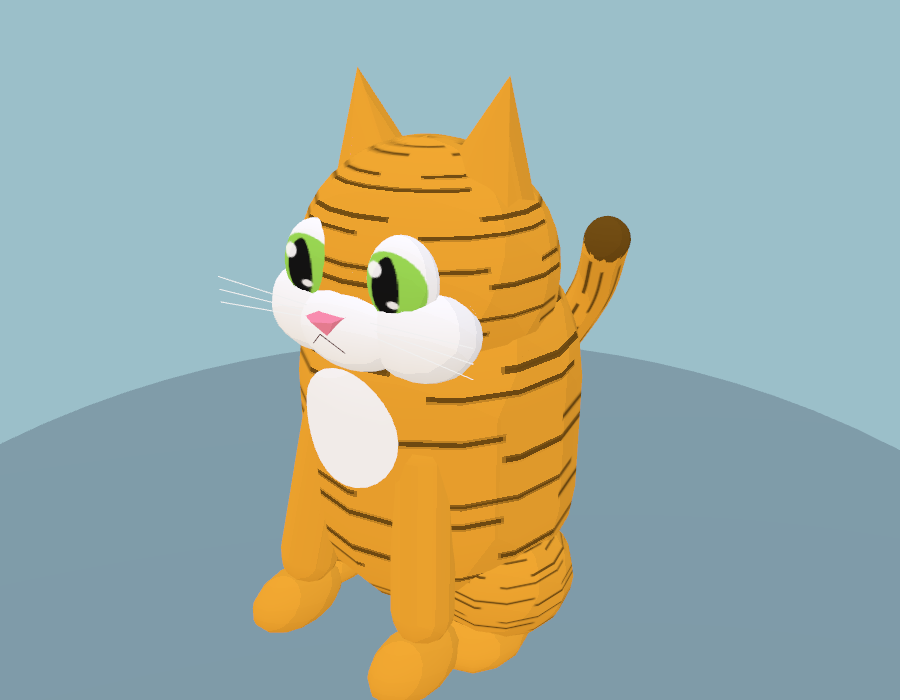
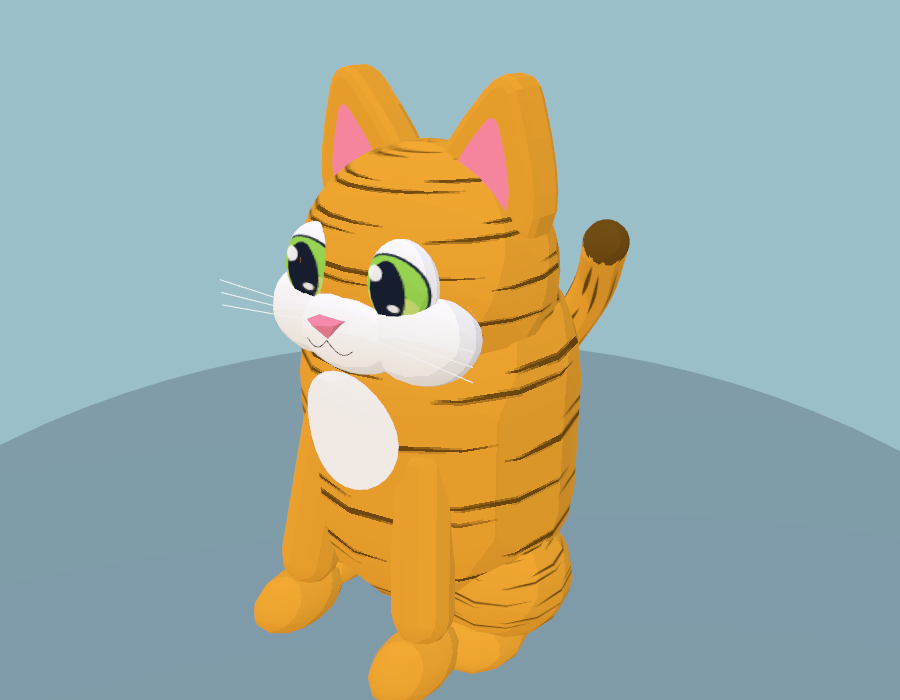
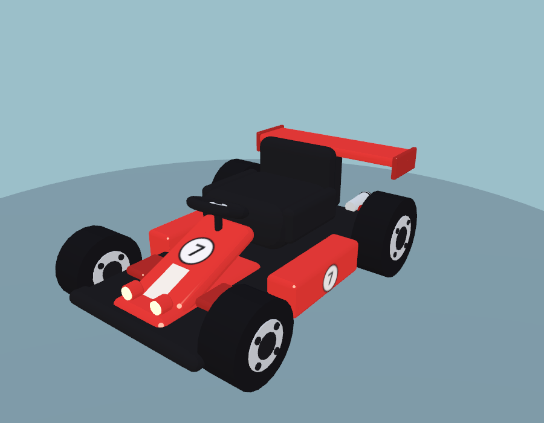
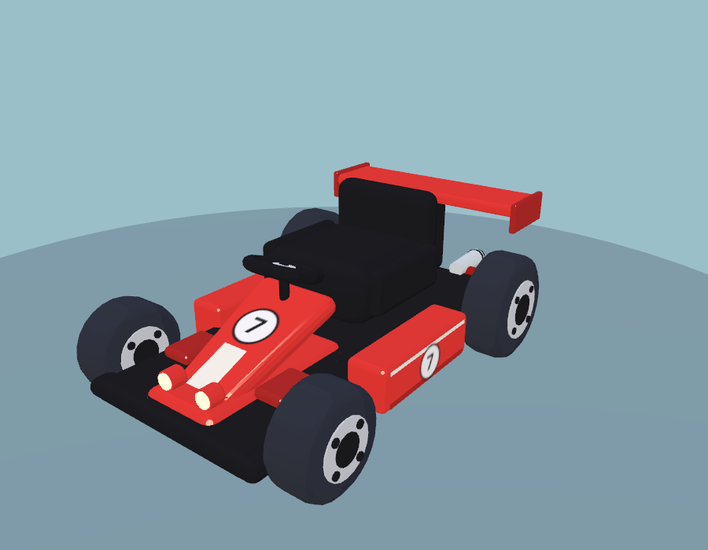
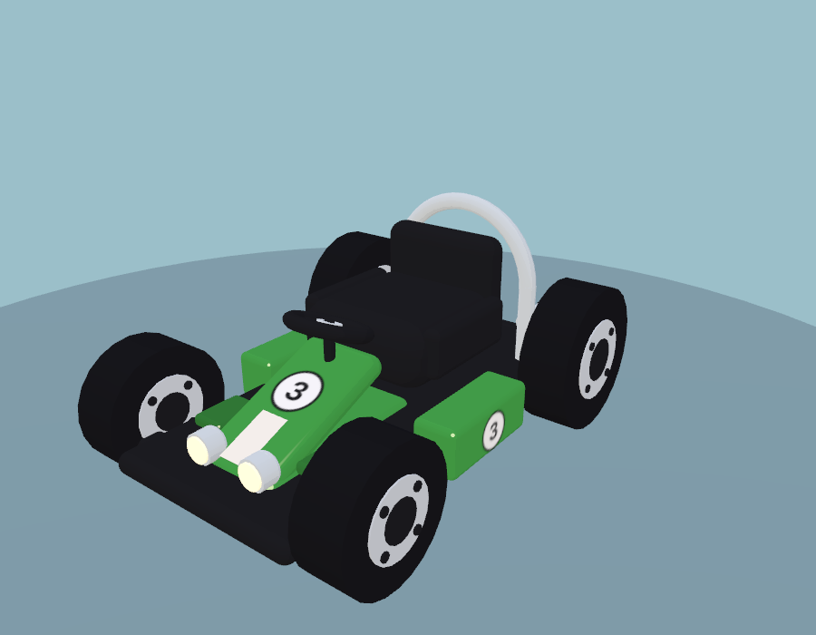
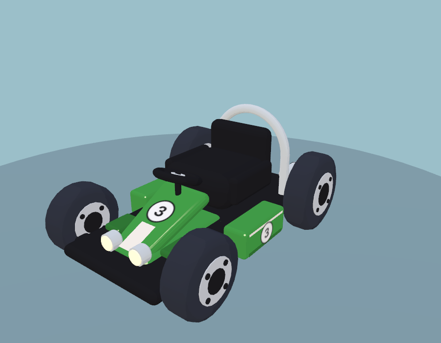
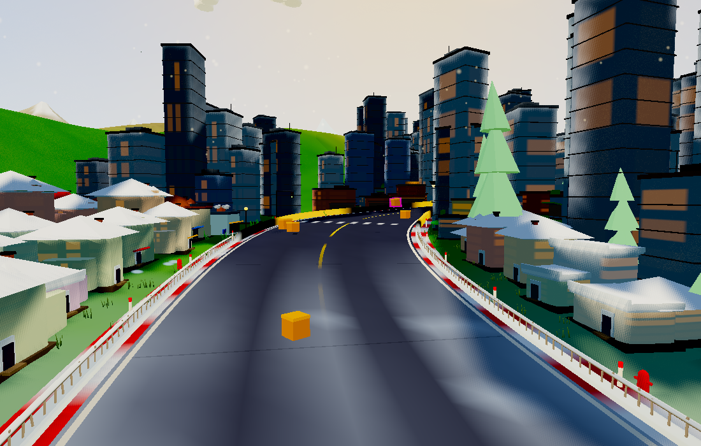
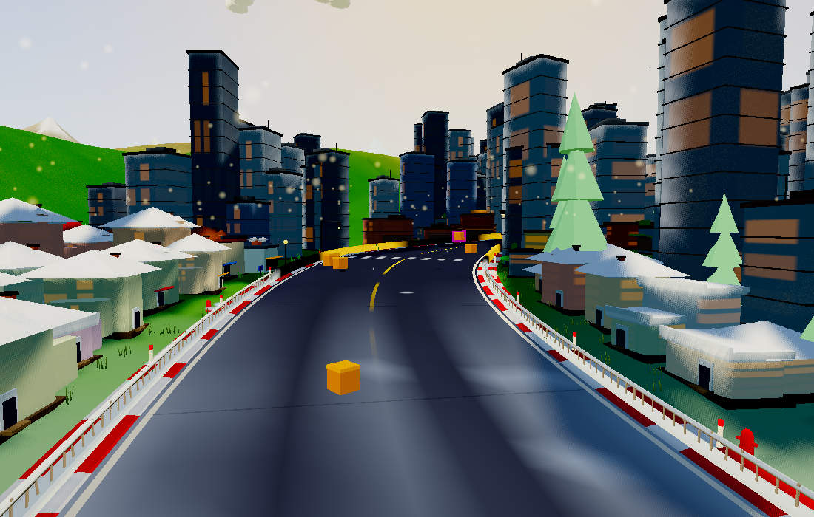

[Latest: thinner ears and refitted accessories](wardrobe-fit/README.md).

Latest: [Forty procedural cat racers, six new shape families and measured costs](cat-roster/README.md).

Latest: [Nineteen new cat accessories, animations and measured costs](new-accessories/README.md).

Latest: [Biome particles: material, motion, coverage and measured costs](environment-particles/README.md).

Latest: [Biome road props, reactions, sounds and performance](biome-road-props/README.md).

Latest: [Crate and barrel contact, tumbling and settling](prop-contact/README.md).

Latest: [Biome-specific mounted tunnel lighting](tunnel-lighting/README.md).

Latest: [Higher-quality bakes, distant scenery and full-race measurements](runtime-detail/README.md).

Latest: [Procedurally baked shelter and contact shading](baked-lighting/README.md).

Latest: [Living scenery, shared wind, wildlife reactions and biome events](living-world/README.md).

Latest: [Procedural road clearance fix](road-clearance/README.md).

Latest: [Additional habitat animals and structures](habitat-expansion/README.md).

# Procedural art refresh

[Latest: biome-specific scenery, buildings and wildlife](habitats/README.md).

[Latest: trackside structures, three new biomes, and measured rendering costs](trackside/README.md).

Current kart particles are circular additive glows; older ember illustrations below are historical.

The cats keep their animated rigs and procedural coats, with sculpted ears and
visible pink insets, ink-rimmed irises, curved smiles, and tapered tabby markings.
Karts gain rounded tire shoulders, a tapered nose panel, and flush side stripes.
Track shoulders have crisp red/cream sections with a shallow beveled profile.
The four-band cel ramp has deeper shadows to separate forms.

Everything is still generated from geometry, canvas paint, and the existing
materials. The initial racer pass added no render passes, lights or animation
work. Subsequent living-world animation and its measured cost are documented
above. Track layout and racing physics are unchanged.
The catalog thumbnails are regenerated from the actual procedural models.

[Scenery and wildlife extension: comparisons and budgets](scenery/README.md)

[Landscape pass and performance comparison](landscape/README.md)

[Particles and road paint: comparisons and submission savings](effects/README.md)

[Landscape grain and replacement ember sparks](grain/README.md)

[Lighting and contact shadows: comparisons and rendering budget](lighting/README.md)

[Final graphics audit: findings, fixes and remaining tradeoffs](audit/README.md)

[Tree silhouettes and painted depth: next pass](forms/README.md)

## Compare

| Main | This branch |
| --- | --- |
|  |  |
|  |  |
|  |  |
|  |  |

## Geometry budget

Compared against main at `0d0198a`. Counts include all model meshes, including
hidden rig parts; these are geometry budgets, not measured GPU frame times.

| Kart | Before triangles | After triangles | Reduction |
| --- | ---: | ---: | ---: |
| GP | 25,292 | 10,804 | 57% |
| Roadster | 22,568 | 10,096 | 55% |
| Buggy | 22,084 | 10,284 | 53% |
| Finned | 23,420 | 10,276 | 56% |
| Cage | 24,268 | 12,468 | 49% |

The savings come from reducing rounded-box subdivisions on flat body panels.
The new ears add 460 triangles per cat. The road shoulders add 4,000 triangles
per circuit, stay in one material batch, and have closed seams at every sample,
including the loop join. Even six of the least-improved karts save over 64,000
triangles after allowing for the ears and the track changes. Existing model
material batch counts are unchanged. Texture dimensions and counts are unchanged.

A seeded 1100×700 Medium WebGL2 world, viewed from the same pinned camera,
reported 424 draw calls on both builds. Visible triangles rose from 387,094 to
391,094 (+1.0%, the shoulder bevel); texture allocation stayed at 49 textures /
61,118,929 bytes. This view does not include the racing field, so it captures
the track's cost without crediting the kart savings. Weather particles remain
animated in the comparison images. These snapshots are not an FPS benchmark.

## Validation and test drive

- `npm run check:art`: all five kart styles in three colors; all 12 cat patterns
  in sitting, driving, and standing poses; all 22 accessories; finite vertex
  data, cache/material compatibility, model budgets, and shoulder seam integrity on classic, city, and hilly alpine circuits.
- `npm run check`: WebGL2 game smoke test, no browser errors.
- `npm run check:split`: six-kart/two-player rendering, independent controls,
  ranking, finish grace, and results pass without browser errors.
- `npm run check:worldcfg`: world encoding and round-trip checks.
- `npm run build:web`: web build succeeds.
- `node tools/catalog-shots.mjs`: all 38 catalog images render without errors.

Run `npm start` and open `http://localhost:8080`. Inspect the garage and race a
familiar course, especially corner kerbs, tire silhouettes, and night lighting.
`viewer.html` provides close-up model inspection; enable its **Game look** toggle.
Browser checks accept `PW_CHROME=/path/to/chrome`.

Hardware frame pacing, iOS, and WebGPU should still be checked on the devices
used to play. Software WebGL2 rendering verifies compatibility and resource
budgets but cannot establish native GPU performance.
