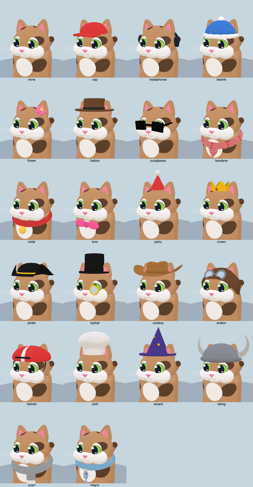
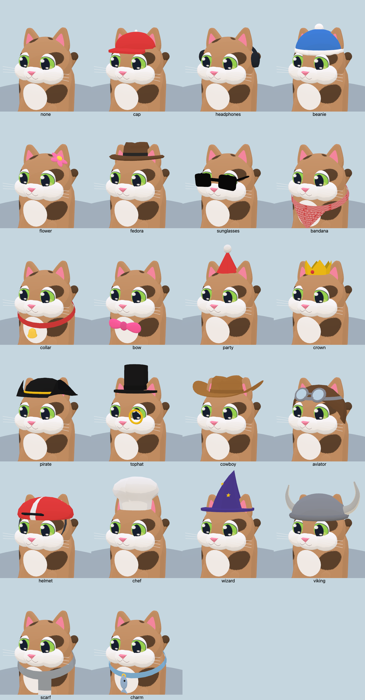

# Cat accessory refinement

Reviewed all 21 wearable accessories (plus no accessory) from the front, side and rear, then in an actual viewer kart. The pass keeps the procedural cel-shaded style and the smaller rounded ears.

| Before | After |
| --- | --- |
|  |  |

[Side views](side.png) · [Rear views](back.png) · [Driving poses](driving.png)

## Changes

| Accessory | Refinement |
| --- | --- |
| Cap | Rounded, bowed bill with a closed underside; button moved onto the crown surface. |
| Headphones | Molded cushions and recessed cup faces; simpler band tessellation. |
| Beanie | Ribbed, folded cuff replaces the inflated-looking ring. |
| Flower | Flattened, elongated petals follow the skull's tangent plane. |
| Fedora | Pinched, dented crown and curved brim distinguish it from the top hat. |
| Sunglasses | Rounded face-plane corners with much less geometry in frames and temple arms. |
| Bandana | Cloth follows the torso; lower fitted band, compact rear knot and attached tails. |
| Collar | Slim fitted band; shaped bell and visible clapper. |
| Bow tie | Pinched inner folds and broader outer loops, seated lower below the cheeks. |
| Top hat | Narrower crown; monocle retains its rim/glint and leaves the eye visible without transparency. |
| Aviator | Goggles get a supporting strap; flaps tuck around the sides instead of flaring out at the back. |
| Helmet | Simpler geometry for the small peak; fitted ear openings. |
| Wizard | Soft bent tip and actual five-point star appliqués replace the straight cone and round dots. |
| Scarf | Band follows the neck and connects to the existing draped end. |
| Fish charm | Fitted collar and a flat, flared fish tail. |
| Party hat, crown, pirate, cowboy, chef, Viking | Keep their recognizable designs; refine the fit with actual ear openings. |

Headwear openings are cut against cached supporting planes from the actual beveled ear geometry during model creation. They are baked into the existing merged meshes. Headwear holds the ears at their openings; the head still leans, looks back and celebrates. Cats with exposed ears retain their independent ear animation. No clipping shader or transparent lens pass is added.

## Rendering cost

Every accessory retains its previous material-batch count in the default-color comparison on both backends. There are no additional lights, shadow passes or transparent materials. Geometry remains shared through the existing merge cache.

Some cut openings add triangles, so this is not a zero-cost geometry change. The largest increase is **839 triangles per top-hat cat**. Sunglasses save **1,536 triangles**, the cap saves **96**, and the bandana saves **39**. The total over one cat wearing each of the 22 selections grows by 3,259 triangles (about 148 per selection). All tested recolored sitting, standing and driving cats remain below 11,000 triangles each. Opening construction is generation-time work; the priority remains race frame rate.

The race comparison uses native WebGPU, High, 1100×700, a procedural meadow track with seed `RUNTIME`, and **six cats forced to wear top hats**, the largest geometry increase. Each run records 40 seconds after warm-up on this Apple M3 Pro. Baseline models are from `f01f41b`; the rest of the game is identical.

| Measurement | Before | After |
| --- | ---: | ---: |
| Mean FPS | 60.00 | 60.00 |
| p99 frame time | 16.8 ms | 16.8 ms |
| Worst frame | 16.8 ms | 16.8 ms |
| Median CPU callback | 5.1 ms | 5.1 ms |
| p99 CPU callback | 6.8 ms | 6.7 ms |
| Shader programs | 289 | 289 |

These refresh-limited desktop samples show no observed regression in this case; they do not establish a speedup or guarantee mobile/thermal performance. Sun position, race trajectories and visibility vary between runs, so the aggregate scene draw counts are contextual, not a fixed-camera comparison. CPU callback timing is not isolated GPU time.

[Before race](race-before.json) · [After race](race-after.json) · [Before raw frames](race-before-frames.json.gz) · [After raw frames](race-after-frames.json.gz) · [Before model budgets](render-before.json) · [After model budgets](render-after.json)

## Validation

- `npm run check:accessories`: all 22 selections rendered on native WebGL and WebGPU, sitting and driving; WebGPU front/side/back/driving sheets. Also checks 396 combinations across both backends: three poses × three recolors × 22 selections. Checks finite geometry, shared material-group compatibility, per-cat triangle budgets, head movement, anchored ears under headwear and moving exposed ears.
- `npm run check:art`: all 36 coat/pose combinations, 22 accessory entries, existing kart budgets and track geometry checks.
- `npm run build:web` and `git diff --check`.

Reproduce the geometry comparison by exporting `git show f01f41b:src/models.js` to a temporary file and setting `MODELS` to that path for `check:accessories`. Omit `MODELS` for the current model and behavioral assertions. `OUT` selects a screenshot directory; `PW_CHROME` selects Chrome.

For the race sample, run `BIOMES=meadow QUALITIES=high BACKEND=webgpu ACCESSORY=tophat OUT=/tmp/accessory-race node tools/race-perf.mjs`. Set `MODELS` to the baseline file for the before run. Run samples sequentially with no other rendering probes active.
