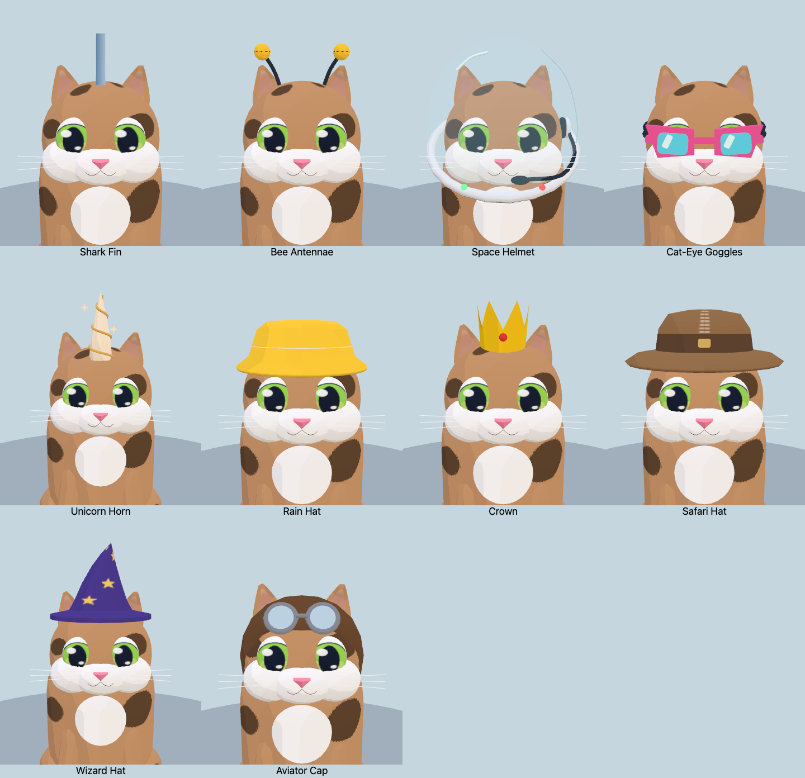

# Accessory fit refinements

This pass addresses the ten playtest screenshots while keeping the thin, coat-aware ears and procedural cel-shaded models.

- **Shark fin:** no headband; the curved base penetrates the scalp. Its pale side is vertex color on the fin itself.
- **Bee antennae:** no headband; the animated stalks emerge directly from the head.
- **Space helmet:** one right-side earcup and its existing mouth-level microphone. Both antenna stalks and the opposite earcup are removed. The angled dome, neckline and small rim lights remain.
- **Cat-eye goggles:** overlapping hinges connect the rims to the curved temples, including in the exact straight-on view.
- **Unicorn:** a lower embedded horn and a continuous rainbow mane that reaches its root.
- **Rain hat:** an uninterrupted shell consistently covers both ears. There are no ear openings or per-frame visibility changes.
- **Crown:** taller points with a curved lower edge buried in the scalp.
- **Safari hat:** replaces the deerstalker with a broad drooping brim, low pinched canvas crown and attached leather band. It covers the ears; its stitching is painted on the crown. The saved `detective` ID is retained, preserving unlocks and custom outfits. The picker calls it **Safari Hat**, and Marple wears it.
- **Wizard hat:** additional painted stars face forward; no decal geometry.
- **Aviator cap:** gray headband removed; the goggles and their bridge remain.

The fin, horn and crown use deliberately embedded roots instead of the general clothing-clearance projection, which previously pushed their bases away from the scalp. All fitting is baked during construction and cached; animation still uses the existing transforms.

## Visual review



[Side profiles](side.png) · [Rear](back.png) · [Overhead](top.png) · [Underside](under.png) · [Driving](drive.png) · [Combined animated poses](motion.png)

The ten affected accessories were also rendered on the four other ear shapes: [rounded / Persian](persian-top.png), [wide / Devon Rex](devon-top.png), [curled](curl-top.png), [folded](fold-top.png). The exact front view is now part of the render audit, alongside three-quarter, side, rear, top, underside, driving and animated views. [All 40 named cats and updated catalog budgets](../cat-roster/README.md).

## Geometry and validation

Complete sitting Classic/spotted cats, compared with `a5030cf`. Counts include hidden ear meshes; these are model/material-batch counts, not full-scene draw-call measurements.

| Accessory | Previous triangles | Updated triangles | Change | Previous → updated batches |
| --- | ---: | ---: | ---: | ---: |
| Crown | 7,820 | 7,820 | +0 | 20 → 20 |
| Aviator Cap | 9,040 | 8,992 | -48 | 21 → 21 |
| Wizard Hat | 8,161 | 8,161 | +0 | 20 → 20 |
| Cat-Eye Goggles | 8,148 | 8,268 | +120 | 19 → 19 |
| Space Helmet | 10,172 | 9,532 | -640 | 21 → 21 |
| Shark Fin | 7,816 | 7,588 | -228 | 19 → 19 |
| Unicorn Horn | 8,432 | 8,432 | +0 | 20 → 20 |
| Rain Hat | 8,664 | 8,120 | -544 | 19 → 19 |
| Bee Antennae | 8,704 | 8,464 | -240 | 20 → 19 |
| Safari Hat (replaces Detective) | 9,010 | 8,180 | -830 | 19 → 19 |

[Cost comparison](costs.json) · [Wardrobe metrics](metrics.json) · [Compatibility results](compatibility.json).

- All **41 wardrobe choices** on native WebGL and WebGPU; **738** pose/recolor combinations, bounded geometry, shared resources and independent motion checks pass.
- All **40 named cats** render on both backends. **3,321** type/accessory/pose combinations pass, including opaque hat coverage. Maximum complete-model complexity is **10,589 triangles and 24 material batches** across this sweep.
- The ten affected accessories also render on both backends for Persian, Devon Rex, American Curl and Scottish Fold: **80** additional rendered combinations.
- Roster/save invariants, simulation and web build pass. Catalog portraits are regenerated.

No extra textures, lights, transparency layers, render passes or per-frame accessory operations were added. The glasses gain 120 triangles for their connecting hinges; the other affected accessories are unchanged or smaller. Removing the bee headband also removes its fixed batch.

## Race measurement

Sequential native Chrome runs on Apple M3 Pro, WebGPU High, 1100 × 700, six space-helmet racers in Meadow. Each uses an 8-second warm-up and 40-second sample (2,400 frames); visual probes were closed.

| Run | Average FPS | 1% low FPS | CPU median / p99 | p99 / worst frame interval |
| --- | ---: | ---: | ---: | ---: |
| Previous helmet (`a5030cf`) | 60.00 | 59.52 | 5.2 / 6.7 ms | 16.8 / 16.8 ms |
| Refined helmet | 60.00 | 59.52 | 5.0 / 6.7 ms | 16.8 / 16.8 ms |

Both runs had no browser errors. Reported geometry attribute buffers fell **345,600 bytes (337.5 KiB)** across the six racers; total renderer allocation fell approximately **0.33 MiB**. Texture, program, render-target and geometry counts stayed unchanged. Mean scene draws were 595.7 before and 564.4 after, but visibility and race trajectories differed, so that reduction and the small CPU difference are not attributed to the accessories alone.

These refresh-limited desktop samples show no measured frame-rate regression; they do not establish a speedup, isolated GPU cost, or mobile/thermal performance. The per-model geometry reductions above are deterministic.

[Before summary](race-before.json) · [After summary](race-after.json) · Raw frames: [before](race-before-raw.json.gz), [after](race-after-raw.json.gz).

## Reproduce

```sh
OUT=/tmp/wardrobe npm run check:accessories
ACCESSORIES=shark,bee,space,catEye,unicorn,rain,crown,detective,wizard,aviator CAT_TYPE=persian GALLERY_ONLY=1 OUT=/tmp/wardrobe-persian npm run check:accessories
# Repeat with CAT_TYPE=devon, curl and fold.
OUT=/tmp/cats npm run check:cat-roster-art
PW_CHROME='/Applications/Google Chrome.app/Contents/MacOS/Google Chrome' node tools/catalog-shots.mjs

git show a5030cf:src/models.js > /tmp/accessory-before-models.js
git show a5030cf:src/cat-accessories.js > /tmp/accessory-before-extra.js
ACCESSORY=space MODELS=/tmp/accessory-before-models.js ACCESSORIES_FILE=/tmp/accessory-before-extra.js BIOMES=meadow QUALITIES=high BACKEND=webgpu SECONDS=40 OUT=/tmp/race-before node tools/race-perf.mjs
ACCESSORY=space BIOMES=meadow QUALITIES=high BACKEND=webgpu SECONDS=40 OUT=/tmp/race-after node tools/race-perf.mjs
```

`ACCESSORIES` creates a focused render gallery; `UPDATE_ACCESSORIES` refreshes selected entries in an existing gallery. Performance probes run sequentially after all visual probes close. `PW_CHROME` can select another native Chrome executable.
