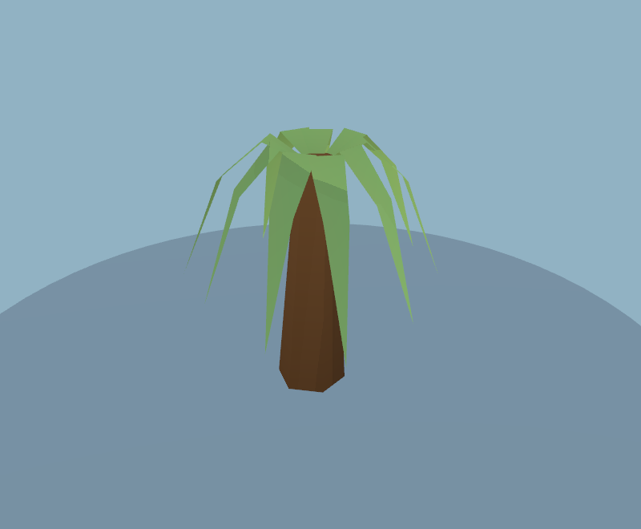
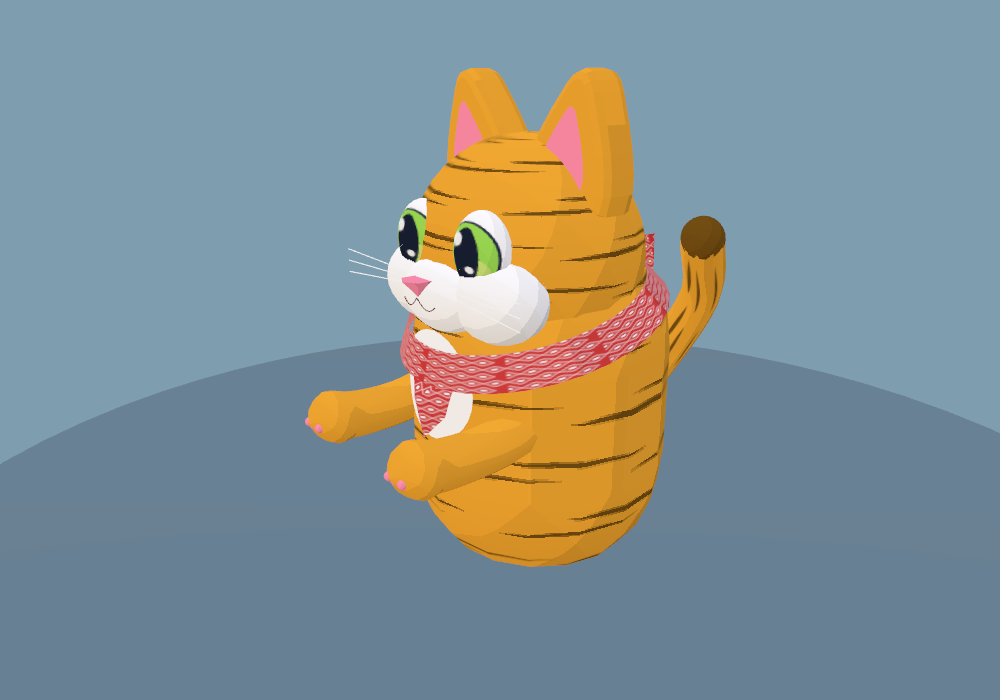
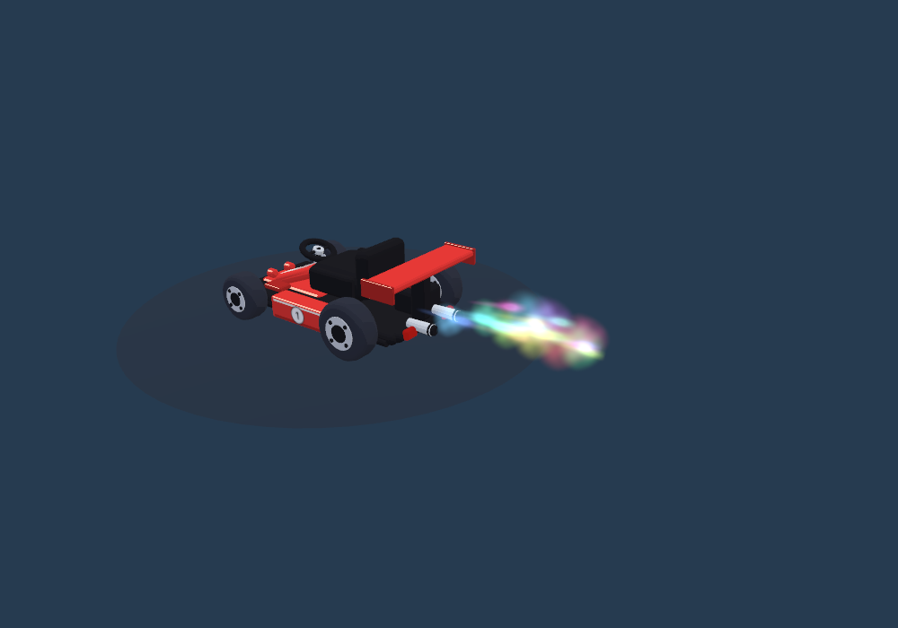
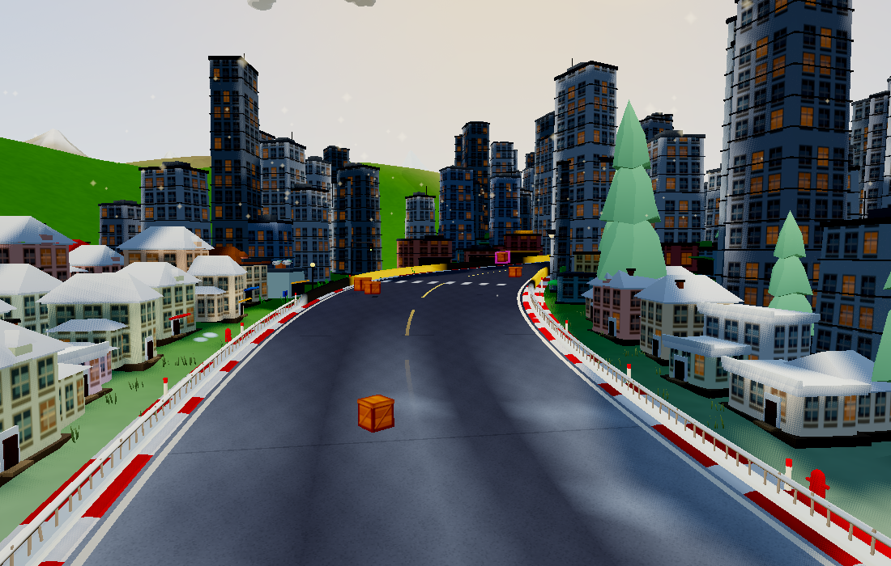
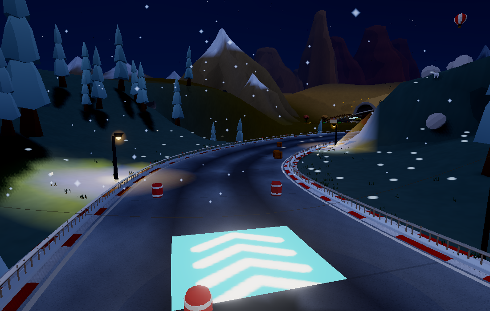

# Attachments, lights, road paint and boost trails

Snapshot at `12a1611`, following `a870206`. The boost jet described here has since been replaced by [production-style circular glows](../glow/README.md); other changes remain.

- Palm frond roots now overlap the top of the leaning trunk. Removed the extra canopy lift that exposed a gap, including in the asset viewer.
- Forelegs and paws share a continuous molded skin in driving, sitting and standing poses. Shoulder pivots and bean details remain, with fewer triangles and the same material batches. Regenerated all 38 catalog thumbnails.
- Street lamps use smaller, softer warm halos and restrained ground pools. Nearby static road/terrain/building vertex colours receive distance- and normal-weighted warm spill at world creation. A spatial index limits bake work to nearby lamps; illuminated reflectance is capped at 1 to keep the bloom pipeline stable. No extra realtime light, draw, texture, shadow map, shader operation, or per-frame bake update. This approximates fixed lamp illumination; it does not add occlusion shadows or moving light on karts. Existing dynamic lights remain.
- Centre paint has narrower warm-yellow stripes with physically spaced, clipped dash ends. Gaps contain no geometry, and whole dash cycles close around the track. Settlement fades remain. Tests cover curves, loop edges, alpha range and geometry budget.
- Boost exhaust emits a tighter rearward jet of motion-aligned hot streaks and small expanding puffs. Baked turbulent opacity replaces concentric puff bands. Charge colours and green catnip remain; no star sparks. Same two 64×64 textures, two instanced particle fields and 280-particle cap.

## Performance evidence

Fixed daytime world: 797,234 → 795,670 triangles; 1,172 material batches unchanged. Reported resource memory: 100,459,320 → 100,402,560 bytes. These are scene/resource counts, not FPS.

Controlled 240-frame effects sequence: 6,187 → 4,926 submitted quads (20.4% fewer), peak live particles 42 → 34; zero invisible/expired particles submitted after cleanup. Particle lifetimes and footprints are smaller.

Native WebGL2 / Apple M3 Pro, 1100×700, Medium, fixed seed: three frozen scene views, nine batches of 20 renders per view. Median GPU milliseconds per render:

| View | Before | After |
| --- | ---: | ---: |
| A | 0.925 | 0.970 |
| B | 0.755 | 0.855 |
| C | 1.187 | 1.129 |

One paired run shows mixed small changes (+0.045, +0.100, −0.058 ms). This is **not evidence of a FPS gain or zero performance impact**: static rendering excludes gameplay, postprocessing, animated particle fields and split-screen. Raw batches are alongside this report. Reduced geometry/particle work and unchanged lighting resources bound the added rendering cost; device testing remains important.

## Visual checks

Fixtures: `tools/attachment-art-check.mjs`, `check:scenery`, `check:landscape` (supports `TOD=night`, `NATIVE=1`), `tools/scenery-perf.mjs`. Checks also cover all 36 cat/pattern poses, 22 accessories, five kart styles, particle recycling and decal depth behaviour.

Validation passed: `check:art`, `check:scenery`, `check:effects-art`, `check:materials`, `check:sim`, `check:items`, gameplay `check`, and `build:web`. Day and native night world geometry contain no non-finite values or missing colour attributes. Hardware timings are daytime only.
