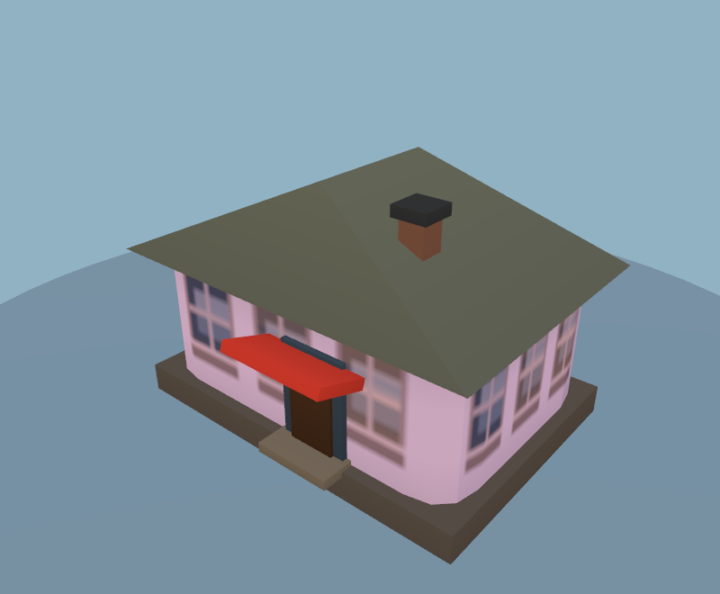
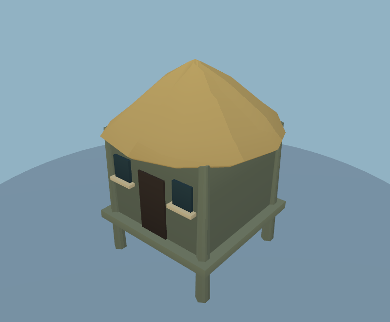
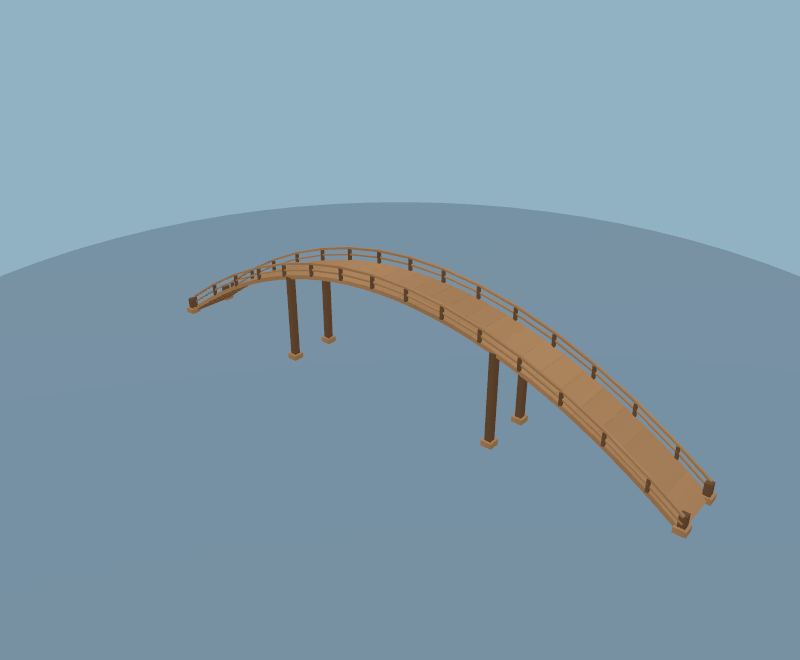
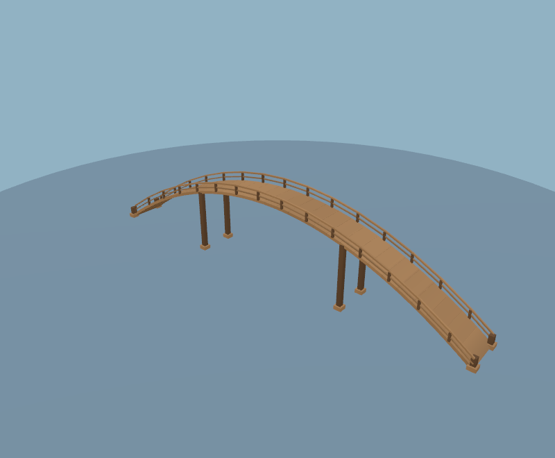
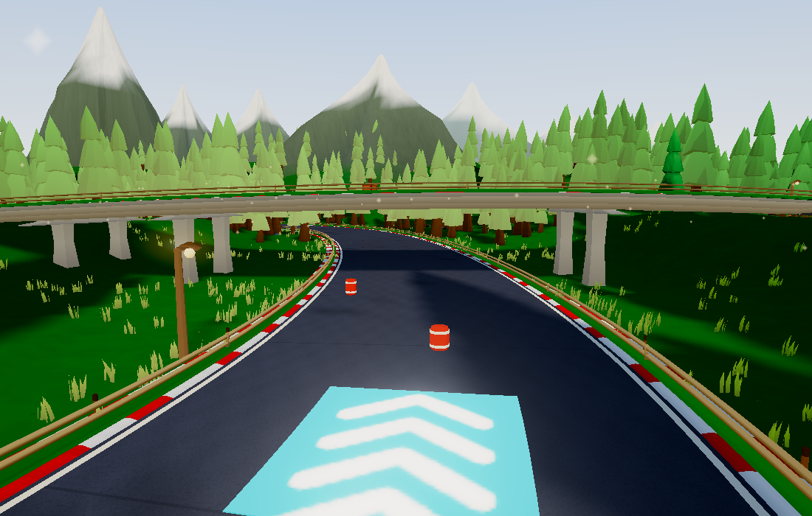
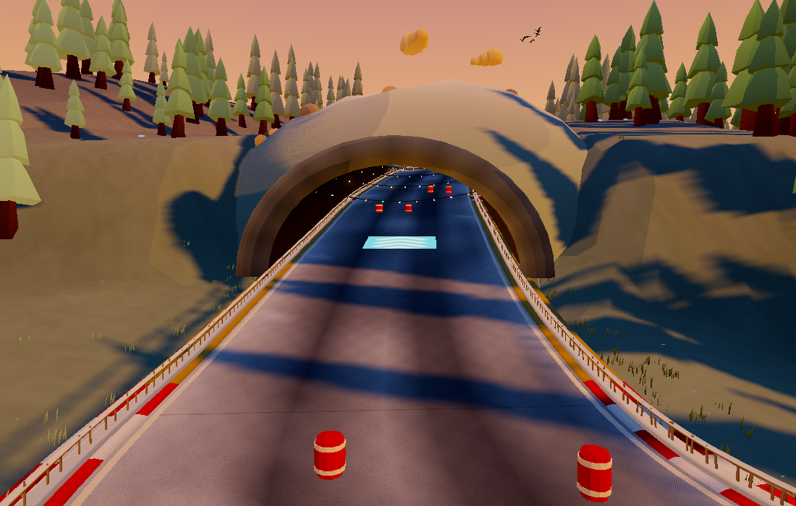

# Procedurally baked shelter and contact shading

Baseline: `2e9f0d4`, after the living-world pass. This adds restrained depth where static scenery overlaps or meets the ground, while retaining the painted palettes and cel shading. All shading is generated from the procedural geometry and placement data.

## Visible changes

- Small buildings and huts gain shading beneath eaves and around foundations. Two additional horizontal wall divisions keep the middle of the facade bright rather than darkening the entire wall.
- Timber bridges, benches, planters and habitat structures gain local recess shading. Shared non-palm canopy and rock prototypes receive a subtle self-occlusion bake.
- City buildings use their known roof, floor and awning bounds for a cheaper analytic bake. This avoids rebuilding a ray-acceleration structure for hundreds of individually sized towers.
- Concrete bridge supports darken at the deck joint; undersides use the locations of actually placed supports. Tunnel entrances transition into darker interiors based on distance from the opening.
- Placed structures and rocks add broad, slope-conforming contact shading to the existing terrain colors. Overlaps use the strongest contribution, so clusters do not accumulate black patches.

| Before | After |
| --- | --- |
|  |  |
|  |  |
|  |  |
|  |  |

The forest comparison uses the same HABITAT recipe and camera. Weather, wind and decorative cloud shapes can vary between captures. Asset comparisons use the same catalogue fixtures. These are subtle shading changes; existing geometry and silhouettes remain recognizable.

## Implementation and limits

`src/baked-lighting.js` casts seven fixed hemisphere rays per unique position/normal on completed rigid assets, using a local triangle BVH and distance falloff. It stores the result in vertex RGB before the existing static batching/instancing. Moving subtrees and flexible/emissive materials are excluded; emissive-window building facades retain their separate window emission.

The bake is capped at 6,000 triangles per asset. Its pigment-independent scalar cache has at most 48 entries and 65,536 floats (256 KiB of payload, plus small bookkeeping). Repeated canopy/rock/structure geometry reuses those values. No new render passes, realtime lights, shadow maps, textures or per-frame scenery updates are introduced. Building batching preserves the new shade when applying wall colors.

This is stylized local occlusion multiplied into base color, not physically accurate global illumination. It also affects direct-lit base color. It does not change with the sun or move onto passing karts; the existing dynamic lighting and shadows remain responsible for those effects. Terrain contact is deliberately broad because it uses the existing coarse grid. It does not promise pixel-sharp contact shadows or bake moving wildlife into the ground.

## Workload and construction cost

Only small building walls add triangles: 16 per hut/stilt hut/cabin/chalet/adobe/ruin; 64 per rounded village body, with another 64 for an optional wing. The 118-asset catalogue changes from 201,133 to 201,421 triangles (+288) with the same material-batch budgets. All other shading reuses the existing topology.

Five separately constructed, fixed-seed worlds (SHADE, size 0.5, detail 1) show the actual geometry increase without decorative sky variation:

| Biome | Before triangles | After triangles | Increase | Cold bake time | Repeated bake time |
| --- | ---: | ---: | ---: | ---: | ---: |
| Meadow | 650,801 | 651,377 | 576 / 0.089% | 368.5 ms | 113.0 ms |
| Forest | 678,448 | 678,592 | 144 / 0.021% | 327.9 ms | 4.6 ms |
| City | 496,012 | 496,012 | 0 | 34.7 ms | 25.6 ms |
| Beach | 385,844 | 385,924 | 80 / 0.021% | 102.7 ms | 3.7 ms |
| Volcanic | 369,338 | 369,690 | 352 / 0.095% | 93.1 ms | 4.1 ms |

These are generation costs on an Apple M3 Pro, not frame costs. Cold world construction changed from roughly 323–570 ms to 404–911 ms across these fixtures. The first version's city ray bake took about 3.8 seconds; the analytic city path reduced it to about 35 ms. Repeated runs benefit from retained caches, but the existing lazy world caches can also change some RNG consumption, so repeats are diagnostic rather than identical-scene statistical trials. Timing is from individual development-machine runs, with other checks potentially active. [Before construction results](before-construction.json) · [After construction results](after-construction.json).

The full Classic SHADE world at Medium / 1100×700 retains **1,016 scene mesh/material batches** and **391 / 269 / 421 / 192 draws** across four views. Renderer allocation changes from **90,840,503 to 90,846,123 bytes (+5,620 / 0.0062%)**. Total scene triangles happen to decrease by 256; that is unrelated decorative cloud variation from Three.js UUID allocations consuming `Math.random`, not a geometry optimization. The explicit world seed keeps track and roadside layout fixed. [Before resource counts](before-world.json) · [After resource counts](after-world.json).

## Native render timings

Apple M3 Pro / ANGLE Metal / Chrome WebGL2 at 1100×700. Nine batches of 20 renders per view; values are median batch-average GPU times. Cameras and wind are frozen; post-processing, gameplay and ambient sprite fields are excluded. The fixed scenery views retain 363 / 241 / 393 draws. These timings do not establish mobile or WebGPU frame rates.

The first pair ran baseline then current; the second pair reversed that order. Each row reports both independent runs, without discarding the slower results.

| GPU view | Before, run 1 / 2 | After, run 1 / 2 |
| --- | ---: | ---: |
| Track A | 0.607 / 0.566 ms | 0.661 / 0.733 ms |
| Track B | 0.507 / 0.631 ms | 0.606 / 0.579 ms |
| Track C | 0.696 / 0.723 ms | 0.767 / 0.766 ms |

Track A/C were slower in both comparisons; B changed direction. The largest observed difference is +0.167 ms in A. Individual batch averages vary substantially (for example, baseline run 1 A spans 0.568–0.867 ms), so this is a small desktop cost with measurement noise, **not a demonstrated speedup or a zero-cost guarantee**. More target-device testing is needed to establish the impact on race frame pacing.

Nearby scenery CPU updates measured 0.0147 / 0.0145 ms before and 0.0143 / 0.0150 ms after. Whole-world updates measured 0.0180 / 0.0185 ms before and 0.0180 / 0.0183 ms after. The update code is unchanged. This probe excludes racing physics, rendering and separately updated kart wakes/string lights.

[Baseline run 1](before-timings-1.json) · [Current run 1](after-timings-1.json) · [Baseline run 2](before-timings-2.json) · [Current run 2](after-timings-2.json).

## Validation and reproduction

- `npm run check:baked-lighting`: exposed faces stay bright, shelter darkens, topology and seeded world RNG remain unchanged, bounded finite colors, cache reuse, idempotence, moving-occluder exclusion, analytic ledges, shared terrain buffers, overlap and elevation handling. Added to CI.
- `npm run check:scenery`: all 118 rendered assets pass their geometry/material budgets. [Asset audit](asset-audit.json).
- `npm run check:biomes`: all 15 single-biome worlds and one mixed world pass placement and wildlife checks. [Habitat audit](habitat-audit.json).
- `npm run check:terrain`: zero terrain/mountain overlaps across 465,165 samples on 15 regression tracks. [Clearance audit](clearance-audit.json).
- Gameplay WebGL2 smoke completes without errors; its Chrome teardown is now bounded. `npm run build:web` passes.
- Catalogue comparisons, the forest crossing and the snowy tunnel were visually inspected.

Run `OUT=/tmp/bake-world node tools/baked-world-check.mjs` for construction diagnostics; add `BASELINE=1 ART_ROOT=/path/to/baseline` for the comparison checkout. Native GPU reproduction uses `ART_ROOT=/path/to/baseline OUT=/tmp/before node tools/scenery-perf.mjs`, then `OUT=/tmp/after node tools/scenery-perf.mjs`. Both full-world tools now pin the world seed explicitly. Set `PW_CHROME` if Chrome is not at the default macOS path.

Use the PR preview's forest, meadow, city, beach and wetland tracks to inspect eaves, foundations and crossings. The asset viewer's **Game look** toggle provides close-ups. Target-device playtesting remains important before merging.
