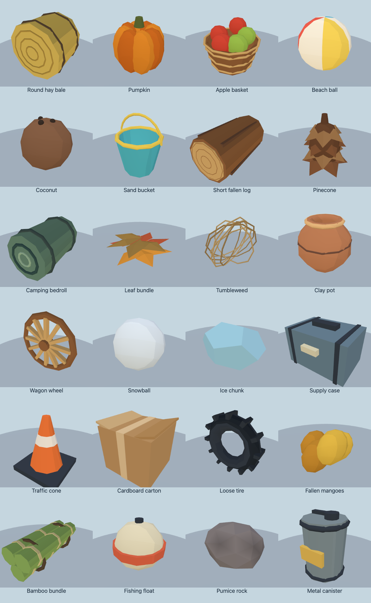
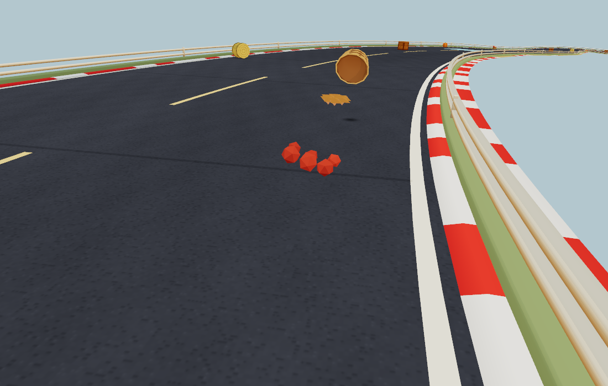

# Biome road props

24 procedural, cel-shaded road objects add local character and different impact reactions. Universal wooden crates remain the only power-up containers in every biome. Their existing floating pickup, spent-crate and replacement lifecycle stays intact: five active pickups on smaller tracks, seven on larger tracks, with every third ground slot reserved for an ordinary replacement crate. Red barrels remain in city and volcanic regions.

## Biome roster

| Biome | Additional objects |
| --- | --- |
| Meadow | Round hay bales, pumpkins, apple baskets |
| Forest | Short fallen logs, pinecones, camping bedrolls |
| Alpine | Logs, pinecones, bedrolls, supply cases |
| Autumn | Pumpkins, apple baskets, leaf bundles |
| Beach | Beach balls, coconuts, sand buckets |
| Desert / mesa | Tumbleweeds, clay pots, wagon wheels |
| Tundra | Snowballs, ice chunks, supply cases |
| City | Traffic cones, cardboard cartons, loose tires |
| Jungle | Fallen mangoes, bamboo bundles, logs |
| Wetlands | Fishing floats, bamboo bundles, logs |
| Volcanic | Pumice rocks, metal canisters |
| Savanna | Tumbleweeds, clay pots, bedrolls |
| Blossom | Apple baskets, leaf bundles, clay pots |
| Lavender | Hay bales, apple baskets, leaf bundles |

Placement is seeded, spread around the full lap, and mostly biased toward road edges. Compatible nearby structures and plants bias placement where available. A five-point biome footprint test substitutes a universal crate at regional boundaries. Existing leaf piles are limited to leafy biomes.

Balls, coconuts and floats bounce; wheels, tires, logs and bales roll; ice slides farther; heavy cases move less. Clay pots, snowballs, leaf bundles and mango piles break or scatter. Baskets lose their apples and remain empty, cones bend, and cartons flatten. Pumice sheds a small dust burst. Twelve procedural material sounds vary pitch, noise and decay, with positional attenuation and mute support.

The image is a focused integration fixture with simultaneous apple, clay and leaf bursts to exercise all three pools. Actual pots, snowballs and fruit piles disappear when broken; emptied baskets and deformed objects persist. No fragments grant items or obstruct karts.

## Runtime budgets

- **64 placement slots total**, including floating crates and leaf piles; this retains the previous total cap. Medium single-biome fixtures have 25 crates, including five floating pickups.
- Each new intact or used model is **one opaque draw**, with shared cached geometry and one vertex-colored material. Models use **36–864 triangles**. No imported textures, extra lights, extra shadow maps or physics dependency.
- **36 fragments maximum**, across three instanced pools of 12. Each burst emits six pieces; full pools recycle slots. Pieces sleep and expire after roughly three seconds. Inactive pools are hidden after loading; all three shader variants warm before gameplay. First-burst program counts stayed unchanged on both graphics backends.
- Sleeping props skip integration. Sphere contacts are analytic; cylinder envelopes are simplified during generation. Other objects retain geometry-derived support bounds. Existing road-triangle contact, local road-strand selection and fence containment remain in use.
- Wind can wake at most **two eligible objects per second**, near racers, with an eight-second per-object cooldown and a five-unit home envelope. No global always-running rigid-body simulation.
- Material sounds reject muted/out-of-range requests before creating audio nodes, limit starts to one every 65 ms globally and one every 180 ms per prop, and disconnect their nodes when finished.

## Measured performance

Comparison against the preceding branch commit **4feba846a36204f541ee5f01fa95b073f6147794**, on the same M3 Pro Mac (18 GPU cores, 36 GB), Chrome 153, macOS 26.6.2. Native **WebGPU, High, 1100×700**, six racing karts, seed `RUNTIME`, 40 seconds per sample after warm-up. Before/after runs were sequential with no concurrent rendering probes. A final beach-ball panel-color correction changes no geometry, materials or runtime work relative to these measurements.

| Biome | Mean FPS before → after | Median CPU callback ms | p99 frame ms | Worst frame ms |
| --- | ---: | ---: | ---: | ---: |
| Beach | 60.00 → 60.00 | 4.4 → 4.7 | 16.8 → 16.8 | 16.8 → 16.8 |
| City | 59.68 → 60.00 | 5.3 → 5.5 | 16.8 → 16.8 | 233.3 → 16.8 |
| Meadow | 60.00 → 60.00 | 5.2 → 4.8 | 16.8 → 16.8 | 16.8 → 16.8 |

These refresh-limited desktop samples show no frame-rate regression in the tested runs, but do not demonstrate a speedup or guarantee mobile performance. The isolated baseline city hitch is retained. Prop placement and interactions change race trajectories, so the lower average draw counts (beach 619→534, city 650→611, meadow 618→519) are contextual measurements, not a controlled fixed-camera reduction. Renderer-reported allocation was slightly lower (0.08–0.41 MiB); it does not represent total process memory. CPU callback times are not isolated GPU timings.

The solver-only Node stress test repeatedly launches mixed object types once per second: **0.41 ms median / 0.69 ms p99 for eight objects**, **2.07 ms median / 3.04 ms p99 for 64**. This is a deliberately busy physics workload and excludes rendering, audio and the game loop. Runtime cost is bounded, not zero.

[Before measurements](race-before.json) · [After measurements](race-after.json) · [Before raw frames (gzip)](race-before-raw.json.gz) · [After raw frames (gzip)](race-after-raw.json.gz) · [Physics/art budgets](physics-metrics.json) · [Browser integration/audio checks](integration-metrics.json)

## Validation and reproduction

- `npm run check:biome-props`: all 15 rosters, seeded repeatability, crate reserves, actual swept-kart impacts, sound events, used geometry, 36-fragment cap/expiry, bounded wind, stable sleeping contacts and **332,664 independent art-vertex/road ray checks**. Runs in CI.
- `npm run check:road-prop-art`: all 24 assets on both real WebGL and WebGPU backends; 48 clean renders, one draw per model, 864 maximum triangles. [Rendering metrics](art-metrics.json).
- `node tools/road-prop-integration-check.mjs`: 15 single-biome worlds plus a mixed world; actual biome lookup and crate placement, toon-shaded burst pools on both backends, no new shader programs at first burst (WebGL 24→24, WebGPU 26→26). Offline audio checks cover all 12 sound signatures, finite/unclipped output, mute, distance rejection and debounce.
- `npm run check:prop-physics`, `npm run check:items`, `npm run check:sim` and `npm run build:web` pass.
- Reproduce the race sample with `BIOMES=beach,city,meadow QUALITIES=high BACKEND=webgpu OUT=/tmp/road-prop-race node tools/race-perf.mjs`. Set `ART_ROOT` to a baseline checkout to compare. Browser tools accept `PW_CHROME`.

The simulation is intentionally lightweight: props contact the road and fences, but do not collide or stack with each other. Deformation swaps prebuilt procedural meshes rather than simulating soft bodies. Broken objects remain spent for that race. Fast motion is bounded by substeps; this is playful prop motion, not a general-purpose rigid-body engine. Sustained mobile/thermal performance still needs device playtesting.

To test, use the PR preview and race beach, meadow, desert, tundra, city and volcanic tracks. Hit objects at different speeds, revisit spilled/broken objects, check grounded crates rising to replace used power-ups, and inspect all models under **Road props** in `viewer.html`.
