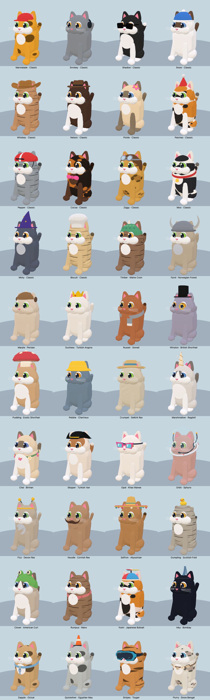
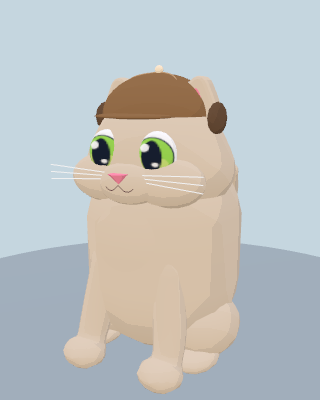
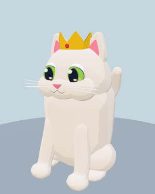

# Forty cat racers

The roster grows from 14 to **40 named cats**, matching all **40 wearable accessories** with one signature accessory each. The original cats keep their indexes, names, colors, prices and earned unlocks. The 26 additions are breed-inspired interpretations in the existing procedural, cel-shaded style.



[Without accessories](without-accessories.png) · [Rear silhouettes and tails](rear.png) · [Driving poses](driving.png) · [Complete roster and model budgets](roster-table.md)

## Appearance

Six new morphology families supplement the original shape. The same animation rig, seated height, wheel reach and accessory anchors serve every type. Each recipe varies cheeks, lower face width, lower torso, ear shape, tail length/fullness, sculpted fur or eyes.

| Family | New types |
| --- | --- |
| Long-haired | Maine Coon, Norwegian Forest, Persian, Turkish Angora, Somali |
| Plush | British Shorthair, Exotic Shorthair, Chartreux, Selkirk Rex |
| Masked/contrasting | Ragdoll, Birman, Turkish Van, Khao Manee |
| Sleek | Sphynx, Devon Rex, Cornish Rex, Abyssinian |
| Distinctive ears/tails | Scottish Fold, American Curl, Manx, Japanese Bobtail |
| Athletic | Bombay, Ocicat, Egyptian Mau, Toyger, Snow Bengal |

Details include smooth fuller cheeks and continuous chest silhouettes, tapered bushy tails, coat waves, a few Sphynx forehead folds, folded/curled/rounded/wider ears, a Manx without a visible tail, a pom-shaped bobtail and two different iris colors on Opal. Coats add **bicolor, mitted points, Van patches, ticking and broad tiger stripes** to the original 12 patterns. Markings remain procedural canvas textures generated once; fur uses opaque geometry.

Headwear openings are generated from each ear shape's convex envelope, with separate geometry-cache keys. The crown of the head, facial attachment points, neck band and paw reach remain standardized so the existing accessory collection is interchangeable. Hats anchor the ears while the head and accessories retain their animation.

## Picker, progression and saves

- The Cat studio offers **27 type choices** (Classic plus the 26 additions), **17 coat patterns**, all accessories and their palettes. Body type and coat are independently mixable.
- All 40 preset portraits are regenerated from the actual models. The asset viewer has a named **Racers** section. The picker displays the new type name on owned cards.
- The additions cost **180–330 treats**. The existing Custom Cat creator includes all shape/coat choices; existing creator and original-cat prices are unchanged.
- AI select distinct named cats from a seeded shuffle of the full roster while retaining their driving traits. Grid previews, warm-up, player/AI races, guest seats and ghosts carry the same type.
- Old saves used index 14 for Custom Cat. Loading an old save migrates that slot to the new custom index. New saves carry a version and an explicit custom marker, preserving custom selections across later roster expansions. The old outfit, colors and name are retained.
- The changes are cosmetic: collider dimensions, driving stats, abilities and race field size are unchanged.

## Smooth silhouette correction

The separate chest and cheek puffs read as lumps on pale cats. They have been removed from all 12 affected types, including Persian and Turkish Angora. Long-haired types retain broad, continuous chest volume by shaping the torso and its matching coat decal together; wide cheeks, ears and tails keep each type recognizable. Curly types retain their subtle continuous coat waves without raised cheek beads.

 

Each affected cat loses **384–784 triangles**, with no increase in material batches or per-frame work. Timber also drops from 21 to 20 batches. [Per-cat comparison against `309e8e0`](smooth-silhouettes.json). All 40 cats were rendered again on WebGL/WebGPU, the 3,321-combination compatibility sweep passed, and catalog portraits and all galleries were regenerated. The frame measurements below are from the preceding roster build; this correction was checked for geometry cost, not re-benchmarked for FPS.

## Runtime cost

Morphology, coat painting, hat openings and geometry merging happen during model construction. The original rig updates each frame; there is no new fur shader, simulation, light or per-frame morphology work. Each race still constructs six racers. Catalog portraits are static, lazy-loaded images rather than 40 live models.

Cheek and chest shaping uses the existing surfaces, with no separate fur-puff meshes. Tail geometry is shared by fullness recipe; the existing bounded model/material/texture caches remain in use. Some types add material batches (for example, Opal's second iris color), so this is not a claim of zero rendering cost.

The compatibility sweep covers **3,321** type × accessory × pose combinations (27 × 41 × 3), with a maximum **10,667 triangles and 24 material batches** per complete cat. These budget counts include hidden rig meshes and are not renderer frame timings. [Compatibility results](compatibility.json) · [Native WebGL/WebGPU preset metrics](metrics.json).

Native Chrome on Apple M3 Pro, WebGPU High, 1100 × 700 drawing buffer, six racers in Meadow; 8-second warm-up followed by 40 seconds (2,400 sampled frames per run). Runs executed sequentially.

| Run | Average FPS | 1% low FPS | CPU median / p99 | Mean draws |
| --- | ---: | ---: | ---: | ---: |
| Previous models, six tabby/sombrero cats | 60.00 | 59.52 | 5.1 / 6.9 ms | 599.7 |
| New Norwegian Forest shape, same coat/accessory | 60.00 | 59.52 | 4.9 / 6.8 ms | 588.9 |
| Normal mixed new roster | 60.00 | 59.52 | 5.0 / 6.7 ms | 588.6 |

No dropped-frame regression appeared in this desktop sample. The rendering cost is not zero: the controlled shape comparison adds about 75 KiB of geometry/index buffers in the renderer snapshot. All three runs had a 16.8 ms p99 frame interval and no browser errors. The smaller CPU/draw figures are within this moving-scene comparison's variability, not evidence that the new models are faster.

[Before summary](race-before.json) · [After summary](race-after.json) · [Mixed summary](race-mixed.json). Raw samples: [before](race-before-raw.json.gz), [after](race-after-raw.json.gz), [mixed](race-mixed-raw.json.gz).

Reproduction (run individually, with other rendering probes closed):

```sh
git show 7bdcedd8973f4c61c77c5772365fc7ef6edb9047:src/models.js > /tmp/zoomies-roster-baseline-models.js
MODELS=/tmp/zoomies-roster-baseline-models.js ACCESSORY=sombrero CAT_TYPE=forest CAT_PATTERN=tabby BIOMES=meadow QUALITIES=high BACKEND=webgpu SECONDS=40 OUT=/tmp/zoomies-roster-race-before node tools/race-perf.mjs
ACCESSORY=sombrero CAT_TYPE=forest CAT_PATTERN=tabby BIOMES=meadow QUALITIES=high BACKEND=webgpu SECONDS=40 OUT=/tmp/zoomies-roster-race-after node tools/race-perf.mjs
BIOMES=meadow QUALITIES=high BACKEND=webgpu SECONDS=40 OUT=/tmp/zoomies-roster-race-mixed node tools/race-perf.mjs
```

The focused baseline uses the previous model factory inside the same expanded-roster game and scene; it is not a whole-branch comparison against production. The previous factory ignores `CAT_TYPE`, giving the old Classic silhouette.

These are refresh-limited desktop measurements, not a mobile/thermal guarantee or proof of a speedup. Scene visibility and race trajectories vary; CPU callback timing is not isolated GPU timing. Generation cost is deliberately traded for reusable models and simple racing updates.

## Validation

- All 40 preset cats render on native WebGL and WebGPU. Front, rear, accessory-free and driving galleries reviewed.
- All morphology/accessory/pose combinations checked for finite geometry, material groups, animation, anchored ears, hidden Manx tails and model budgets.
- Pure-data checks cover all 40 unique signature accessories, 26 unlock purchases, six new families, original indexes, malformed inputs and legacy/custom save migration. These run in CI.
- The real editor exposes all 27 choices. A legacy custom cat survives migration; changing its shape, committing, reloading and entering a race retains its old outfit/colors and the new shape. New version-2 preset 14 correctly selects Timber rather than Custom Cat. AI names and actual models agree.
- Native High split-screen uses Dumpling as P2 and checks the new morphology, independent controls, separate viewports, rankings, finish/DNF results and no solo-economy payout. Viewport ownership is tested with a layer-isolated marker; the previous moving-versus-parked pixel heuristic was unreliable when scenery, wind or impacts changed the parked view.
- Progression economy, simulation determinism, existing art budgets and web build checked.

Reproduce with `npm run check:cat-roster`, `npm run check:cat-roster-art`, and `npm run check:cat-roster-ui`. Set `PW_CHROME` if needed and `OUT` for the galleries. `GALLERY_ONLY=1` skips the compatibility sweep. Regenerate catalog portraits with `CATS_ONLY=1 node tools/catalog-shots.mjs`.

For the split-screen check: `NATIVE=1 P2_CAT=31 QUALITY=high node tools/split-check.mjs 60` (plus `PW_CHROME` when needed). Performance runs must execute sequentially with other rendering probes closed; their exact commands and limitations are recorded with the measurements above.
