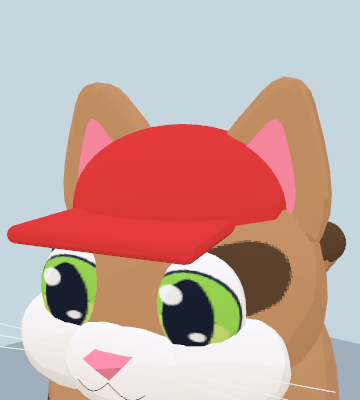
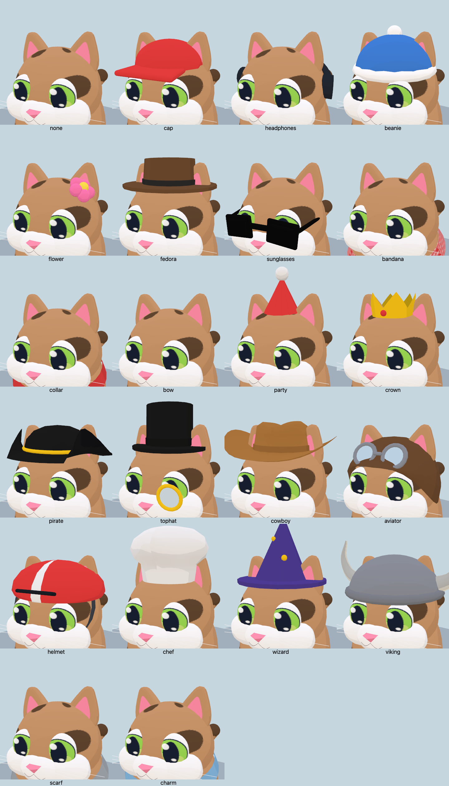

# Compact rounded ears

The refreshed ear shell and pink inset are scaled to 80% of their previous size before merging. Their rounded style is preserved; scalp attachment points, ear animation pivots and accessory placements are unchanged. At rest, each ear's horizontal extent is now about 0.579 units, close to production's 0.592 (previously 0.724).

| Previous refresh | Production ear shape | Smaller rounded ears |
| --- | --- | --- |
|  |  |  |

The production comparison substitutes the ear construction from `origin/main` into the current model, holding the head, cap, lighting and camera constant.

All 22 accessory selections render on native WebGL and WebGPU without console errors. Before/after triangle and material-batch counts match for all 44 renders. This is a generation-time geometry transform: no new geometry, materials, draw calls or per-frame work. Existing `check:art` validates all 36 coat/pose combinations and 22 accessory entries; `build:web` passes. No new FPS measurements were needed for this size-only change.
