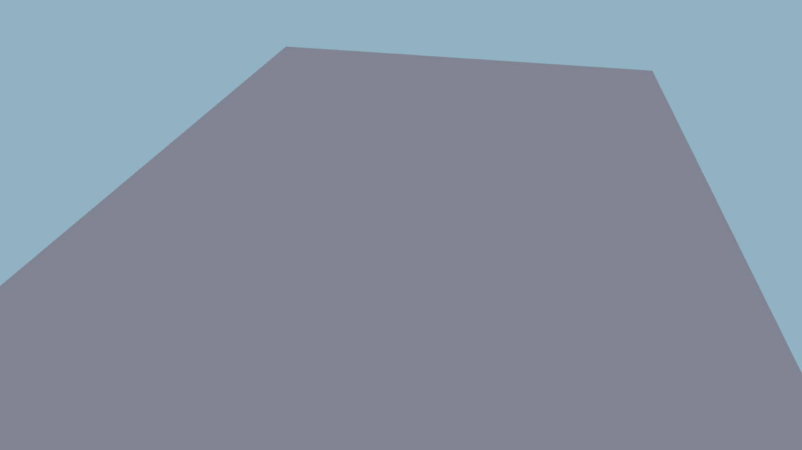
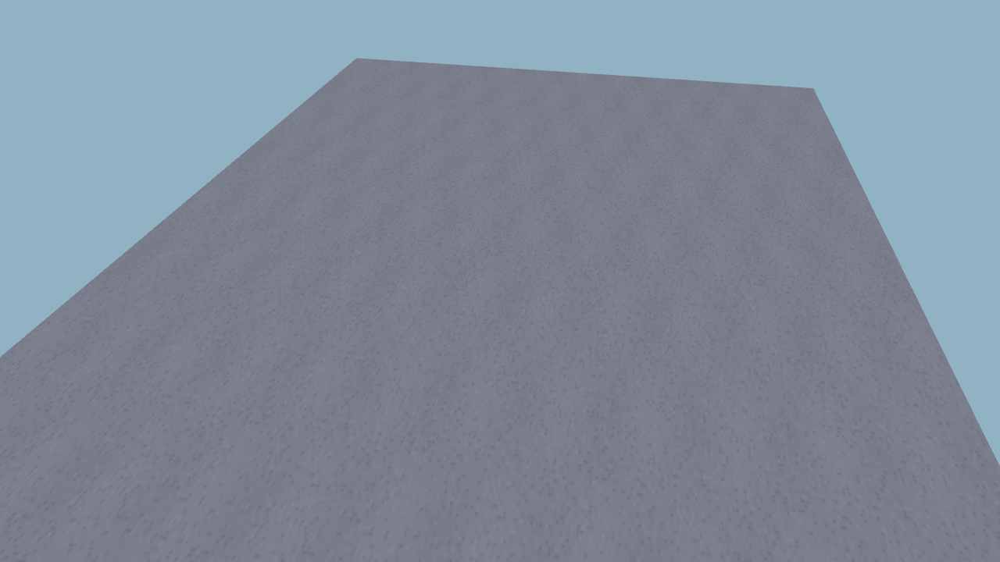
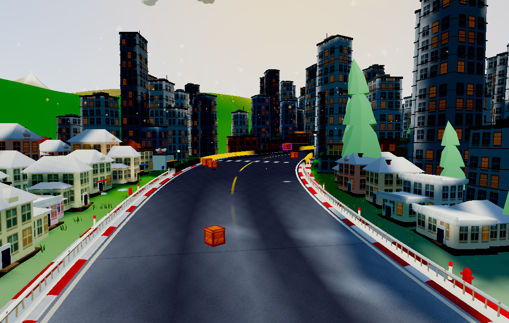

# Procedural particles and road paint

This records the initial effects pass. The later [grain and embers pass](../grain/README.md) replaces the star-shaped sparks with motion-aligned ember streaks.

This pass adds scalloped, banded smoke/boost puffs; four-point spark glints;
diamond ambient motes; tapered rain streaks; and fine grooves in skid ribbons.
Driving particles still use the same two 64×64 textures, two instanced fields
and 280-particle cap. Weather counts, ambient counts, emission rates and motion
are unchanged.

The asphalt gains restrained stone flecks and broad painted grain in one
128×128 repeating canvas, replacing the old 64×64 random bump map. Existing
biome tints, worn driving lanes, cover, seams and road markings are preserved.
This replaces bump-normal perturbation with a colour lookup; it adds no road
geometry, material batches, textures, or render passes. The larger mipmapped
road image adds approximately 64 KiB of texture storage.

| Before | After |
| --- | --- |
|  |  |
|  |  |

## Remove invisible particle work

Particles previously stayed alive until their lifetime expired even when their
opacity had already reached zero. They still simulated, uploaded attributes,
and submitted billboard triangles. They now return to the existing object pool
as soon as they are fully faded. Shader warm-up particles remain alive through
their intended brief lifetime underground, avoiding first-use compilation
hitches.

A deterministic four-second test emits boost bursts, boost trails and tyre grit
at fixed intervals, comparing `edbabd2` with this pass:

| Measurement | Before | After |
| --- | ---: | ---: |
| Particle instances submitted across 240 frames | 8,997 | 6,187 (−31.2%) |
| Fully transparent instances submitted | 2,810 | 0 |
| Peak live particles in this sequence | 54 | 42 |
| Particle cap | 280 | 280 |
| Road triangles | 20,000 | 20,000 |

This is a workload-specific submission reduction, **not a 31% FPS gain**.
The ambient mote shader also replaces radial length with a diamond distance,
avoiding its per-fragment square root. Hardware frame timing still requires
playtesting on the target device.

[Before test output](before-metrics.json) · [After test output](after-metrics.json).

The full-world comparison against the preceding landscape pass keeps the same
797,270 scene triangles and 51 textures. Renderer-reported allocation changes
from 99,511,543 to 99,575,701 bytes (+0.064%). The four fixed views render with
no browser errors. [World counters](world-metrics.json).



## Validation

`check:effects-art` renders both textures and the road material, runs the fixed
emission sequence, and checks expired/transparent particle cleanup, capacity
recycling and shader warm-up survival. `check:art` verifies the cat/kart budgets
and road seams. The gameplay smoke test and web build also pass.

```sh
PW_CHROME=/path/to/chrome OUT=/tmp/effects npm run check:effects-art
PW_CHROME=/path/to/chrome ART_ROOT=/path/to/old-checkout BASELINE=1 OUT=/tmp/before npm run check:effects-art
```
