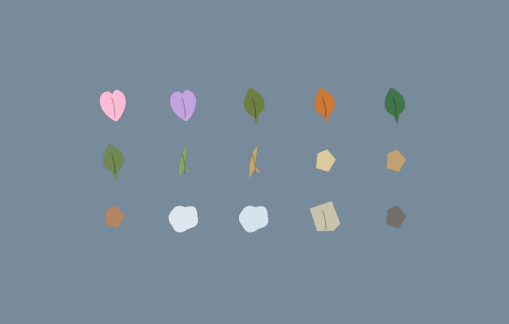
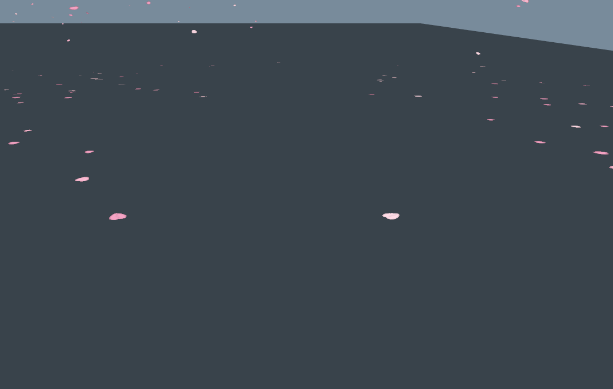
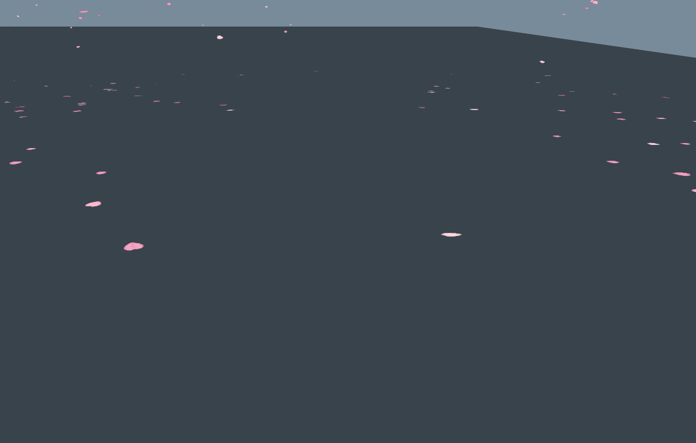

# Biome particles: material, motion and coverage

Environmental debris now uses recognisable procedural shapes and restrained, material-specific motion across all 15 biomes. The approved circular additive boost/drift effects are retained. Dust, leaves, petals, paper and ambient grains use ordinary shading instead of additive glow.

The enlarged gallery shows the actual kart-wake atlas materials. Left to right: blossom, lavender, forest, autumn, jungle; wetlands, meadow, savanna, beach, desert; mesa, alpine, tundra, city, volcanic. Actual grains and snow clumps are much smaller than leaves/petals in game. The 256×128 atlas is generated once by canvas code, including notched petals, leaf veins, grass husks, grains, snow clumps, folded paper and soft dust. No external bitmap assets.

## Behavior

- Blossom/lavender petals flutter and flip. Forest/autumn/jungle/wetlands leaves turn and skitter. Meadow/savanna clippings make short, low arcs. Sand and grit fall quickly, snow sheds small clumps and powder, city paper tumbles, and volcanic ash remains dark and subtle.
- Ground wake influence shrinks from a 13-unit radius to roughly 4.5 units, centered behind the kart. Lift scales with speed and drifting, with material response below one unit rather than the old five-unit pop. Four kart influences and four short-lived trail samples replace twelve broad influences.
- Airborne/stationary karts do not generate new ground wakes. Height gating prevents traffic on an elevated strand disturbing lower-road material. Human players are prioritized among the nearest four wake sources, and distance decisions include all split-screen cameras.
- Grounded cover rests flat; wake and falling cards rotate, fold and shade as they move. Falling material shrinks out at both ends of its loop to hide the reset. Bounds include shader displacement, with fewer instances drawn at distance and on Low/Battery saver.
- Seeded reservoir sampling distributes the fixed scenery budgets around the entire lap. Final-position biome checks, lake rejection and tunnel/deck exclusions keep placement appropriate. Lavender, wetlands and volcanic no longer fall back to generic dust palettes.
- Kart dust estimates loose cover from the existing road projection and the same wear/clump pattern used by the road art: sandy/snowy edges emit more than swept lanes; clean asphalt emits very little. Nearby AI and every local player share bounded wake effects. Emission uses time accumulators, so 30/60/120 Hz produce the same counts.
- Ambient compute motes are smaller matte grains instead of large floating diamonds. They follow the local biome, shared wind and world light, fade at vertical wrap, and follow camera elevation. Their count falls from 450 to 240; Low/Battery saver still skip the compute entirely.

| Resting cover | Ground-level passing wake |
| --- | --- |
|  |  |

These are isolated GPU fixtures, deliberately close to the particles. The elevated-kart version at +12 units is pixel-identical to the resting version on both graphics backends.

## Runtime budgets and tradeoffs

| Resource | Budget |
| --- | --- |
| Shared kart particles | 280 total, unchanged |
| Environmental portion | At most 80 of those 280; never evicts gameplay effects |
| Kart rendering batches | Two existing additive fields plus one shared normal-blended atlas field |
| Ground cover | At most 1,900 instances across the full lap |
| Falling material | At most 320 total across all biomes |
| Scenery card geometry | Four triangles each, previously eight |
| Ground wake influences | Eight, previously twelve; squared-distance falloff |
| Ambient compute | 240 motes, previously 450 |

Instanced scenery moves in vertex shaders. Broad light/fog follows existing world illumination; there are no new real-time lights, shadows, physics bodies or post-processing passes. Only active kart-particle attribute ranges upload. Shape/rotation attributes are packed to fit the minimum eight-vertex-buffer WebGPU limit. The additional field warms during countdown; its first real burst adds no shader programs.

These remain lightweight cosmetic effects. Kart particles settle against their emission-height plane and fade quickly, rather than performing terrain raycasts or rigid-body collisions. Scenery cards receive broad lighting and a fold shade rather than individual dynamic shadows. The single alpha-blended wake batch avoids per-particle sorting; low opacity and bounded overlap limit the artifacts that tradeoff can introduce.

## Measurements

Baseline: preceding branch commit **e37fb0f86105a234d0f70f17ef4070397e0a540a**. Native Chrome 153 on an M3 Pro Mac (18 GPU cores, 36 GB, macOS 26.6.2), **WebGPU Medium, 1100×700**, six racing karts, `RUNTIME` seed. Three 40-second samples per build after warm-up, with rendering probes run separately.

| Biome | Mean FPS before → after | Median CPU callback ms | p99 frame ms | Worst frame ms |
| --- | ---: | ---: | ---: | ---: |
| Blossom | 60.00 → 60.00 | 4.2 → 4.4 | 16.8 → 16.8 | 16.8 → 16.8 |
| Desert | 59.85 → 60.00 | 3.9 → 4.1 | 16.8 → 16.8 | 116.7 → 16.8 |
| City (night) | 59.48 → 60.00 | 4.2 → 4.9 | 16.8 → 16.8 | 216.6 → 16.8 |

All final samples held 60 FPS, with no browser errors and 16.8 ms p99/worst frame times. Median CPU callback cost rose **0.2–0.7 ms**; renderer-reported allocation rose **0.36–0.44 MiB**. The baseline stalls are retained, not treated as an optimization win. These refresh-limited desktop samples do not prove a speedup, isolated GPU savings or mobile performance.

Changing particle generation consumes a different sequence of random values and changes some subsequent scenery placement; particle interactions also change race trajectories. Consequently these are whole-game comparisons, not identical-camera measurements of particle cost. Average draw calls increased (blossom 319→386, desert 328→347, city 319→402), including the changed visible scenery and full-lap cover. Geometry/count reductions are firm implementation budgets, not a claim that all rendering work decreased.

[Before summary](race-before.json) · [After summary](race-after.json) · [Before raw frames](race-before-raw.json.gz) · [After raw frames](race-after-raw.json.gz) · [Rendering/coverage checks](render-metrics.json) · [Logic checks](logic-metrics.json)

## Validation and playtest

- `npm run check:environment-particles`: explicit coverage of all 15 registered biomes; deterministic full-lap sampling; identical emission totals at 30, 60 and 120 Hz; capped emission after a pause; speed/sliding/airborne gates; surface-cover bounds. Included in CI.
- `npm run check:environment-render`: native WebGL and WebGPU atlas and moving-cover rendering; all 15 fixture rosters plus a real mixed procedural track; two-view distance selection; Low density reduction; 280/80 pool saturation, expiry and gameplay priority. First-burst program counts remain WebGL 8→8 and WebGPU 9→9. Pixel comparison proves elevated-road wakes leave lower cover unchanged. Ambient compute and its quality toggle run on both backends.
- Native Medium two-player split-screen test: independent controls, six-kart field, finish/grace/results logic, no browser errors.
- Simulation determinism, item lifecycle and web build pass. The existing round-particle art regression verifies circular boost masks and pooled expiration.

Reproduce performance with `BIOMES=blossom,desert,city QUALITIES=medium BACKEND=webgpu OUT=/tmp/particle-race node tools/race-perf.mjs`; set `ART_ROOT` to a baseline checkout. Browser tools accept `PW_CHROME`.

For visual review, drive slowly and then drift through blossom or autumn; compare sandy shoulders with the swept line in desert; try snowy tundra, lavender and night city. Look for a brief, local response rather than a tall cloud. Boost effects should remain round and bright. Check Low/Battery saver and split screen, and use the PR preview on the mobile devices normally used to play.
