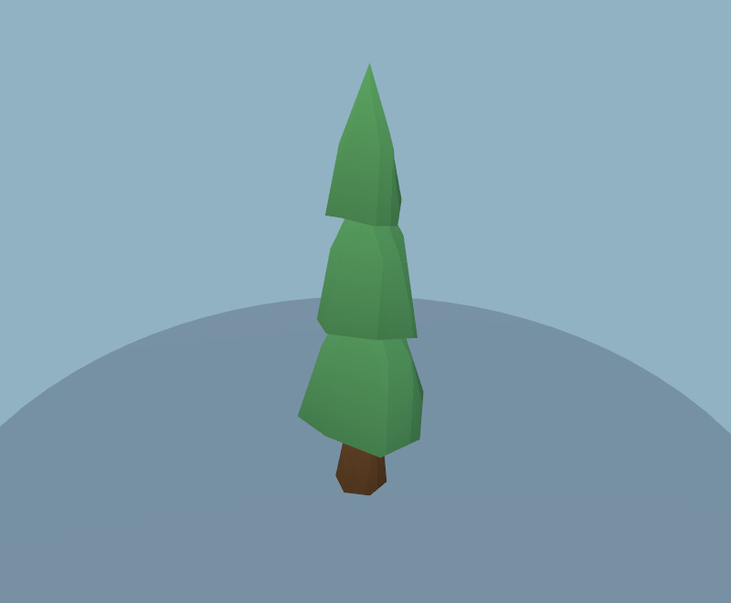
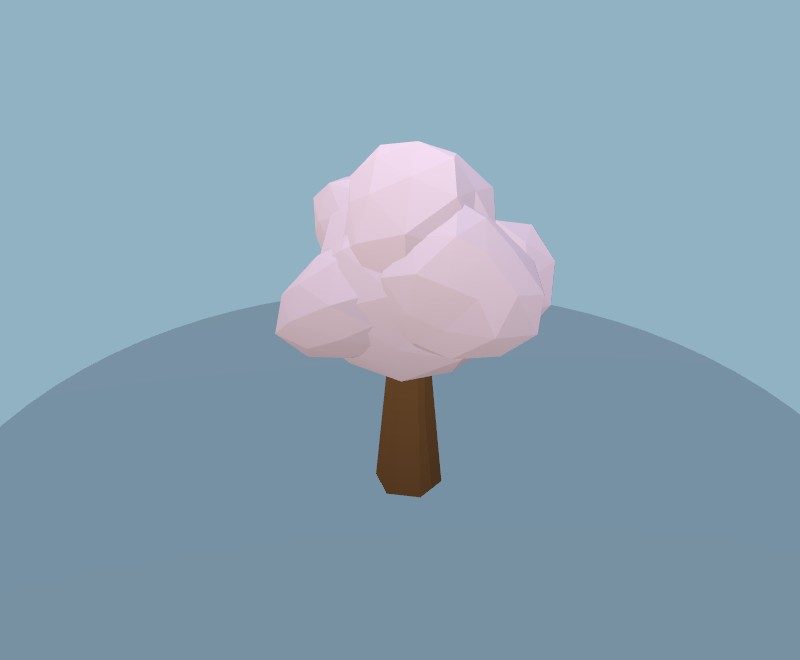
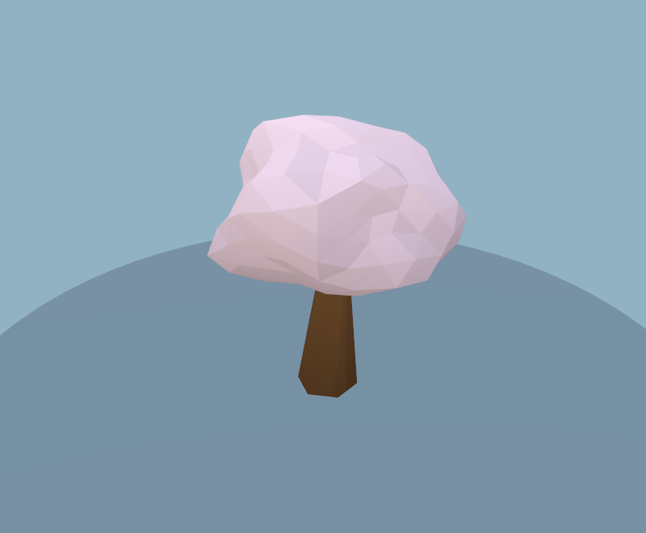
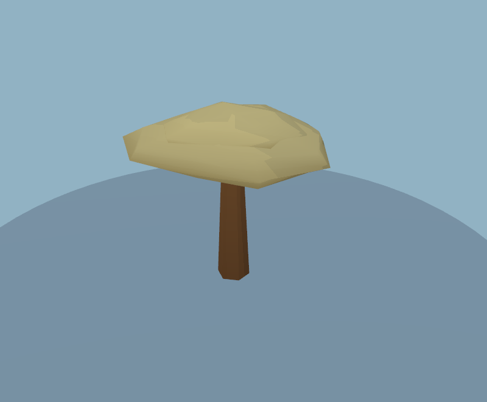
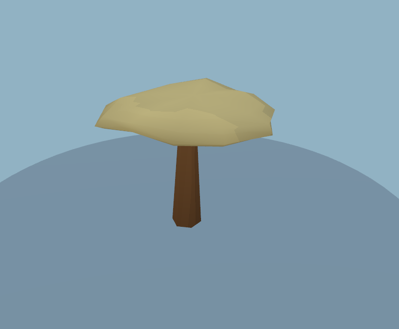
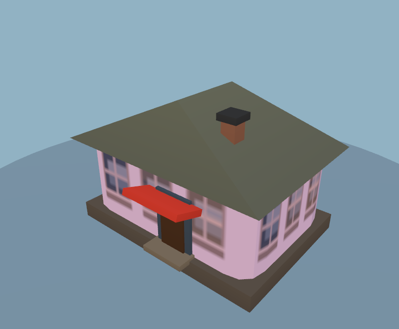
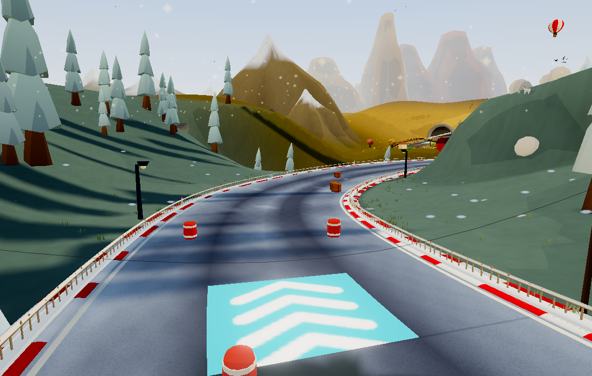

# Tree forms and painted depth

This pass follows `dd7d149`, retaining the procedural cel style. It concentrates
on the silhouettes and surface cues already present in the scene, rather than
adding another lighting or post-processing feature.

- Pines have drooping branch tips, a subtly offset crown and tier-local baked
  shading, making the overlapping boughs easier to distinguish.
- Acacias use one broad umbrella surface instead of two intersecting spheres.
- Blossom trees use one continuous lobed surface instead of six overlapping
  balls, retaining a rounded crown with fewer hidden internal surfaces.
- Trunks gain irregular flared feet, a slight lean and darker base paint.
  Crown placement follows the trunk lean before biome-specific width scaling,
  in both the instanced world and asset viewer.
- Broadleaf crowns have a gentle asymmetric sweep. All trees keep the existing
  shared wind, instancing, colours, placement RNG and quality-tier behavior.
- The existing 64×80 facade sheet now paints recessed window edges, broader
  glass reflections and raised sills. These are static painted cues, not a new
  reflection effect. Texture dimensions, filtering and sample counts stay put.

| Asset | Before | After |
| --- | --- | --- |
| Pine |  |  |
| Blossom |  |  |
| Acacia |  |  |
| Facade |  |  |

## Resource budget

Across all 82 catalog assets, no asset adds triangles or material batches.
Whole-tree counts, including the trunk, change as follows:

| Tree | Before triangles | After triangles |
| --- | ---: | ---: |
| Blossom | 504 | 344 |
| Acacia | 196 | 192 |

Pine, broadleaf and palm topology is unchanged. The blossom canopy alone drops
480 → 320 triangles (33.3%); the acacia canopy drops 172 → 168. The sculpting
and paint calculations run during asset construction. Existing colour buffers
and shaders do the per-frame work; there are no additional textures, lights,
passes or animation updates.

In the fixed full-world sample, triangles change **797,270 → 797,234** and
renderer allocation **100,463,992 → 100,459,320 bytes**. Material batches remain
**1,172** and textures **52**. This sample contains nine acacias and no blossom
crowns, so it does not represent the larger saving in a blossom-heavy scene.
Shape changes can change pixel coverage/culling; unchanged draw budgets alone
are not proof of unchanged GPU time.

[Baseline catalog counters](before-assets.json), [updated counters](after-assets.json),
[world counters](world.json). Prior-world comparison: [audit result](../audit/world-after.json).

## Hardware measurement method

`tools/scenery-perf.mjs` runs native Chrome WebGL2 on the Apple M3 Pro via ANGLE
Metal, checks the GPU identity and disjoint-timer extension, and refuses software
renderers. It uses seed 12345, Medium, a 1100×700 drawing buffer and three fixed
track cameras. The game/renderer animation callbacks are paused; the TSL clock
and shared wind are fixed. Sprite fields are hidden to remove their varying
startup placements. Each view is warmed with 20 renders, then measured using
nine GPU timer-query batches of 20 renders.

These are **static scene-render throughput measurements**, excluding gameplay
simulation and the game's post-processing stack. They are not six-kart race
frame times, do not establish mobile/WebGPU performance, and must not be
reported as a game FPS improvement. Run without other rendering tests, and
compare repeated before/after runs rather than a single timing sample.

### Results

Four isolated runs in after/before/before/after order produced these ranges of
per-run medians (milliseconds per scene render; lower is better):

| Fixed view | Before | After |
| --- | ---: | ---: |
| Track A | 0.822–0.986 | 0.805–0.806 |
| Track B | 0.758–0.786 | 0.732–0.743 |
| Track C | 0.986–1.217 | 1.038–1.128 |

A and B were lower in these samples; C overlaps and varies in both directions.
This provides no evidence of a consistent regression in this bounded workload,
but is too variable and narrow to claim a whole-game speedup. The initial
exploratory samples were excluded because other render checks were running.
Raw isolated runs: [after 1](native-after-1.json), [before 1](native-before-1.json),
[before 2](native-before-2.json), [after 2](native-after-2.json).

Run with `ART_ROOT=/path/to/checkout OUT=/tmp/run node tools/scenery-perf.mjs`;
set `PW_CHROME` if Chrome is elsewhere. Do not run other render tests alongside it.

## Validation

The 82 asset renders pass finite-attribute, colour and budget checks. Four
full-world views pass with no browser errors, and the gameplay smoke check and
web build passed. Model presets and catalog racers did not
change, so racer thumbnails do not need regeneration.
