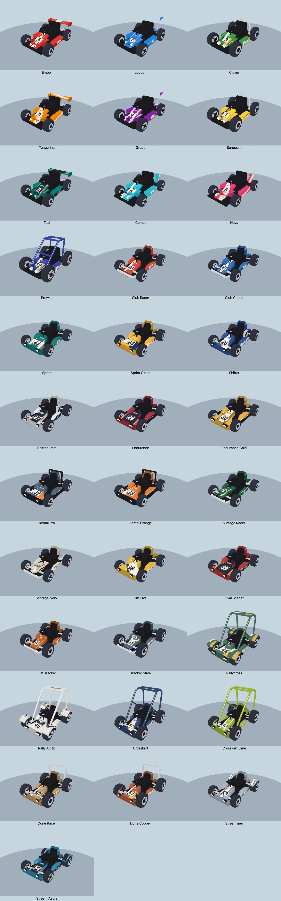
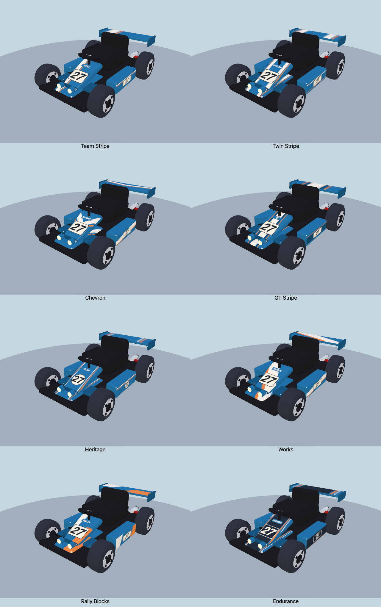

# Racing paint across the whole garage

All **34 presets / 17 chassis**, including the original ten karts, now have curated racing paint. Eight restrained designs draw from club racing, classic sports cars, works teams and rally competition. Existing names, colors, numbers, unlocks and saved selection IDs remain stable.



[Before this pass](before.png) · [After](after.png) · [Top](top.png) · [Sides](sides.png) · [Rear](rear.png).

## The designs

| Scheme | Treatment |
| --- | --- |
| Team Stripe | One offset stripe with a fine accent line |
| Twin Stripe | Paired stripes and fine outer pinlines |
| Chevron | One broad V and a narrow accent V |
| GT Stripe | Central stripe with a dark border and fine accent lines |
| Heritage | Round number fields, upright digits and fine paired pinstripes |
| Works | A broad diagonal team sweep and contrasting accent |
| Rally Blocks | Two restrained corner color blocks and squared number plates |
| Endurance | Dark central and side fields, cream digits and fine edge stripes |



[Same chassis from above](numbers-top.png) · [Procedural atlas drawings](atlases.png).

Each preset receives a considered scheme: Ember gets GT stripes, Lagoon uses heritage roundels, Clover wears rally blocks and Teal has endurance panels. Vintage editions keep roundels; the two editions of each newer chassis differ through paint and color. Secondary colors are derived from the body color with a small restrained palette. There are no external image assets or random paint splashes.

Nose numbers remain on the centerline and use actual glyph bounds for optical centering. Both side numbers stay upright. Dedicated UV regions keep numbers off panel edges and end caps. Wings, fins, rally roofs/fenders and streamliner fairings carry matching graphics without repeated number badges. The roof/fender region has enough texture height to keep angled paint edges clean.

All eight schemes are available in the custom creator for **every chassis**. The existing first three livery IDs remain valid. AI, guest, ghost and preview model paths use the same factory. All 34 catalog portraits have been regenerated.

## Rendering cost

One opaque **256×256 procedural atlas** contains nose, side, upright plate and trim layouts. It is generated at model creation and cached by appearance and physical panel dimensions, retaining the existing 64-entry cache limit. No new animation work, geometry, lights or render passes are added.

The original chassis now paint their existing surfaces instead of adding separate transparent number planes and stripe planes. This replaces their smaller number-only texture with a full paint atlas: a modest texture-memory trade for fewer triangles and material submissions. New chassis retain their existing atlas dimensions and material approach.

| Chassis | Triangles before → after | Material batches before → after |
| --- | ---: | ---: |
| GP | 10,804 → 10,788 | 22 → 21 |
| Roadster | 10,096 → 10,080 | 24 → 22 |
| Buggy | 10,284 → 10,268 | 22 → 20 |
| Finned | 10,276 → 10,260 | 22 → 20 |
| Cage | 12,468 → 12,452 | 22 → 21 |
| Streamliner | 6,356 → 6,356 | 21 → 20 |
| Other 11 newer chassis | unchanged | unchanged |

These are whole-model geometry/material counts, not whole-race draw calls. [All 68 before/after model comparisons](budgets.json) · [Current metrics](metrics.json).

## Validation

- All 34 presets render on native Chrome WebGL and WebGPU, with front, rear, side and top views inspected.
- 816 style/livery/color/backend combinations pass geometry, material-group, shared-cache and independent-rig checks. Existing and new chassis remain within their render budgets.
- Sixteen extra native WebGPU views compare the eight schemes on one original GP chassis.
- Live garage tests cover all 17 chassis, all eight schemes on an original chassis, old Custom Kart migration, new Sprint persistence, GP/Endurance save/reload and player/AI race paint. [Results](ui-check.json).
- Original art checks, roster checks and the web build pass.

```sh
npm run check:kart-roster
npm run build:web
PW_CHROME='/Applications/Google Chrome.app/Contents/MacOS/Google Chrome' npm run check:art
OUT=/tmp/zoomies-garage-liveries npm run check:kart-roster-art
npm run check:kart-roster-ui
```

## Full-race comparison

Sequential native Chrome / WebGPU High samples on an Apple M3 Pro, at 1100×700: six GP karts on seeded meadow `RUNTIME`, eight seconds of race warmup, then 40 seconds / 2,400 frames per run. The baseline serves `models.js` and `racing-karts.js` from `13d33f4`; other game code is shared. No gallery or catalog renderer ran alongside these retained samples.

| Measurement | Before | New paint |
| --- | ---: | ---: |
| Mean FPS | 60.00 | 60.00 |
| 1% low FPS | 59.52 | 59.52 |
| p99 frame, ms | 16.8 | 16.8 |
| Worst sampled frame, ms | 16.8 | 16.8 |
| Median CPU callback, ms | 4.9 | 5.1 |
| p99 CPU callback, ms | 6.6 | 6.9 |
| Mean scene draws | 575.8 | 574.2 |
| Renderer textures | 59 | 59 |
| Renderer programs | 293 | 295 |
| Renderer total bytes | 209,995,639 | 211,771,823 |

No observed FPS/frame-pacing regression in this desktop sample. CPU timing was slightly higher; this is not a measured speedup. Reported renderer memory rose by about **1.69 MiB**, including about **1.50 MiB** of texture allocation as the original number-only textures become full paint atlases. Whole-game counts also reflect differences in visible scenery, race positions and sun state. The isolated model measurements above establish the reduced material batches; refresh-limited samples do not establish mobile or thermal behavior. Initial compilation/loading stalls appear in the raw logs and are outside the warmed race sampling window. Neither run reports browser errors.

[Summary](race-summary.json) · Raw frames: [before](race-before.json.gz), [after](race-after.json.gz).

```sh
git show 13d33f4:src/models.js > /tmp/zoomies-all-paint-before-models.js
git show 13d33f4:src/racing-karts.js > /tmp/zoomies-all-paint-before-shell.js
BIOMES=meadow QUALITIES=high BACKEND=webgpu SECONDS=40 KART_STYLE=0 MODELS=/tmp/zoomies-all-paint-before-models.js RACING_KARTS_FILE=/tmp/zoomies-all-paint-before-shell.js OUT=/tmp/zoomies-garage-paint-before node tools/race-perf.mjs
BIOMES=meadow QUALITIES=high BACKEND=webgpu SECONDS=40 KART_STYLE=0 OUT=/tmp/zoomies-garage-paint-after node tools/race-perf.mjs
```
