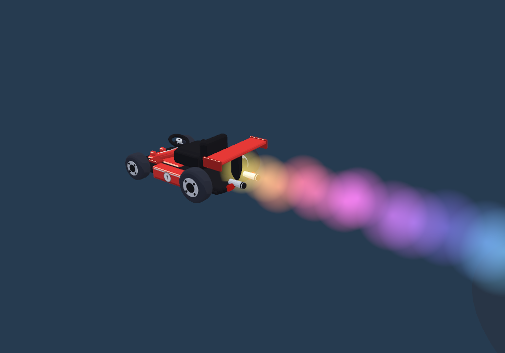
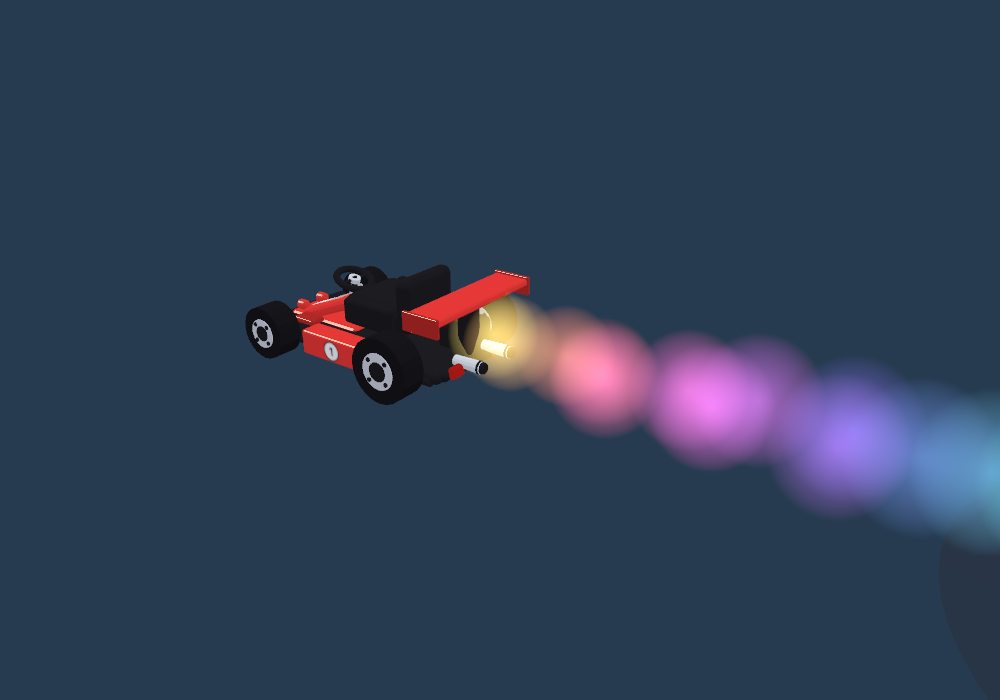

# Production-style boost glow

Restored the round additive glow and boost/trickle emitter settings from production/main `0d0198a`: bright circular centres, broad soft halos, larger expanding puffs and a gently rising rainbow trail. Green catnip and charge-tier colours remain. Drift/collision embers keep their existing tapered shape.

The existing two instanced fields, two 64×64 textures, 280-particle cap, pooled objects, partial uploads and early retirement of invisible particles remain. No new lights, postprocessing, geometry or per-frame texture work.

## Controlled effects workload

Same 240-frame emission sequence via `check:effects-art`, compared with production:

| Metric | Production | Current |
| --- | ---: | ---: |
| Submitted particle quads (sum across frames) | 8,997 | 6,187 |
| Peak live particles | 54 | 42 |
| Invisible particle submissions | 2,810 | 0 |
| Fully faded slots retained | 280 | 0 |

31.2% fewer submissions than production. These are workload counts, **not FPS measurements**. The restored larger glows cover more pixels than the previous narrow jet; the earlier jet's 4,926-submission result no longer describes the current effect. Visible emitter behaviour matches production, while invisible work is removed.

`attachment-art-check.mjs` now advances the kart at racing speed so the fixture shows separated glow circles instead of accumulating every emission behind a parked kart. Both comparison images use this fixture; small differences in colour phase reflect the surrounding model changes/random sequence.

Current:

Production:

Validation: particle expiry, recycling, caps and shader warm-up checks; moving-kart visual comparison; gameplay smoke check; web build. No model changes in this follow-up.
