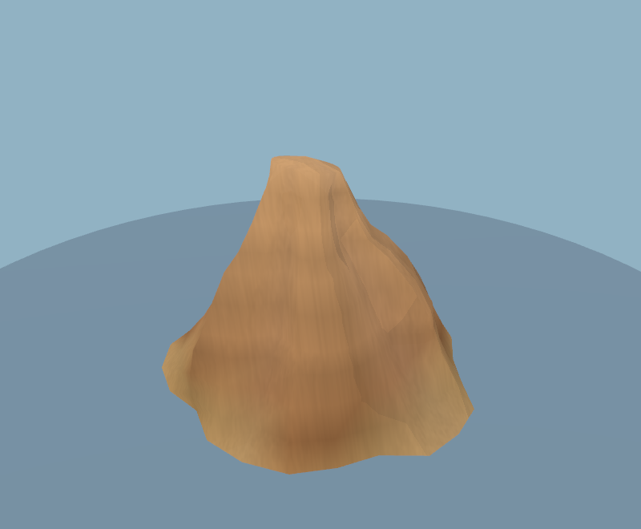
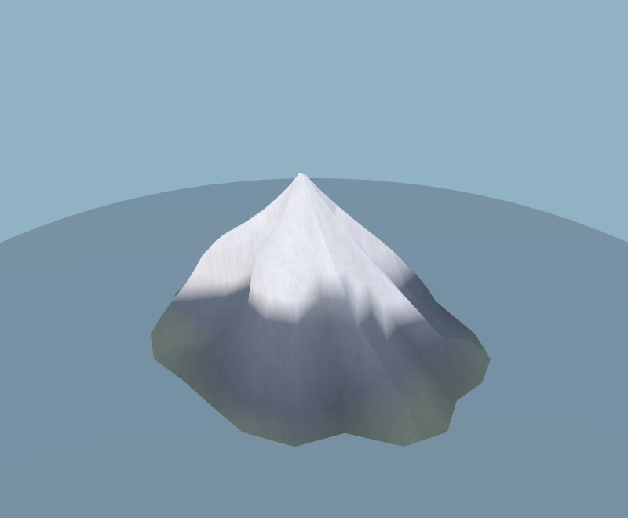
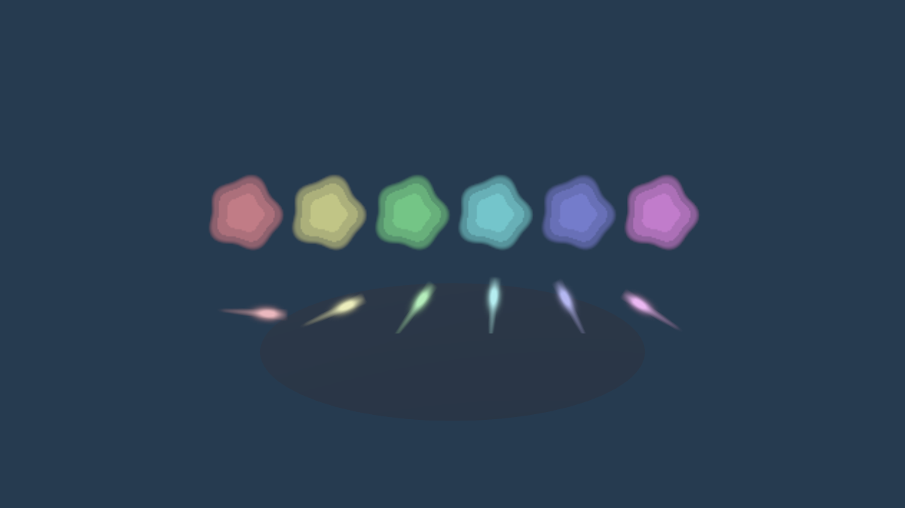
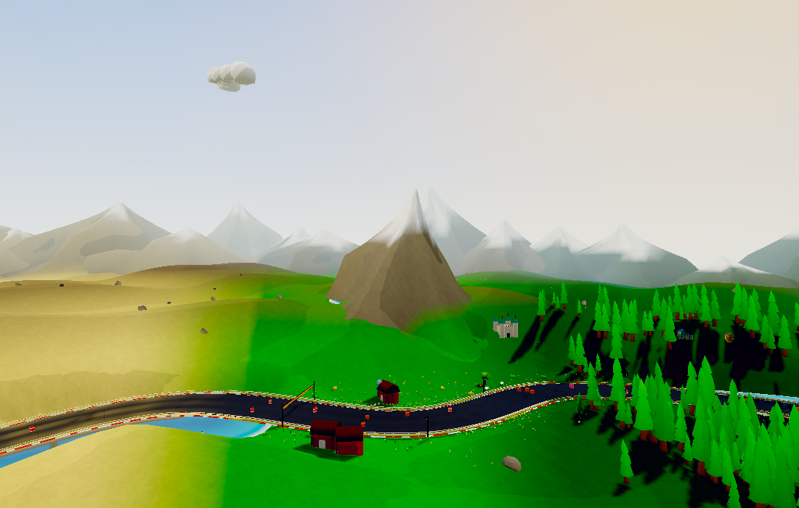

# Landscape grain and motion-aligned embers

Hills, terrain and mountains now share one procedural 128×128 grain texture.
The noise is generated once using its own deterministic hash, leaving the
world-generation random stream unchanged. Broad and fine variations combine
into restrained erosion-like detail that keeps the existing biome colours,
snowline and cel lighting readable.

Grain coordinates are baked into the mesh. Terrain tiles share their source
attributes, so the pattern remains continuous across tile edges. Mountain UVs
are recomputed after placement and skirt conformation. A single oblique
projection includes height to retain detail on steep faces without the three
samples of triplanar mapping. Some directional stretching on steep slopes is
the tradeoff. Mipmapping and modest anisotropic filtering soften detail at a
distance, reducing shimmer.

The star sparks are replaced with compact bright heads and tapered ember tails.
Their orientation follows velocity projected into each camera, so split-screen
views use their own direction rather than one CPU-calculated angle. Existing
emitter colours, trajectories, gravity, lifetimes, cap and two draw batches
remain unchanged. This only needs a three-float velocity attribute on the spark
field (3,360 bytes of capacity; 12 bytes uploaded per live spark).

| Before | After |
| --- | --- |
|  |  |
|  |  |
|  |  |

## Cost and validation

No geometry, draw batches, lights or render passes are added. Grain adds one
texture lookup to terrain and mountain surfaces, plus UV attributes where
needed. It does not run procedural noise in the fragment shader. The shared
tile uses approximately 85 KiB including mipmaps. Spark rotation adds a small
amount of vertex math; particle cleanup and its measured 31.2% submission
saving in the fixed boost/grit sequence are retained.

The fixed world comparison keeps **797,270 scene triangles** and adds one
shared texture (**51 → 52**). Renderer-reported allocation changes from
**99,575,701 to 100,464,040 bytes (+0.89%)**. Terrain UVs now need GPU storage;
mountains gain UV attributes as well. This is still about 1% below the original
pre-refresh world's allocation. [World counters](world-metrics.json).

Resource counters are not frame-time measurements. An extra texture sample has
a cost even with unchanged triangles and draw calls; hardware WebGPU/iOS frame
pacing still needs device playtesting.

Validation: all 82 scenery previews, particle rendering/expiry/recycling/warm-up
checks, fixed world views, gameplay smoke test and web build.
