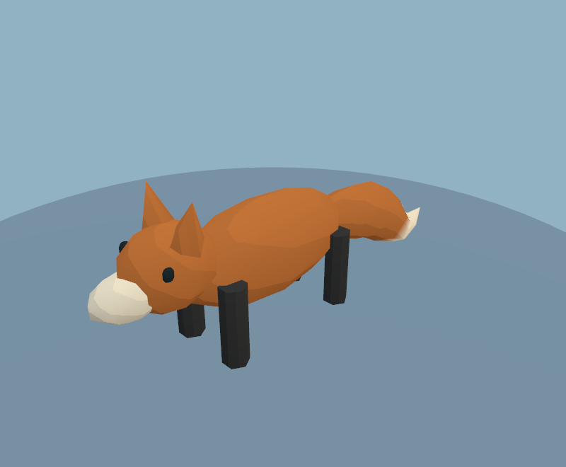
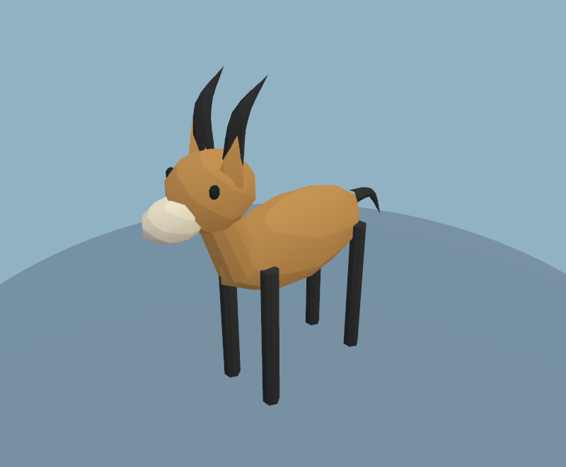
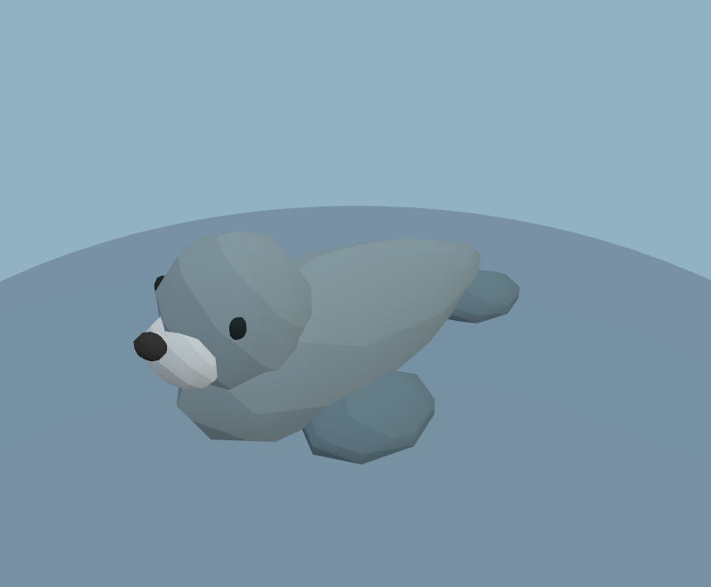
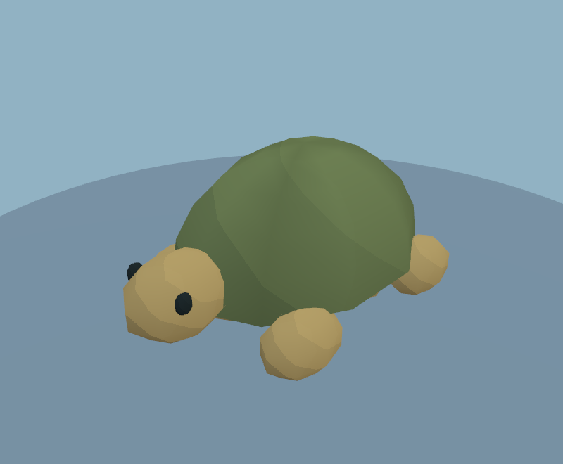
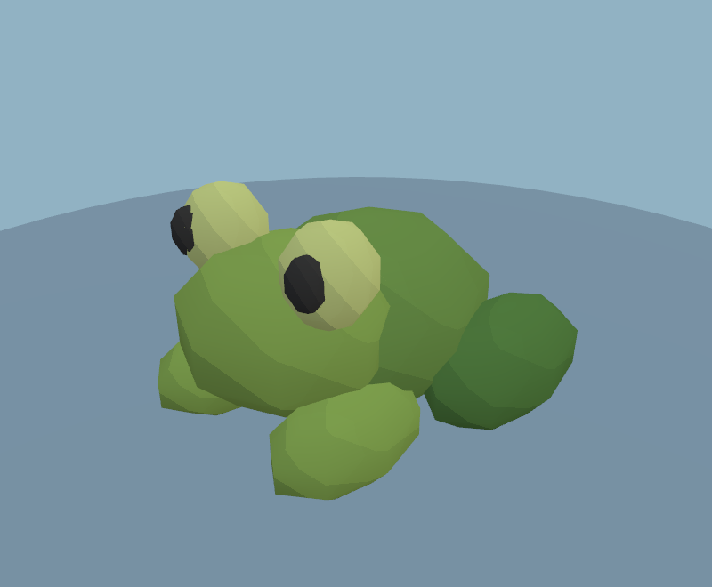
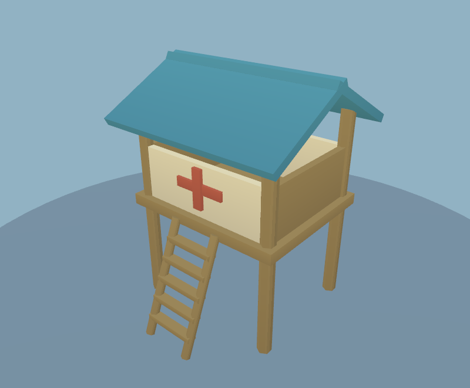
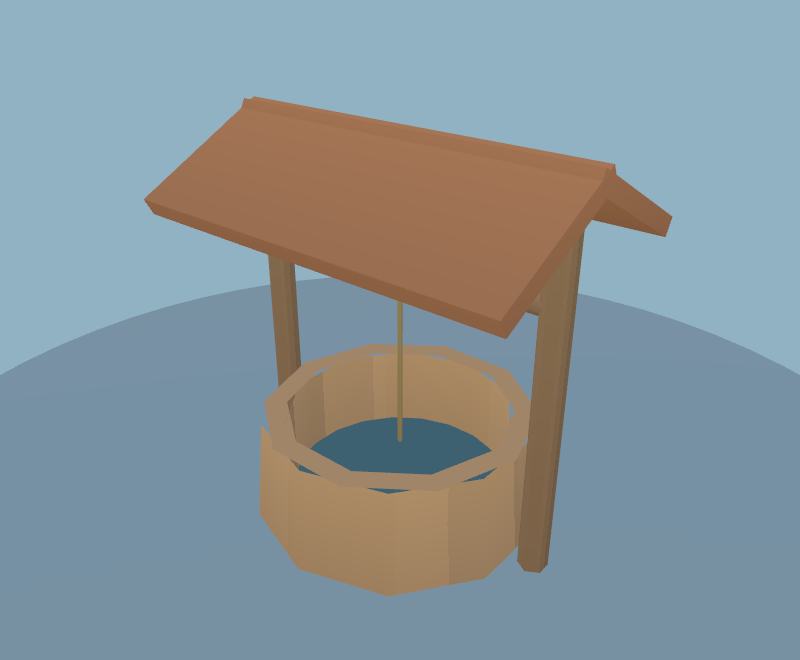
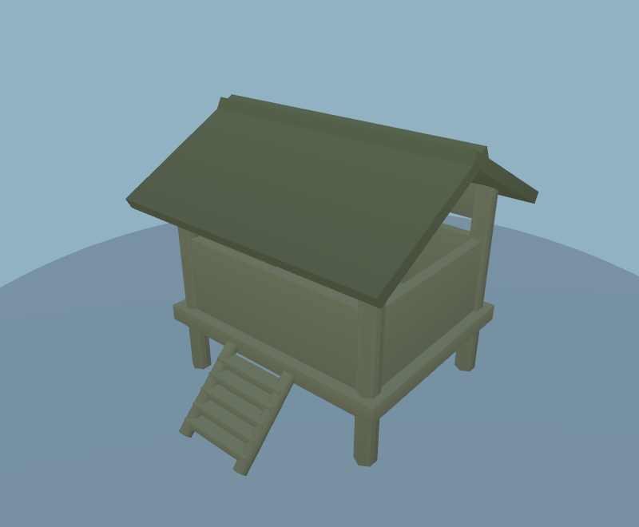
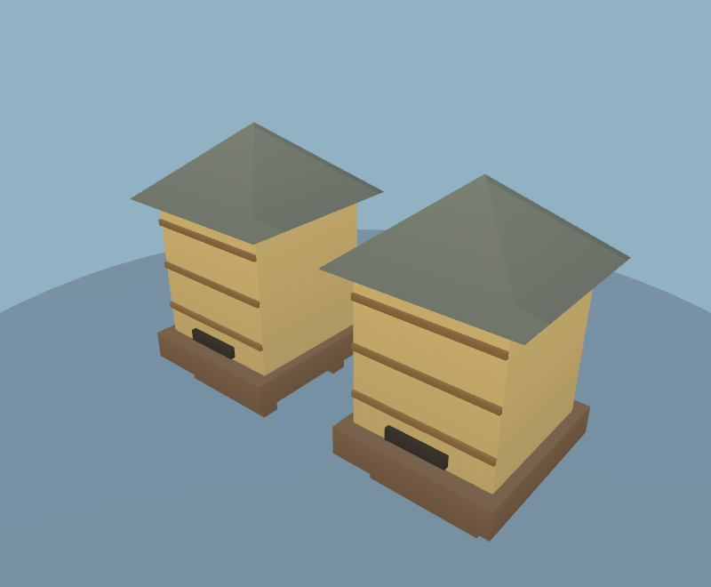

# Additional habitat animals and structures

Fourteen new procedural models expand the habitat pass at `b19f9a5`. They replace choices in the existing placement rosters; placement density, the six-flock bird ceiling and the 48 × detail ground-animation cap are unchanged. Every new model uses one vertex-coloured mesh and the existing shared material. Static structures join the spatial batches. No new textures, lights, shadow maps or animation loops.

| Habitat | Added wildlife | Added structures |
| --- | --- | --- |
| Meadow | Existing farm animals retained | Water troughs |
| Forest / autumn | Foxes, boars | Forest lookout (forest only) |
| Alpine / tundra | White hares | Stone cairns |
| Desert / mesa | Tortoises | Hollow stone wells |
| Blossom / lavender | Brown hares | Bee hives |
| Jungle | Boars, frogs | Existing huts retained |
| Savanna | Antelope | Water troughs |
| Beach | Seals | Lifeguard towers |
| Wetlands | Frogs | Bird hides |
| Volcanic | Existing vultures retained | Stone cairns |

Buildings use 80–336 triangles; animals use 528–832. The seal has a tapered torso and attached flippers; tails and antelope horns use continuous tapered surfaces. Tortoise shell facets are painted vertex colour. Wells and troughs use recessed opaque water, with no extra water renderer. Hares adopt snow or brown coats at construction time.

## Fixed-world workload comparison

Classic seed 12345, Medium, native Chrome WebGL2, 1100×700. Before `b19f9a5`; after this expansion. Total scene triangles **660,830 → 665,910 (+0.77%)**. Renderer allocation **90,072,754 → 90,658,242 bytes (+0.65%)**. Placement/RNG changes affect the whole generated world. These are resource counts, not measured GPU timings or an FPS guarantee.

| View | Triangles before → after | Draws before → after |
| --- | ---: | ---: |
| track-a | 328,703 → 328,731 | 384 → 374 |
| track-b | 258,674 → 263,822 | 224 → 239 |
| track-c | 368,604 → 367,806 | 462 → 457 |
| mountain | 263,634 → 263,912 | 223 → 218 |

The most expensive sampled view adds 15 draws; the other three reduce draws. Costs vary with biome/seed. These small increases retain most of the preceding habitat pass's resource savings. Mobile/WebGPU performance is not measured here.

## Review

Validation passed: 117 rendered assets with geometry/draw budgets; all 15 single-biome worlds plus one mixed world, with every new asset represented; gameplay smoke and web build. Native classic and beach renders were inspected.

The asset viewer exposes every model by name. `check:scenery` enforces one draw and a limit of 850 triangles per new animal / 350 per structure. Screenshots below use game materials. The full-world audit checks placement and sampled roaming transforms in all 15 biomes and a mixed map; it does not prove every possible seed or boundary.

