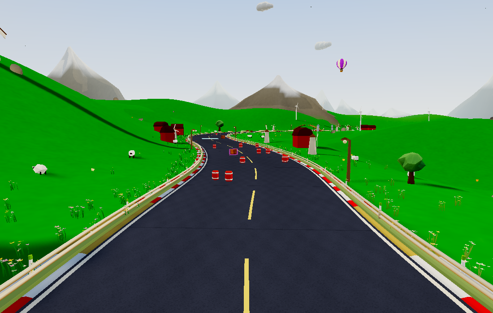
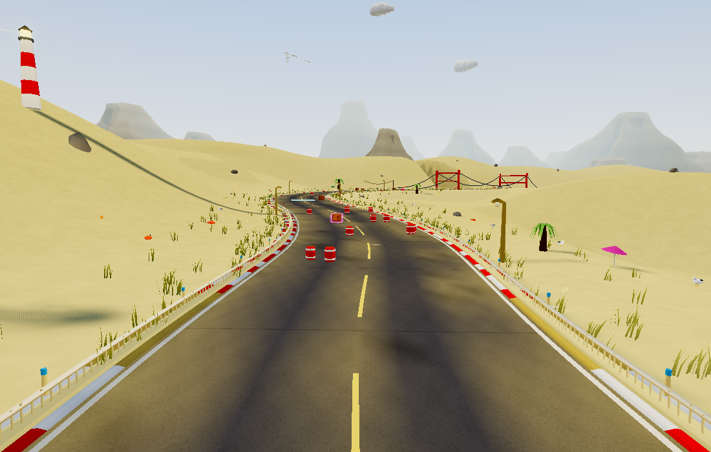
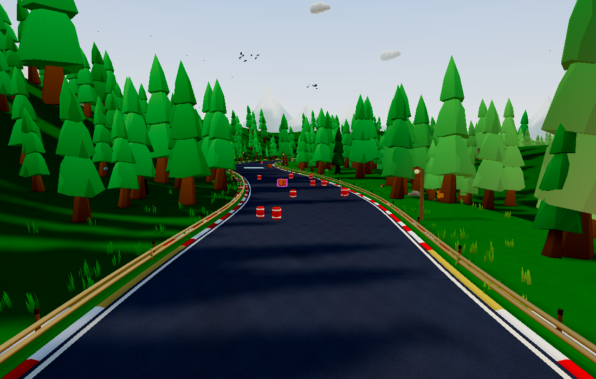
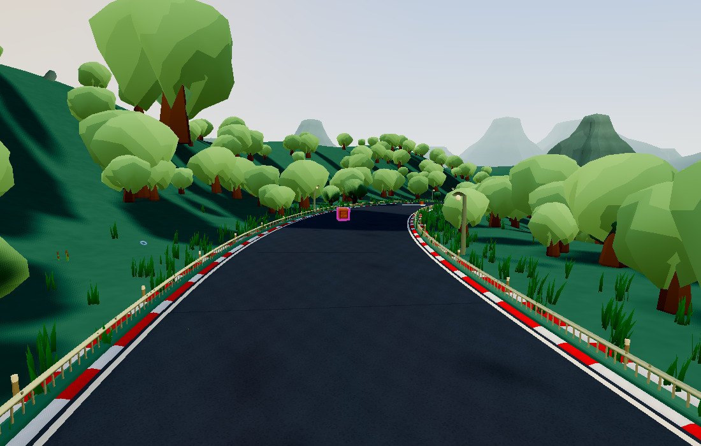
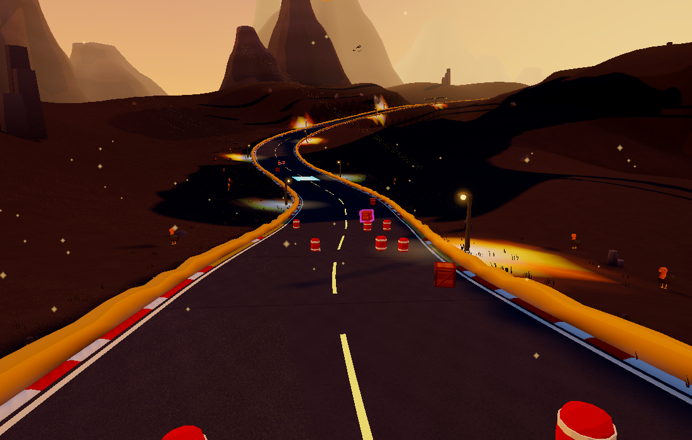
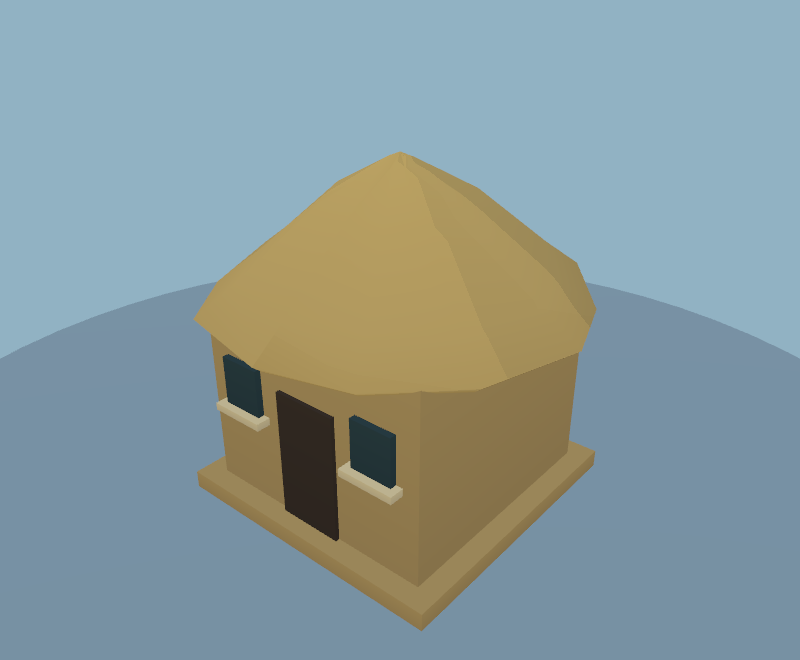
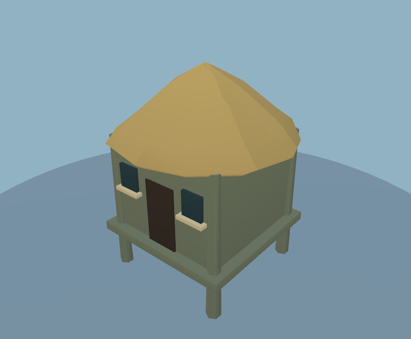
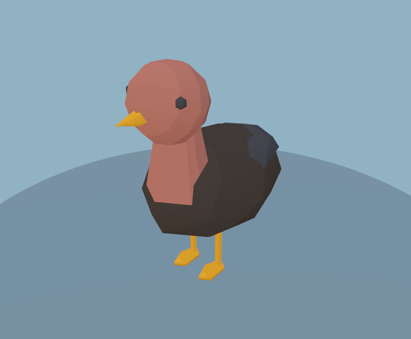

# Biome-specific scenery and wildlife

This pass follows `f538a7d`. The actual placement location now selects from an explicit habitat roster, instead of generic town/farm fallbacks. Small rural settlements leave open pasture; only cities retain dense building rows. The new buildings remain procedural and cel shaded.

## Habitat roster

| Biome | Animals and planting | Buildings and landmarks |
| --- | --- | --- |
| Meadow | Cows, sheep, grass, trees, swallows | Farmhouses, barns, hay, silos, windmills |
| Forest | Deer, conifers, bushes, logs, ravens | Cabins and giant trees |
| Alpine | Goats, conifers, rocks, ravens | Snow-roofed chalets and stone castles |
| Autumn | Deer, sheep, cows, autumn trees, swallows | Farmhouses, cabins, barns, windmill/castle |
| Desert / mesa | Cacti, vultures, dry rocks | Adobe buildings and rock spires |
| Blossom | Deer, flowering trees and planters, swallows | Pavilions, cottages, giant trees |
| Jungle | Palms, parrots, tropical bushes | Thatched huts and giant trees |
| Savanna | Acacias, goats, vultures, dry bushes | Thatched huts and giant acacias |
| Tundra | Goats, short conifers, rocks, ravens | Snow-roofed chalets and rock spires |
| City | Pigeons and planted greenery | Stores, towers, street furniture, ferris wheel/cat statue |
| Beach | Palms, crabs, gulls, dune grass | Thatched huts, parasols, lighthouse |
| Lavender | Sheep, cows, purple flowers, swallows | Farmhouses, barns, windmill |
| Wetlands | Ducks, reeds, willows, herons | Stilt huts and giant willows |
| Volcanic | Vultures, basalt, sparse ground cover | Stone ruins, rock spires, stone tunnels |

Forest/jungle/wetland dragonflies and suitable warm-biome butterflies/moths use explicit habitat lists. Cold and volcanic biomes no longer get generic nighttime moths. Lake ducks and rim goats also check the actual habitat. Beach and jungle mountain silhouettes no longer acquire snowy summits.

Landmarks cannot fall back to an unrelated structure. Landmark counts are capped per type. Pigeon lofts are city-only; balloons and festive light strings are limited to selected settled biomes. Bridge variants and stone finishes follow their biome. Flowers, pillars, turbines and billboards check their offset locations, not just the track point from which they were placed. Existing biome-specific terrain, trees, grass, leaf litter and weather systems remain in use.

Shared racing objects retain their recognizable functions: road signs carry paw/race branding, while lamps, marker posts and banners now use local finishes. No new racing mechanics or collision shapes were added.

## Movement and boundaries

The generation-time habitat checks sample a prop's footprint or a flock's flight envelope. Ground animals reject incompatible roaming targets. Flying species circle near their own habitat rather than following world-wide orbits. City pigeons startle, then circle their loft; previously they could fly indefinitely when a player remained nearby. These checks are bounded; they are not an exhaustive proof over every possible procedural seed or every point in a blended biome transition.

`src/biome-dressing.js` is the shared roster. Unknown biome names fail explicitly rather than silently receiving farm scenery. `npm run check:biomes` constructs all 15 single-biome worlds and one mixed world, checks actual placement records, advances wildlife transforms across two minutes of sampled animation phases, triggers city pigeons, and validates geometry. All 16 audited worlds pass.

## Performance

Same classic seed 12345, Medium, 1100×700, Chrome WebGL2. Before: `f538a7d`; after: this habitat pass. The world remains procedural, so changing the prop roster and RNG consumption changes some placements. This measures the resulting workload, not just isolated mesh simplification.

| View | Before triangles | After triangles | Before draws | After draws |
| --- | ---: | ---: | ---: | ---: |
| Track A | 351,703 | 328,703 | 426 | 384 |
| Track B | 275,270 | 258,674 | 285 | 224 |
| Track C | 408,025 | 368,604 | 462 | 462 |
| Mountain | 273,456 | 263,634 | 260 | 223 |

Total scene triangles: **721,759 → 660,830 (−8.4%)**. Renderer allocation: **96,270,190 → 90,072,754 bytes (−6.4%)**. This is renderer allocation, not total application memory or an FPS guarantee.

Each new habitat building is **one draw**, with 92–300 triangles. Bird populations retain the six-flock ceiling, but each occupied flying species needs its own wing/body pair: up to 12 draws across six species rather than two for a universal bird. Lamp/marker/rock tints add small per-instance colour buffers. No new textures, realtime lights, shadow maps or postprocessing passes. Roaming habitat checks happen when choosing targets, not on every animation frame.

## Validation and review

- `check:biomes`: all 15 biomes plus a mixed map; actual wildlife transforms, habitat membership and finite geometry pass.
- `check:scenery`: 103 rendered assets; existing budgets pass; new buildings have explicit triangle/draw budgets.
- `check:art`, gameplay smoke, world-config codec, deterministic simulation, item logic and web build pass.
- Full-world native renders inspected for beach, meadow, volcanic, wetland, forest and the classic comparison. The asset viewer includes huts, stilt huts, cabins, chalets, adobe buildings, pavilions, ruins, vultures, parrots and flying bird variants.
- Mobile/WebGPU playtesting and exhaustive seed coverage remain outside these measurements.

Reproduce a full-world habitat view with `PW_CHROME=/path/to/chrome NATIVE=1 DRESSING=1 BIOME=beach npm run check:landscape`. Change BIOME to any of the 15 names. Raw counts and habitat audits are committed alongside this document.

## Native GPU sample

One sequential before/after pair on Apple M3 Pro, Chrome WebGL2 at 1100×700. Median of nine batches of 20 frozen scene renders per view; gameplay, postprocessing and ambient/weather sprites are excluded.

| View | Before ms/render | After ms/render | Difference |
| --- | ---: | ---: | ---: |
| 0.06 | 0.753 | 0.660 | -0.093 ms |
| 0.38 | 0.491 | 0.535 | +0.044 ms |
| 0.72 | 0.727 | 0.732 | +0.006 ms |

This is one device/workload sample, not a full-game FPS or zero-impact claim. Both raw timing files include every batch.
