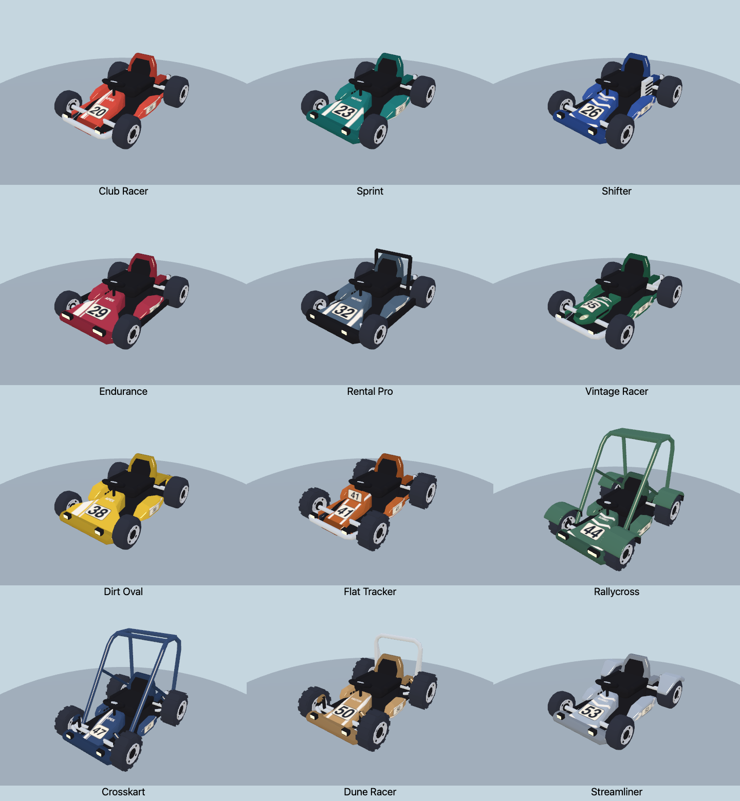
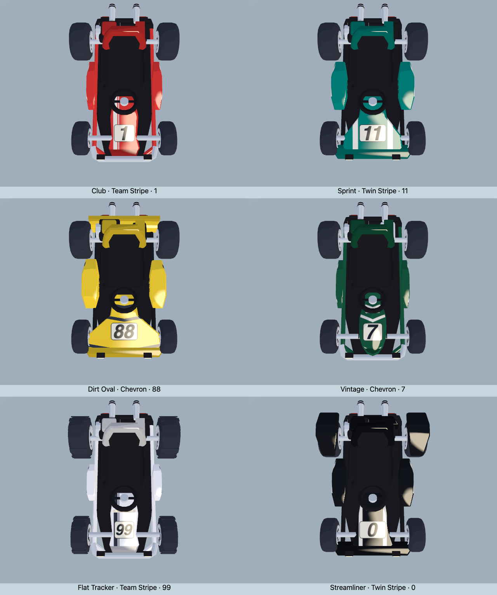

# Fitted kart liveries and centered numbers

The previous texture placed the number badge at x=161 in a 256px image, then reused it on noses, side pods and an upright plate. That shifted nose numbers off the centerline, stretched side lettering, and repeated paint over panel edges.

The revised procedural paint uses separate nose, side and plate regions in **one 256×256 texture**. Each region is drawn in the physical proportions of its panel, with UV seams that keep the side number on the outer face. Body shapes and geometry budgets remain unchanged.



[Before](before.png) · [After](after.png) · [Centered numbers from above](numbers-top.png) · [Left sides](numbers-left.png) · [Right sides](numbers-right.png).

## Changes

- Nose badges now sit on the chassis centerline, sized to fit both narrow and broad fairings. Numbers are optically centered using actual glyph bounds, so 1, 7, 11 and 88 stay balanced despite different character widths and italic overhang.
- Side badges have their own compact layout and a planar projection. Lettering stays straight instead of stretching with each row of the tapered side pod. Both sides read correctly, including the taller panel on Dirt Oval.
- Flat Tracker's upright plate has a dedicated centered layout. Number paint does not repeat over its edges or back.
- Team Stripe keeps its intentional offset racing stripe, while the number stays centered. Twin Stripe is balanced around the badge; Chevron has clean, symmetrical marks. Side graphics frame the number instead of carrying a distorted copy of the hood design.
- Badges use a cream field and dark border with consistent padding. Light body colors receive dark stripe graphics; dark colors keep light stripes. Small team lettering is centered above the badge, clear of the narrowing tip and front bumper.
- Paint on top faces, side faces and end caps is explicitly separated, avoiding folded number fragments and smeared logos.



## Cost and validation

- **Identical triangle and material-batch counts for all 34 presets on both renderers**: 68 before/after comparisons. New chassis remain at 6,208–8,508 triangles and 20–21 batches. [Raw metrics](metrics.json).
- Existing geometry is given appropriate UV seams, with no added triangles, decal meshes, rendering passes, lights, animation work or texture lookups. One opaque 256×256 paint texture remains attached to the existing livery material.
- Paint is generated once and cached by color, livery, number and panel dimensions. Matching proportions reuse materials across chassis; different proportions can retain additional cached paint variants when browsing the garage. The cache retains the existing 64-entry limit.
- All 34 presets render on native WebGL and WebGPU; 216 geometry/material/rig combinations pass. Eighteen additional native WebGPU views inspect 0, 1, 7, 11, 88 and 99 from above and both sides, across all three liveries and light/dark colors.
- All 24 new catalog portraits are refreshed; the original ten remain byte-identical. Roster/save checks and the web build pass.

[Atlas layouts](atlases.png) show the precompensated drawings: side letters intentionally look narrow in texture space and return to their correct proportions on the broad, shallow side panels.

```sh
npm run check:kart-roster
npm run build:web
PW_CHROME='/Applications/Google Chrome.app/Contents/MacOS/Google Chrome' OUT=/tmp/zoomies-kart-liveries npm run check:kart-roster-art
```

## Full-race sample

Sequential native Chrome / WebGPU High runs on an Apple M3 Pro at 1100×700, six Rallycross karts, seeded meadow `RUNTIME`, eight seconds of warmup and 40 seconds / 2,400 frames per run. The baseline serves the paint/shell module from `5d04fd1`; both runs use the same game code.

| Measurement | Before | New paint |
| --- | ---: | ---: |
| Mean FPS | 60.00 | 60.00 |
| 1% low FPS | 59.52 | 59.52 |
| p99 frame, ms | 16.8 | 16.8 |
| Worst frame, ms | 16.8 | 16.8 |
| Median CPU callback, ms | 5.1 | 5.0 |
| p99 CPU callback, ms | 6.7 | 6.6 |
| Mean scene draws | 547.3 | 578.9 |
| Renderer textures  | 59 | 59 |
| Renderer programs  | 293 | 293 |
| Renderer total (bytes) | 211,519,259 | 211,521,653 |

These refresh-limited desktop samples show no observed FPS regression, but do not establish a mobile/thermal guarantee or speedup. Race positions, sun state and visible scenery differ; scene draws and renderer allocation are whole-game snapshots, not isolated livery costs. Neither run reports browser errors.

[Summary](race-summary.json) · Raw frames: [before](race-before.json.gz), [after](race-after.json.gz).

```sh
git show 5d04fd1:src/racing-karts.js > /tmp/zoomies-before-livery.js
BIOMES=meadow QUALITIES=high BACKEND=webgpu SECONDS=40 KART_STYLE=13 RACING_KARTS_FILE=/tmp/zoomies-before-livery.js OUT=/tmp/zoomies-livery-perf-before node tools/race-perf.mjs
BIOMES=meadow QUALITIES=high BACKEND=webgpu SECONDS=40 KART_STYLE=13 OUT=/tmp/zoomies-livery-perf-after node tools/race-perf.mjs
```
