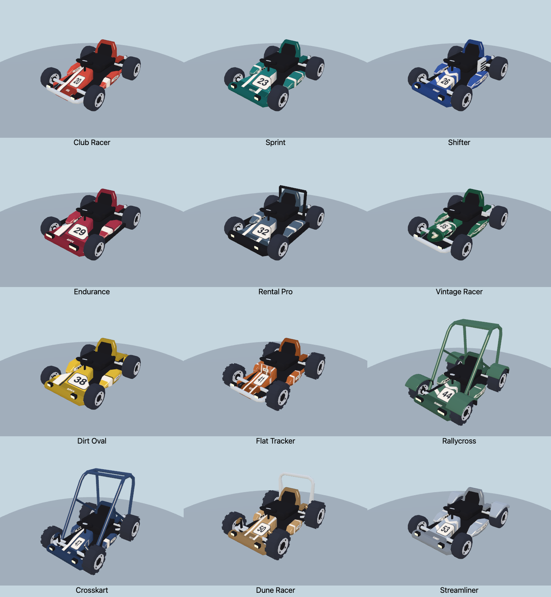

[Latest paint and number-placement pass](../kart-liveries/README.md). The views below record the preceding shape refinement.

# Racing-kart refinement pass

Refine all twelve new procedural chassis and their 24 team editions. The cel-shaded materials, racing behavior, unlocks, saved IDs and original ten karts remain unchanged.



[Before](before.png) · [After](after.png) · [Rear](after-rear.png) · [Side](after-side.png) · [Driving with a tall accessory](after-driver.png) · [Custom creator](creator.png).

## Shape and finish

- Tapered bucket-seat backs, fitted dark padding and smaller side bolsters replace square seat slabs. The back shell picks up the chassis color, and seat supports connect to the floor.
- Noses have shaped shoulders and integrated lower lips; side pods taper at both ends. Broader bumpers curve toward their shoulders, with rounded tubular bumpers on exposed-frame designs.
- Rallycross and Crosskart cages have swept, rounded shoulders and mounted feet. Dune Racer's rear hoop has rounded corners. The upper envelope retains clearance for cats and tall hats.
- Rallycross's rolled fenders follow each tire instead of sitting above it as flat shelves. Integrated mud flaps and supports remain. A sampled sweep of 47,040 fender-surface/steering cases found no tire penetration at front-wheel yaw angles −0.55, −0.275, 0, 0.275 and 0.55 radians, including a 0.01-unit tire margin.
- Sculpted rim lips frame recessed wheel centers and lug heads. Rear engine fan housings, chain guards and a continuous rear bumper make mechanical parts read more clearly; tail-light housings attach to that bumper.
- Livery number panels have crisp borders, with painted pinstripes and fasteners. Light-colored bodies receive dark racing stripes for better contrast. Texture dimensions remain 256×256, and markings add no separate meshes.

## Geometry and runtime cost

Every chassis keeps its previous **20–21 material batches**. The revised bodies use **6,208–8,508 triangles**, including hidden effects meshes and excluding the cat. The original GP uses 10,804 triangles: the refined models remain **21–43% smaller** by triangle count.

The new curves add geometry, particularly on cages and fenders. Simpler flat geometry on tiny brackets, cooling fins and inset trim offsets much of that cost. Relative to the first pass, Shifter saves 188 triangles and Vintage Racer saves 272; other models add 100–916. Rallycross, the largest new model, adds 596. [Per-chassis comparison](budgets.md) · [Raw budgets](budgets.json) · [All 68 rendering measurements](metrics.json).

There are no new frame loops, material batches, texture maps, lights, transparent passes or physics bodies. Geometry remains cached per chassis and wheel type; materials and painted liveries remain shared.

## Full-race comparison

Sequential native Chrome / WebGPU High runs on an Apple M3 Pro at 1100×700, with six Rallycross karts (the largest new model), seeded meadow `RUNTIME`, eight seconds of race warmup and 40 seconds / 2,400 measured frames. Baseline: `0552b9a`, immediately before this refinement.

| Measurement | Before | Refined |
| --- | ---: | ---: |
| Mean FPS | 60.00 | 60.00 |
| 1% low FPS | 59.52 | 59.52 |
| p99 / worst frame, ms | 16.8 / 16.8 | 16.8 / 16.8 |
| Median CPU callback, ms | 5.2 | 5.1 |
| p99 CPU callback, ms | 6.7 | 6.8 |
| Mean scene draws | 583.4 | 569.9 |
| Renderer textures / programs | 59 / 293 | 59 / 293 |
| Reported renderer allocation, bytes | 211,479,835 | 211,529,079 |
| Browser errors | 0 | 0 |

The allocation difference is **48.1 KiB**. There is no observed frame-rate regression in this sample. These refresh-limited desktop runs do not prove a speedup or mobile/thermal performance; race position, sun state and visible scenery vary, so the whole-scene draw reduction is not attributed to the model refinement. Renderer accounting excludes other browser/process memory.

[Summary](race-summary.json) · Raw frames: [before](race-before.json.gz), [after](race-after.json.gz).

Reproduce the race measurement on each revision, with other visual probes closed:

```sh
BIOMES=meadow QUALITIES=high BACKEND=webgpu SECONDS=40 KART_STYLE=13 OUT=/tmp/zoomies-kart-refine-perf node tools/race-perf.mjs
```

## Checks

- All 34 presets render on native WebGL and WebGPU, with front/rear/side/top and driving-pose inspection.
- 216 chassis/livery/color/backend combinations pass finite-geometry, material-group, shared-geometry, independent brake/boost and grounded-wheel checks.
- The art suite now enforces a tighter limit of **9,000 triangles and 21 batches** for the new chassis.
- Original kart geometry and batch counts are unchanged, and regenerated original catalog thumbnails remain byte-identical. All 24 new thumbnails have been refreshed.
- Native garage checks pass all 17 body choices, livery editing, desktop/phone controls, legacy/new save reload and racing. [Results](ui-results.json).
- Roster/save migration checks, web build and whitespace checks pass.

```sh
npm run check:kart-roster
npm run build:web
PW_CHROME='/Applications/Google Chrome.app/Contents/MacOS/Google Chrome' OUT=/tmp/zoomies-kart-refined npm run check:kart-roster-art
PW_CHROME='/Applications/Google Chrome.app/Contents/MacOS/Google Chrome' npm run check:kart-roster-ui
```
