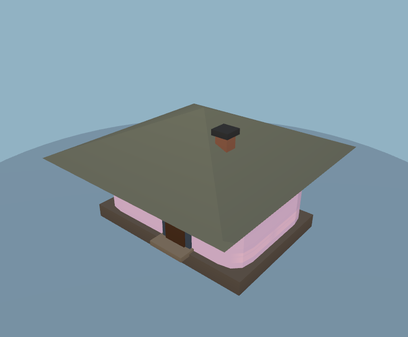
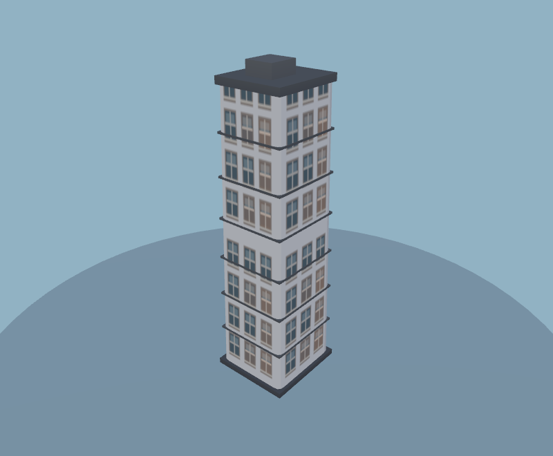
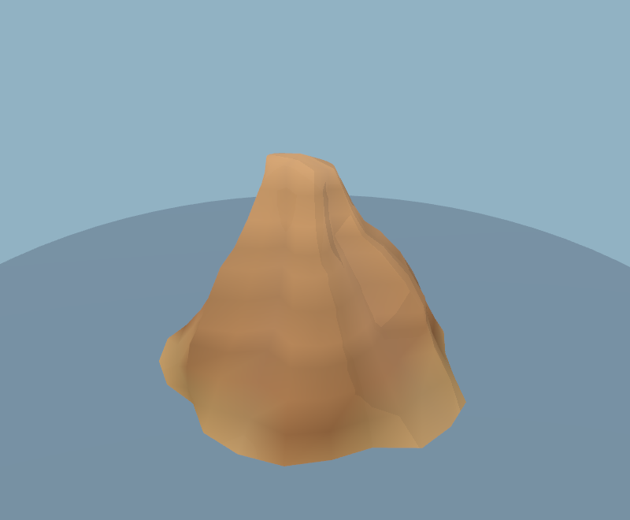
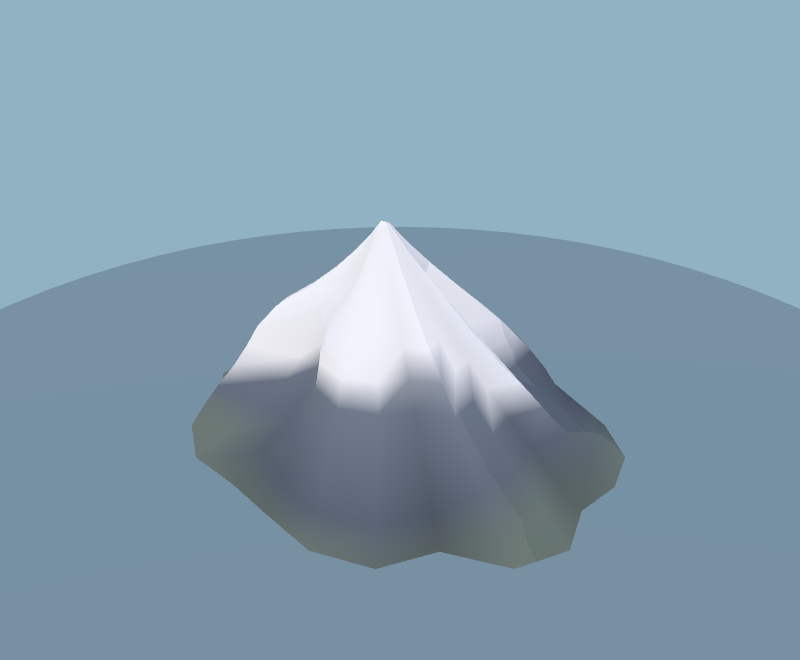
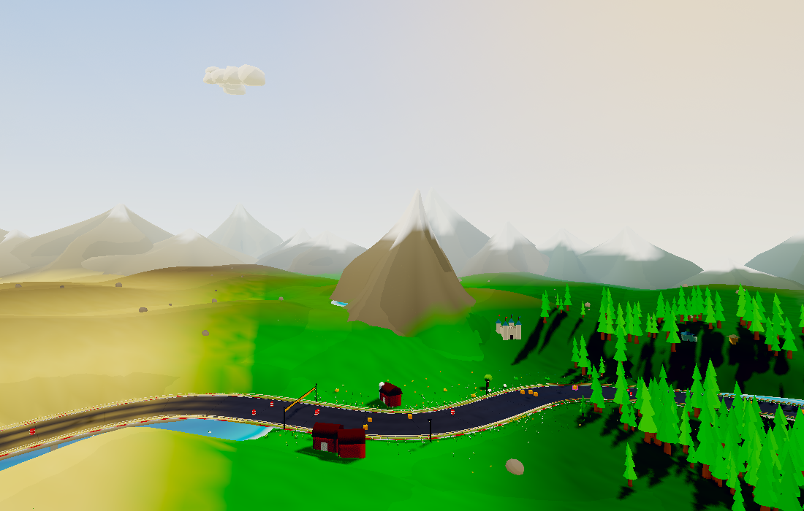
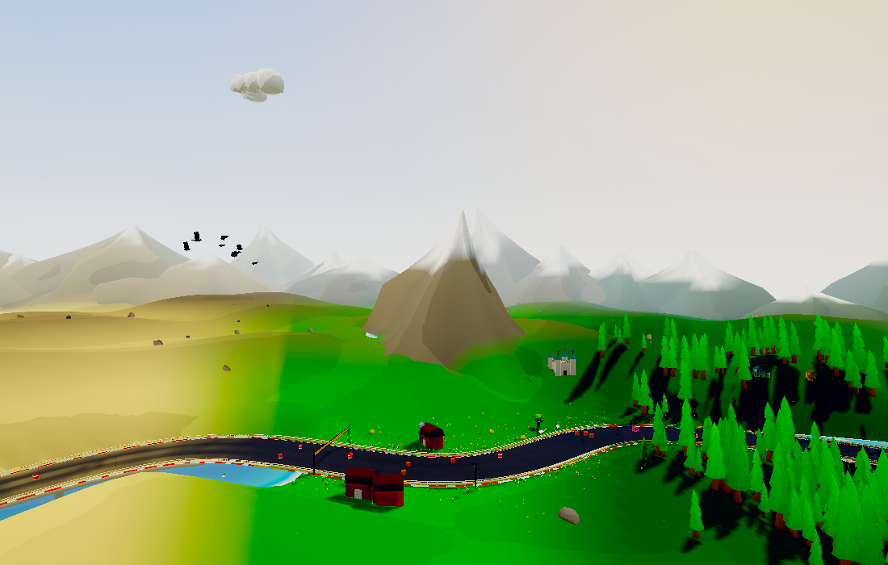
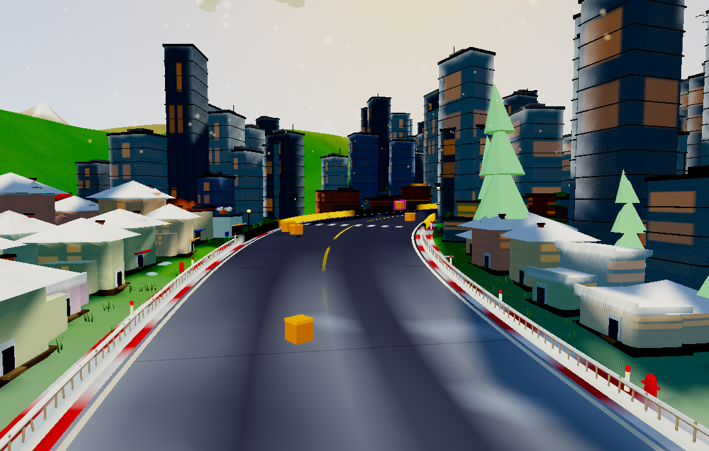
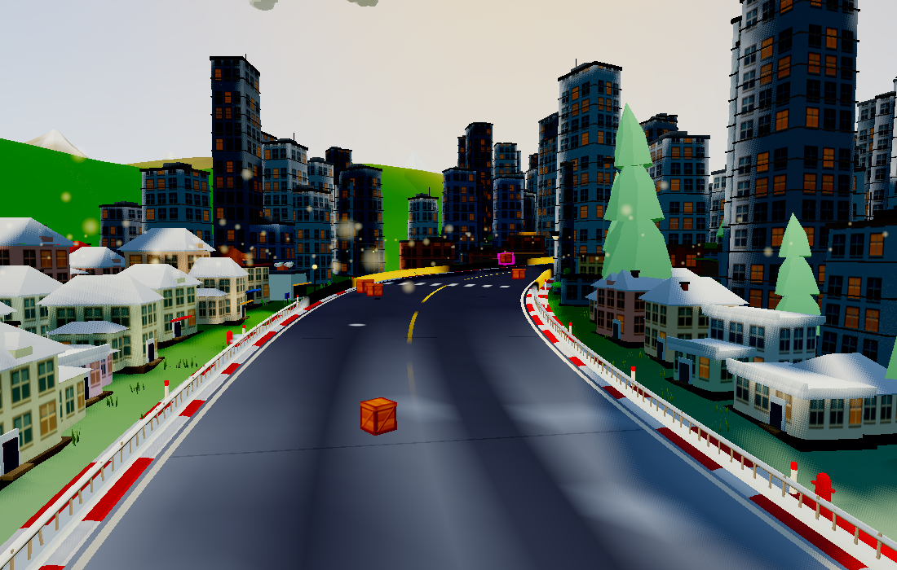

# Landscape polish and rendering savings

This pass extends the procedural art refresh to mountain shapes, building
silhouettes, facades, and the terrain's painted colours. It also reduces
geometry in the existing scenery. Everything remains generated in code.

- Mountains use broader facets, offset shoulders, cool recessed rock shading,
  and wider dry-biome summits with sandstone bands. Snow and foothill colours
  remain part of the same surface. Each peak drops from 868 to 504 triangles
  (42% fewer), preserving sector culling and the terrain-conforming skirt.
- Village roofs now fit the building footprint, with a long hip ridge instead
  of oversized pyramid roofs. Side wings receive their own fitted roofs.
- Tower walls, floor bands, and crowns taper together. Facade UVs map per wall
  and per storey, with painted windows that remain readable in daylight.
  The new facade is one shared 64×80 procedural canvas texture; night windows
  retain the existing emissive map. Building batches are unchanged.
- Terrain colour uses broad flowing patches rather than independent vertex
  noise. Heights, road layouts and collision data stay the same.
- Small rounded scenery shapes use one bevel subdivision instead of two:
  108 rather than 300 triangles per rounded box (64% fewer). Animal and prop
  renders were reviewed with the game's toon materials.

The same 79 scenery catalog entries fall from 206,131 to 193,463 triangles
(6.1% fewer) versus the previous scenery pass. Three mountain previews bring
the new catalog to 82 entries; each mountain is limited to 504 triangles and
one material batch by `check:scenery`.

| Previous scenery pass | Updated building |
| --- | --- |
|  |  |

| Tapered city tower | Dry mountain | Alpine mountain |
| --- | --- | --- |
|  |  |  |

## Whole-update resource comparison

The table below compares original main (`0d0198a`) with the complete graphics
branch, including cats, karts, vegetation, animals, props, and this landscape
pass. The harness uses seed 12345, Medium quality, 1100×700, WebGL2, and four
fixed cameras. The title world is used to keep placement and cameras identical;
this does not measure a six-kart race workload.

| View | Original triangles | Updated triangles | Change | Draw calls (original → updated) |
| --- | ---: | ---: | ---: | ---: |
| track-a | 387,094 | 384,632 | -0.6% | 424 → 425 |
| track-b | 304,420 | 291,906 | -4.1% | 292 → 292 |
| track-c | 480,082 | 470,908 | -1.9% | 516 → 513 |
| mountain | 281,566 | 276,366 | -1.8% | 249 → 250 |

Total scene triangles: **814,430 → 797,270 (−2.1%)**. Renderer-reported
allocation: **101,460,561 → 99,511,543 bytes (−1.9%)**. Textures: **49 → 51**
(the shared crate and facade canvases).

[Original counters](before-metrics.json) · [Updated counters](after-metrics.json).
The original run flags seven meshes missing vertex colours; the updated run
flags none. The baseline command still writes the comparison artifacts but
returns a failing status for that pre-existing validation issue.

| Original main | Complete graphics update |
| --- | --- |
|  |  |
|  |  |

These are geometry, submission and renderer allocation counts, **not a hardware
FPS benchmark**. The browser runs SwiftShader. Lower geometry reduces rendering
work, but FPS also depends on pixel shading, shadows, post-processing, device,
and scene. The new facade texture adds a texture sample to building surfaces.
Native GPU frame pacing and WebGPU/iOS still need a device test drive.

The separate kart checks retain the original 49–57% geometry savings per kart.
No extra lighting, post-processing passes, particles or per-frame animation
loops were introduced.

## Reproduction and checks

```sh
PW_CHROME=/path/to/chrome OUT=/tmp/landscape npm run check:landscape
PW_CHROME=/path/to/chrome ART_ROOT=/path/to/original-checkout OUT=/tmp/before npm run check:landscape
PW_CHROME=/path/to/chrome OUT=/tmp/catalog npm run check:scenery
```

`check:landscape` renders the four views and records resource counts, finite
geometry and required colour attributes. `check:scenery` renders all 82 assets
and enforces geometry/material budgets. `check:art`, gameplay smoke (`check`),
world-config and simulation checks, and the web build pass.
