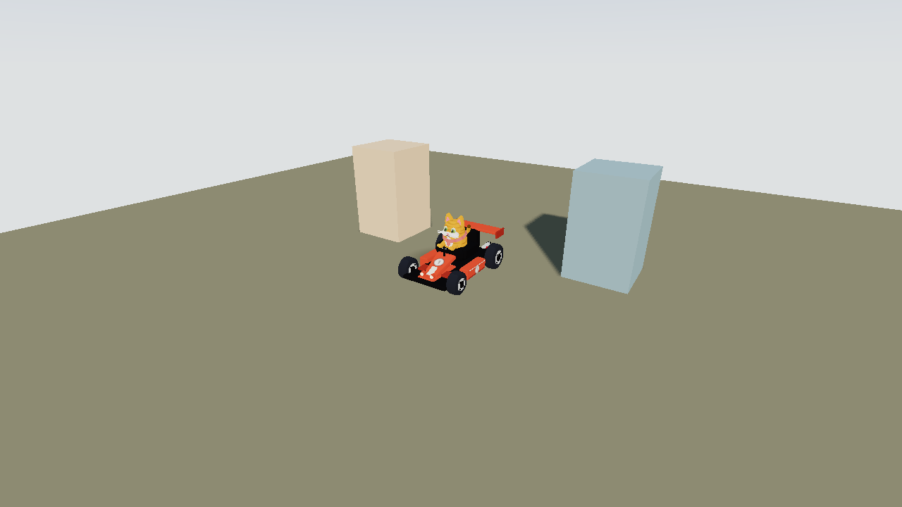
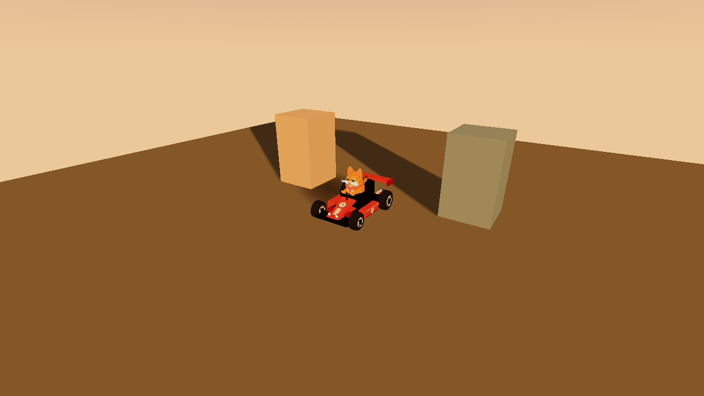
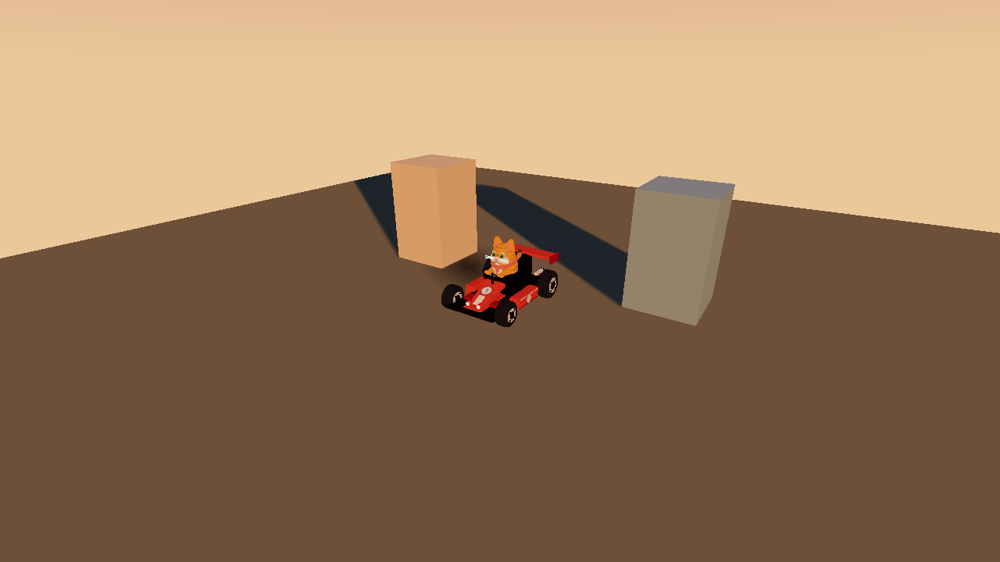
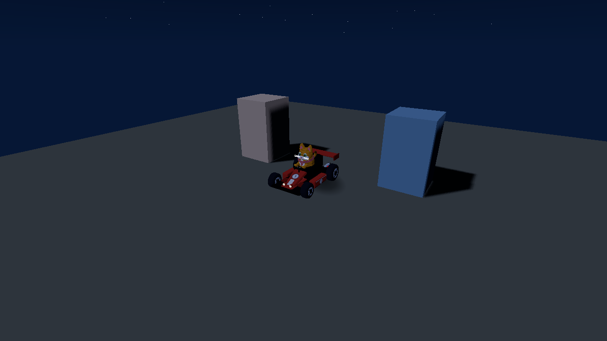
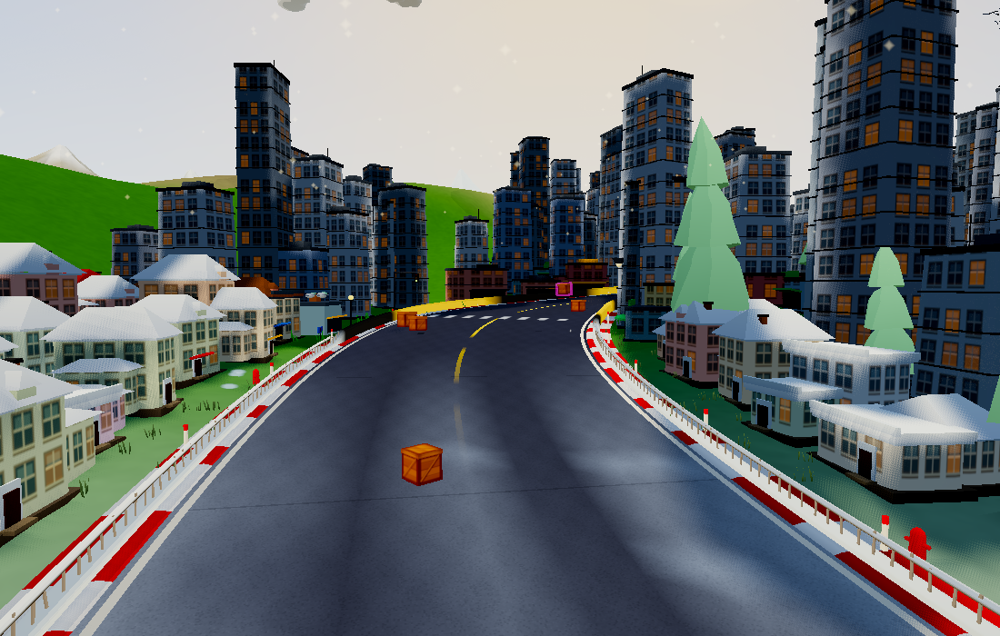

# Lighting and contact shadows

Retune the existing sun/moon and hemisphere fill to separate warm direct light
from cooler sky light, with more neutral ground bounce. Sunset shadows no
longer inherit the same orange cast as the sun. Night gets gentler contrast
and more ambient fill. The existing colour grade uses less saturation and a
small shadow lift while preserving the four-band cel shading.

The shared 64×64 contact-shadow mask has a firmer centre and a lighter
penumbra. Its size, gradient-stop count, quad footprint and sampling are
unchanged, including the existing hop behaviour.

Weather uses the existing dynamic formulas: rain reduces sunlight shafts and
rim light more strongly, wet weather lowers exposure a little further, and
lightning flashes are less likely to bleach detail. These are coefficient
changes, with no new per-frame operations.

## Rendering budget

This pass changes only light/grade constants and existing texture gradient
values. It adds no lights, passes, samples, buffers, textures or geometry.
Shadow-map resolution, filtering, caster lists and update scheduling are
unchanged: lower tiers retain cached scenery shadows and kart contact quads;
High retains its existing movement-gated shadow updates (at most 30 Hz).

Compared with `1604a9c`, the fixed full world retains **797,270 scene triangles**,
**52 textures** and **100,464,040 bytes** of renderer allocation. Animated
particles produce small differences in individual snapshot draw/triangle
counts; these are not additional lighting work. The isolated lighting fixture
uses a fixed seed and the same camera for all three moods.

Resource counts establish the unchanged workload, not a measured zero-FPS
impact on every device. No more expensive dynamic-shadow technique is enabled.
Hardware WebGPU/iOS frame pacing still needs device playtesting.

## Visual comparisons

These isolated fixtures use the actual scene lights, procedural kart and
contact mask, without the full game's post-processing grade.

| Mood | Before | After |
| --- | --- | --- |
| Midday |  |  |
| Sunset |  |  |
| Night |  |  |

Full game, including its grade:

Validation: three mood fixtures, four full-world views, gameplay smoke with no
browser errors, simulation checks and web build. Raw results:
[before fixture](before-metrics.json), [after fixture](after-metrics.json),
[world counters](world-metrics.json).
