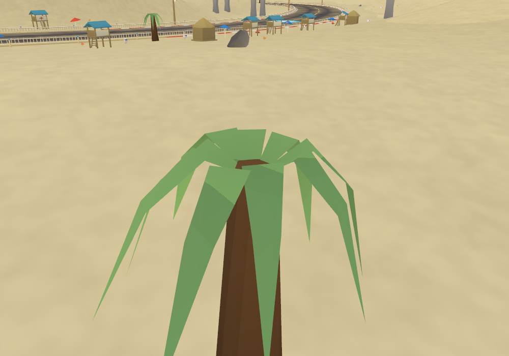
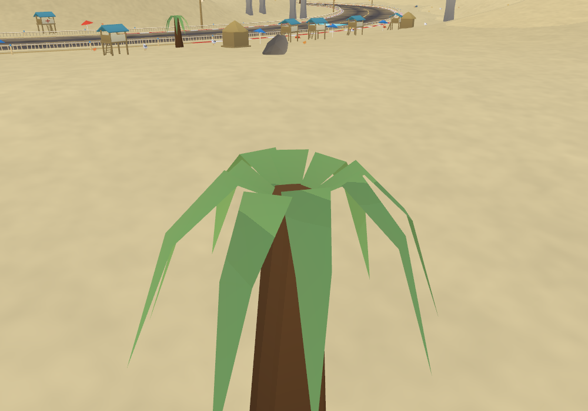
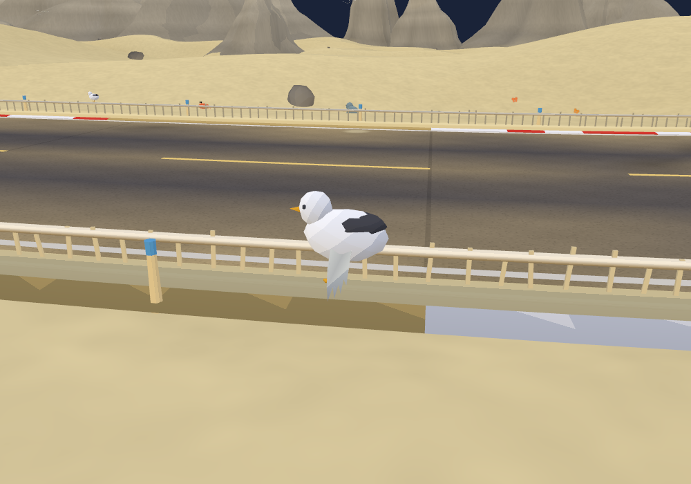
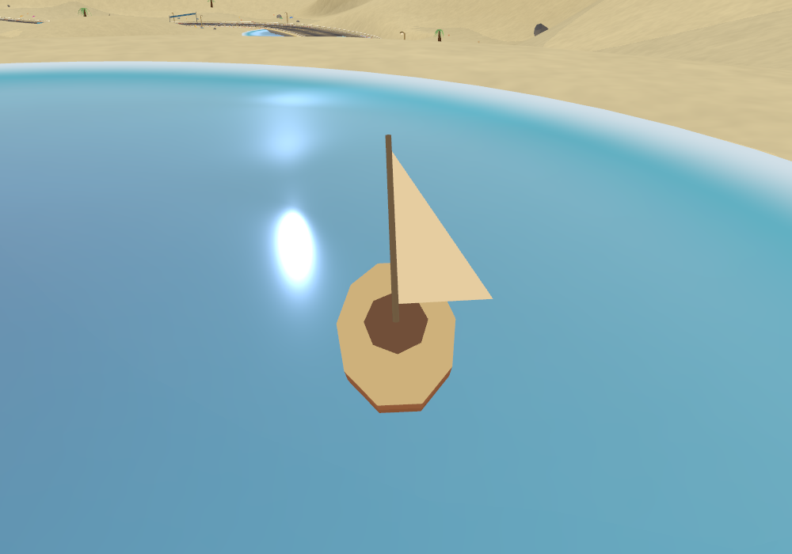
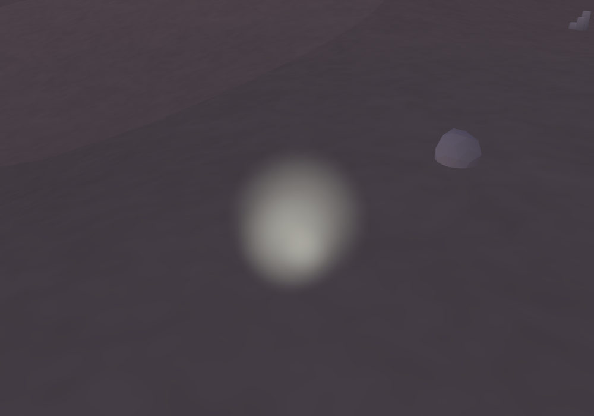
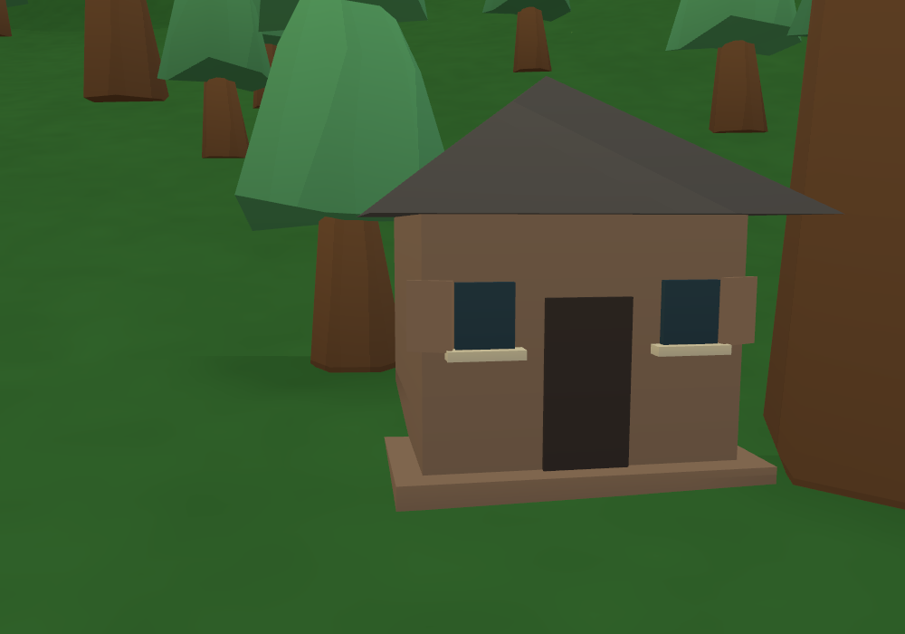
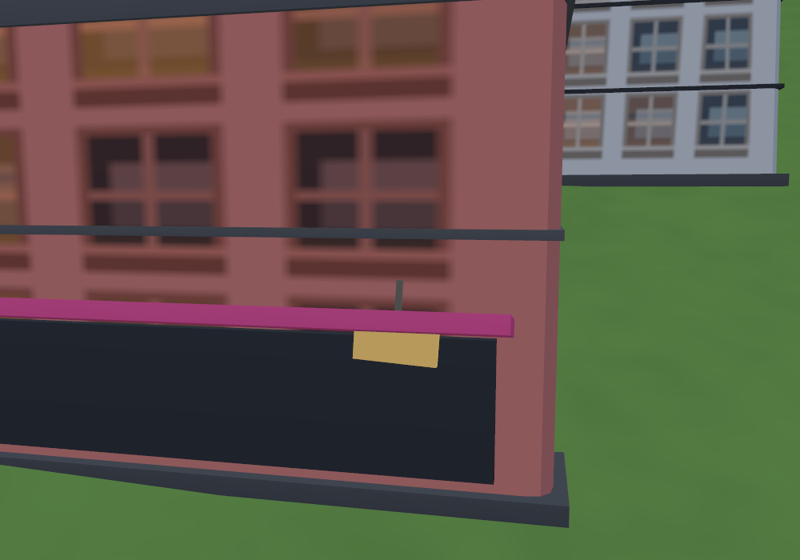

# Living procedural scenery

Comparison baseline: `09de95b`, immediately after the road-clearance fix. This pass adds motion and reactions within fixed budgets, retaining the procedural cel-shaded art and existing habitat rosters.

## What moves

- Trees have shape-specific wind response: firmer pines, softer blossom and drooping palm tips. Palm crowns stay attached to their trunks. Grass, reeds, flowers, loose leaves, cloth and wind-driven props share the travelling gust field and clock.
- Banners, bridge flags, selected market canopies, parasols and boat sails flex with pinned attachment weights. Windmill sails respond to gust strength; selected cottage/desert shutters and shop signs gently swing. String-light idle sway follows the same wind while retaining its existing kart wake.
- The existing grass reaction reaches slightly farther from the kart. Ground leaves follow the wind and retain their pooled wake trail. A corrected local-coordinate calculation stops distant leaves from receiving oversized idle displacement; reducing wake-history taps from 12 to 8 offsets some shader work.
- Ground animals pause, forage, watch nearby racers and briefly flee. Hares hop faster; gulls and parrots make a short flapping takeoff. Reactions have hysteresis so a parked kart does not trigger them every frame. These are simple procedural poses, not skeletal animation.
- Existing sky flocks occasionally bank and swoop inside their original horizontal habitat orbit. Beach/wetland sailboats follow validated water circuits. Volcanic steam makes staggered short bursts, using soft circular billboards that drift with the wind.

Kart exhaust/boost particles retain their round glow treatment. No new race physics, downloaded art, realtime lights or shadow maps.

## Fixed costs and culling

| Feature | Ceiling / implementation |
| --- | --- |
| Wind on existing vegetation | Vertex shader; weights baked once; no per-tree CPU loop or added foliage triangles |
| Hinged/flexible roadside details | 8 live detail meshes, at most 2 decorated examples per kind; nearby hinges only within 150 units |
| Bridge flags | 2 flags worldwide; pole + cloth, 4 draws total |
| Ground wildlife | Existing detail-scaled animal cap and distance gate; up to 2 small extra wing meshes per eligible gull/parrot, hidden when grounded |
| Sky wildlife | Existing 6-flock ceiling and half-rate instance uploads |
| Sailboats | 2 worldwide; 133 triangles and 2 draws each; update at most 12.5 Hz, visible within 320 units |
| Steam | 2 vents, 6 pooled puffs each; 24 triangles / 1 draw total; no texture; 7-second bursts every 38 seconds, visible within 260 units, at most 12.5 Hz uploads |

Animated pieces are detached before static building/prop batching. The remaining structures keep their existing batches. Event placement and animal behaviour use their own seeded random streams, leaving the world's generation stream intact. Boat placement uses bounded attempts with water, habitat and road clearance checks. Not every generated world has suitable water or every animated prop.

## Measured workload

Classic seed 12345, Medium, 1100×700, native Chrome WebGL2:

| Resource | Before | After |
| --- | ---: | ---: |
| Total scene triangles | 665,910 | 666,086 (+0.026%) |
| Scene mesh/material batches | 1,006 | 1,016 |
| Renderer allocation after the view tour | 90,658,242 bytes | 90,760,689 bytes (+0.113%) |
| Draws: track A / B / C / mountain | 374 / 239 / 457 / 218 | 376 / 243 / 463 / 218 |

[Before resource counts](before-world.json) · [After resource counts](after-world.json). This fixture contains no new boats or steam; their explicit ceilings are above. Counts are workload measurements, not an FPS claim.

### Native timing comparison

Apple M3 Pro, ANGLE Metal, native Chrome WebGL2, 1100×700. Sequential baseline/current runs; nine batches of 20 renders per view, median batch-average GPU time. Wind and cameras are frozen. The timing workload excludes post-processing, gameplay simulation and ambient sprite fields, so its draw counts differ from the full-world tour.

| GPU scenery view | Before | After | Change |
| --- | ---: | ---: | ---: |
| Track A | 0.648 ms | 0.703 ms | +0.054 ms |
| Track B | 0.567 ms | 0.503 ms | −0.064 ms |
| Track C | 0.732 ms | 0.697 ms | −0.035 ms |

The CPU probe separately times the existing `world.update` controller, nine batches of 600 updates at a simulated 60 Hz:

| CPU scenery update | Before | After |
| --- | ---: | ---: |
| Nearby kart / distance gating | 0.0127 ms | 0.0145 ms |
| Whole world / menu mode | 0.0128 ms | 0.0172 ms |

These short measurements include normal run-to-run GPU variation. They show a small cost on this desktop; they do not establish a universal speedup or mobile/WebGPU frame-rate guarantee. CPU figures exclude racing physics, rendering and separately updated kart wakes/string lights. [Raw baseline batches](before-timings.json) · [Raw current batches](after-timings.json).

Reproduce with `ART_ROOT=/path/to/baseline OUT=/tmp/before node tools/scenery-perf.mjs`, then `OUT=/tmp/after node tools/scenery-perf.mjs`. Set `PW_CHROME` if Chrome is not at the default macOS path.

## Validation

- `check:living`: eight representative biome worlds, 900 consecutive updates each (90 simulated seconds), exercising actual controllers, kart reactions, takeoff, habitat membership, finite poses, distance gating, fixed budgets and pinned palm roots. Actual game materials compile and render without browser errors. Beach, city and volcanic scenes were rechecked after final visual corrections. [Motion audit](motion-audit.json).
- `check:scenery`: 118 rendered catalog assets pass geometry/material budgets, including the new sailboat. [Asset audit](asset-audit.json).
- `check:biomes`: all 15 single-biome worlds and one mixed world pass their habitat audits. [Habitat audit](habitat-audit.json).
- `check:terrain`: all 15 road-clearance regression tracks retain zero sampled terrain/mountain overlaps at 465,165 road samples. [Clearance audit](clearance-audit.json).
- Gameplay smoke reported no errors; its browser teardown stalled after reporting, so the completed probe was terminated. Web build passes. Software-rendered smoke-test FPS is not used as performance evidence.

## Rendered examples

Pinned palm crown at two wind phases:

| Phase 2 | Phase 7 |
| --- | --- |
|  |  |

Use the preview track maker to choose a biome. Drive near roadside wildlife, watch palms and banners through a gust, or select wetlands/beach for boats and volcanic for occasional steam. The asset viewer also includes the sailboat.
