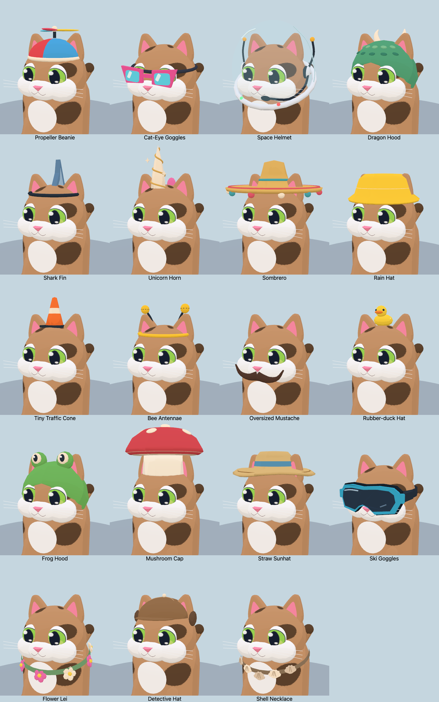

# Nineteen new procedural accessories

All 19 requested accessories are available in the Custom Cat studio and asset viewer, with color swatches and save/load support. Existing accessory IDs and ordering are unchanged. The complete wardrobe now has 40 wearables plus “None”; the new pieces use the existing Custom Cat unlock.

[Side views](side.png) · [Rear views](back.png) · [In a kart](driving.png)

| Accessory | Detail and movement |
| --- | --- |
| Propeller Beanie | Four colorful cloth panels; three rotor blades spin faster with actual kart speed. |
| Cat-Eye Goggles | Swept retro frames, turquoise lenses and baked reflection streaks. |
| Space Helmet | A fitted transparent bubble, opaque glints, antennae, a headset with one boom mic, collar seal and blinking status lights. |
| Dragon Hood | Raised scales, curved ivory horns and a tail that flutters and responds to turns. |
| Shark Fin | Two-tone swept fin on a brow strap. |
| Unicorn Horn | Raised golden spiral, five-color mane and two pulsing glints. |
| Sombrero | Wide brim, colorful bands and a pom-pom trim that tilts/bounces in turns. |
| Rain Hat | Yellow fisherman-style crown and downward-sloping brim. |
| Tiny Traffic Cone | Small orange cone, pale reflective stripe and dark base. |
| Bee Antennae | Curved dark feelers, striped yellow tips and a gentle turn-sensitive wobble. |
| Oversized Mustache | Curled tips with speed-sensitive bounce and turn tilt. |
| Rubber-duck Hat | A perched duck with wings, beak, eyes and tail. |
| Frog Hood | Raised frog eyes with separate pupils/highlights and openings for the cat's ears. |
| Mushroom Cap | Broad red cap on a white stem, ivory underside and large surface-fitted spots. |
| Straw Sunhat | Slightly floppy brim, woven rings and blue ribbon. |
| Ski Goggles | One curved dark shield, colored frame, nose cutout, foam seal, wide strap and muted reflections. |
| Flower Lei | Nine large five-petal flowers with yellow centers on a fitted neck band. |
| Detective Hat | Deerstalker crown, front/rear peaks, side flaps and broad stitching. |
| Shell Necklace | Five large scalloped shells with readable ribs on a fitted cord. |

## Angled helmet neckline

The helmet opening follows the marked neckline at roughly 24 degrees: low under the chin and high at the nape. Both the lower dome edge and collar come from the same tilted intersection with the ellipsoid. The dome is also about 6% narrower; the headset and single mic stay aligned with the face. The blinking status lamps follow the new rim.

[Neckline before/after, side and front](neckline-comparison.png)

This is generation-time shaping only. The complete spotted helmet cat still has **9,816 triangles and 21 batches**, including the same single transparent dome; animation, materials and lights are unchanged. The 82 WebGL/WebGPU selection renders, 738 pose/color checks and web build pass. Reviewed front, side, rear and driving views. No new FPS benchmark was run for this geometry-only reshaping; earlier measurements below remain labeled for the builds tested.

## Fit refinements

The dragon tail now starts inside the rear of the hood above its hem, so the broad root stays attached as it flutters. The mushroom cap sits on a short white stem with fitted ear openings. The space dome is about 14% narrower and shallower, retaining ear/muzzle clearance, with closer earcups and **one** boom microphone beside the mouth. Ski goggles now use a single curved shield with a nose cutout, a deep foam seal and a broad elastic strap.

[Before/after comparison of the four revisions](fit-comparison.png)

| Complete spotted cat | Before triangles | After triangles | Batches before → after |
| --- | ---: | ---: | ---: |
| Dragon Hood | 8,916 | 8,944 | 20 → 20 |
| Mushroom Cap | 8,565 | 9,137 | 19 → 19 |
| Space Helmet | 9,396 | 9,816 | 21 → 21 |
| Ski Goggles | 7,848 | 7,824 | 19 → 19 |

These revisions add no rendering batches, lights or animation work. The helmet retains the same single transparent surface. All 82 backend/selection renders and 738 pose/recolor combinations pass again. [Previous geometry counts](render-before-fit.json).

The revised helmet was tested on all six racers under the same 40-second native WebGPU High meadow setup described below: **60.00 FPS**, **16.8 ms p99/worst frame time**, **5.2 ms median CPU callback**, **6.9 ms p99 CPU callback**, and **293 shader programs**. The earlier helmet sample was 60.00 FPS / 16.8 ms / 4.8 ms median CPU / 6.7 ms p99 CPU / 293 programs. Whole-race variation prevents attributing the 0.4 ms CPU difference solely to the model. Mobile performance remains unmeasured. [Revised sample](race-fitted-space.json) · [Raw frames](race-fitted-space-frames.json.gz).

## Runtime cost

Colors are baked into vertices and parts merged at model creation. Each rigid or animated part uses one shared material and one geometry batch. The geometry cache is bounded to 96 entries; transforms remain per cat. Ear openings reuse the actual ear hulls and are cut during generation. The racing loop only updates small transforms or visibility: no searches, allocations, cloth solver, particle emitters, reflection captures, textures or additional lights.

Most pieces use one extra opaque batch, animated pieces usually two. The space helmet uses three, including **one** front-sided transparent dome with depth writes disabled. There is no refraction, physical transmission or second transparent shell. Reflection marks on the goggles and helmet are modeled, not dynamic environment reflections. These are deliberate fidelity/cost tradeoffs. Geometry ranges from 236 to 2,879 extra triangles per cat; all tested complete cats remain below 11,000 triangles. Shadow rendering may submit the opaque parts again under the game's existing shadow setup.

[Per-model geometry and batch counts](render-metrics.json)

## Initial race measurement (before the fit refinements)

Sequential native Chrome/WebGPU samples on an Apple M3 Pro, High quality, 1100×700, six racers, procedural meadow seed `RUNTIME`. Each sample records 40 seconds after eight seconds of race warm-up. Baseline models are from `f9c1143`; forced `space` is unknown there, so baseline racers wear **no accessory**. The two new cases force all six racers to wear space helmets (transparency/batch stress) or sombreros (largest geometry). No other rendering probes ran during these samples.

| Measurement | No accessory | Space helmet | Sombrero |
| --- | ---: | ---: | ---: |
| Mean FPS | 60.00 | 60.00 | 60.00 |
| p99 frame time (ms) | 16.80 | 16.80 | 16.80 |
| Worst frame (ms) | 16.80 | 16.80 | 16.80 |
| Median CPU callback (ms) | 5.00 | 4.80 | 5.10 |
| p99 CPU callback (ms) | 6.80 | 6.70 | 6.80 |
| Shader programs | 289 | 293 | 289 |

These refresh-limited desktop samples show no observed frame-rate regression in the measured cases. They do not establish zero cost, a speedup, mobile performance or sustained thermal behavior. Race paths, visibility and sun position differ between runs, so aggregate scene draws and memory are contextual rather than fixed-camera accessory costs. CPU callback timing is not isolated GPU timing.

[Baseline](race-before.json) · [Six space helmets](race-space.json) · [Six sombreros](race-sombrero.json)

[Baseline frames](race-before-frames.json.gz) · [Space frames](race-space-frames.json.gz) · [Sombrero frames](race-sombrero-frames.json.gz)

## Validation

- Native WebGL and WebGPU render all 41 wardrobe selections in sitting and driving poses; WebGPU front/side/back/driving galleries reviewed.
- 738 combinations cover three poses and three recolors on both backends, checking finite geometry, material groups, head/ear animation and triangle budgets.
- New accessories have shared geometry/materials, independent animated transforms, at most three batches and fewer than 3,000 triangles. Only the space dome is transparent. Propeller rotation follows speed and agrees at 30/60/120 Hz; helmet blinking does not affect another cat.
- The real Custom Cat editor exposes all 19 new labels and color swatches. Choosing a blue propeller beanie, committing the racer and reloading preserves both the accessory ID and color. No browser errors.
- Existing procedural art checks and web build pass.

Reproduce: `OUT=/tmp/accessories npm run check:accessories`. Set `PW_CHROME` to your Chrome executable if needed. For races use `BIOMES=meadow QUALITIES=high BACKEND=webgpu ACCESSORY=space OUT=/tmp/race-space node tools/race-perf.mjs`, then repeat with `ACCESSORY=sombrero`. For the baseline export `git show f9c1143:src/models.js` to a temporary file and supply its path as `MODELS`. Run performance samples sequentially.
