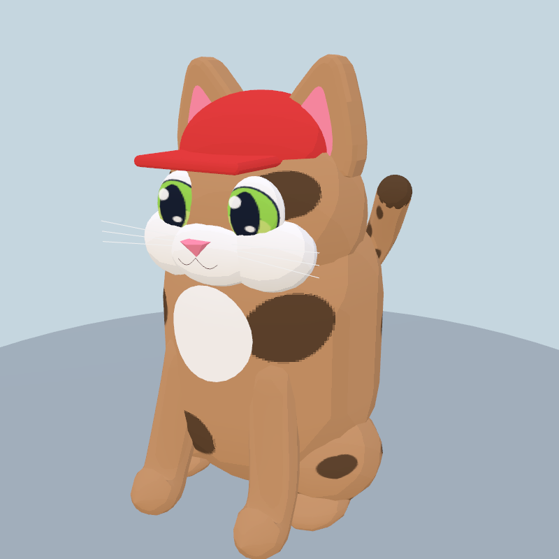
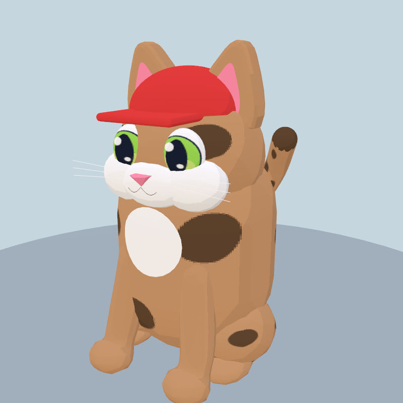
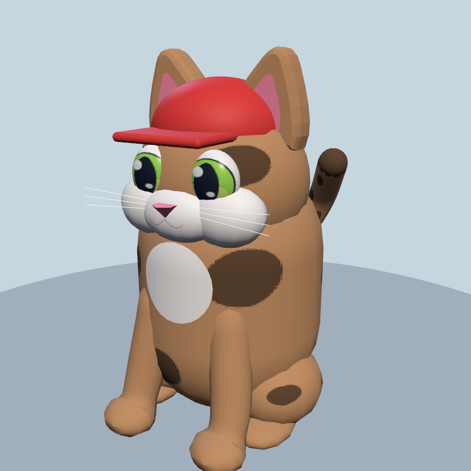
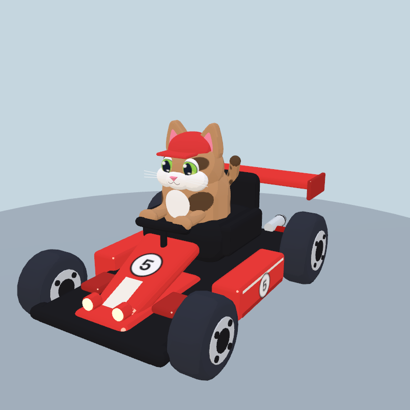

# Rounded cat paws

Forepaws now widen gently beyond the wrist and end in a flattened, rounded cap. Previously the radius collapsed while the foreleg axis kept advancing, producing a pointed cone. The new end rings trace an ellipsoid cap and keep the shoulder-to-paw skin continuous in sitting, driving and standing poses.

| Before | After |
| --- | --- |
|  |  |

This only changes vertex positions and regenerated normals at model creation. Topology, shared geometry caching, materials, animation and draw counts are unchanged. The spotted sitting model remains 7,968 triangles / 20 material batches; the viewer's cat-and-kart composition remains 18,084 triangles / 43 batches. No new per-frame work or shader features are added. These are geometry comparisons, not new FPS measurements.

Validation: native WebGL and WebGPU render both sitting and driving poses with standard and game materials without console errors. `check:art` passes all 36 coat/pose combinations, 22 accessory entries, model budgets and existing track checks. `build:web` and `git diff --check` pass.
