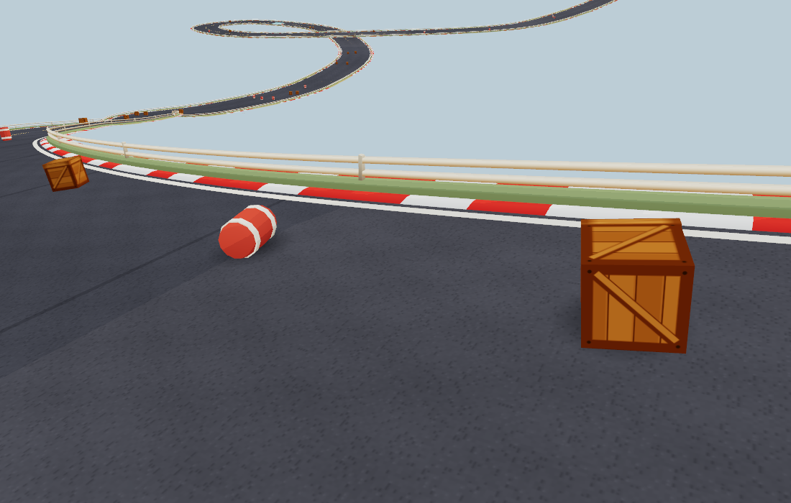

# Crate and barrel contact

The old solver used the upright half-height for ground and fence clearance while
the model rotated, sampled a coarse centreline height, and eased every landing
back upright. Crate corners/lids could enter the road or fence; barrels could
settle at the wrong height after a tumble.

The replacement rotates a small convex envelope with each model, including the
crate lid and barrel bands. It uses the rendered asphalt triangles on the same
road strand, so curves, grades, lap seams and stacked crossings retain their
actual elevation. Up to six substeps of at most 1/120 second limit movement per contact
solve. Ground contact exchanges vertical and angular momentum, with damped
bounce and time-based friction. Quiet objects settle onto a nearby stable face;
barrels can rest on their sides. A small 0.035-unit contact margin prevents
surface flicker.

The full footprint stays inside the asphalt, leaving clearance for shoulders,
kerbs and leaning fence posts. Props remain contained on the track, as before;
this is a lightweight visual solver, not a full engine for jumping over fences
or stacking props on each other. Sleeping props do no collision queries.
Floating pickups retain hull clearance, rise from their actual landed pose, and
fall from the visible bobbed position when collected. Blob shadows now follow
the road grade.

The image uses the real generated road and prop models with the game's cel
materials, without surrounding scenery or full-game postprocessing.

## Verification

- `npm run check:prop-physics`: 72 high-speed launches across flat/hilly loops,
  stacked crossings, lap seams and 30/60/120 Hz. Independent mesh rays check
  64,788 model vertices across 973 poses. All land and sleep; 21 barrel cases
  land on their sides. Final poses agree across those frame rates. Sleeping
  bodies are checked to perform no surface sampling. Included in CI.
- `node tools/prop-contact-render-check.mjs`: native WebGL and WebGPU, actual
  procedural road and item lifecycle. Each backend checks 37,584 model vertices
  during initial placement and impacts on a roughly 15% grade. Minimum measured
  clearance is 0.035 units; no browser/validation errors.
- Item pickup/replenishment, kart simulation and the web build pass.

[Physics/stress measurements](physics-metrics.json) · [Rendered checks](render-metrics.json).

A solver-only Node stress test on this M3 Pro, relaunching every body once per
second, took **0.11 ms median / 0.16 ms p99** for eight props, and **0.91 ms
median / 1.26 ms p99** for 64. This excludes rendering and is not a mobile
performance estimate. Road collision data is prepared during loading; no new
rendered meshes, lights, passes or physics-library dependency are added.

Native WebGPU High, six-kart meadow race at 1100×700, 40 seconds per sample:
the baseline (`34e48cf`) and isolated final sample both held **60.00 FPS**,
**16.8 ms p99/worst frame time**. Median whole-frame CPU callback time was
**4.7 → 4.9 ms**; p99 was **6.6 → 6.7 ms**. Neither reported browser errors.
An earlier final-build sample, run while the separate visual probe was active,
averaged 59.78 FPS and had a 166.6 ms hitch. It is retained in the raw data;
the isolated rerun did not repeat it. This is a refresh-limited desktop sample,
not proof of hitch-free play or unchanged mobile performance.
[Race summaries](race-metrics.json) · [All raw frames](race-frames.json.gz).
