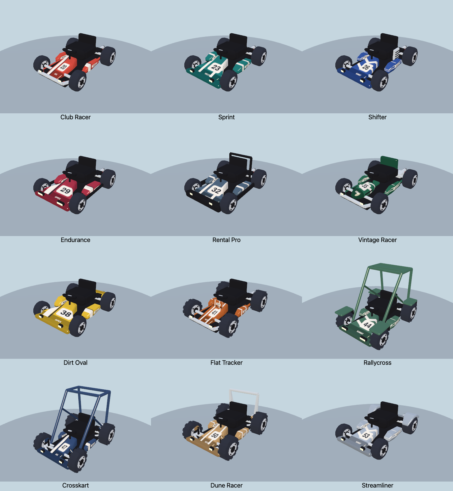
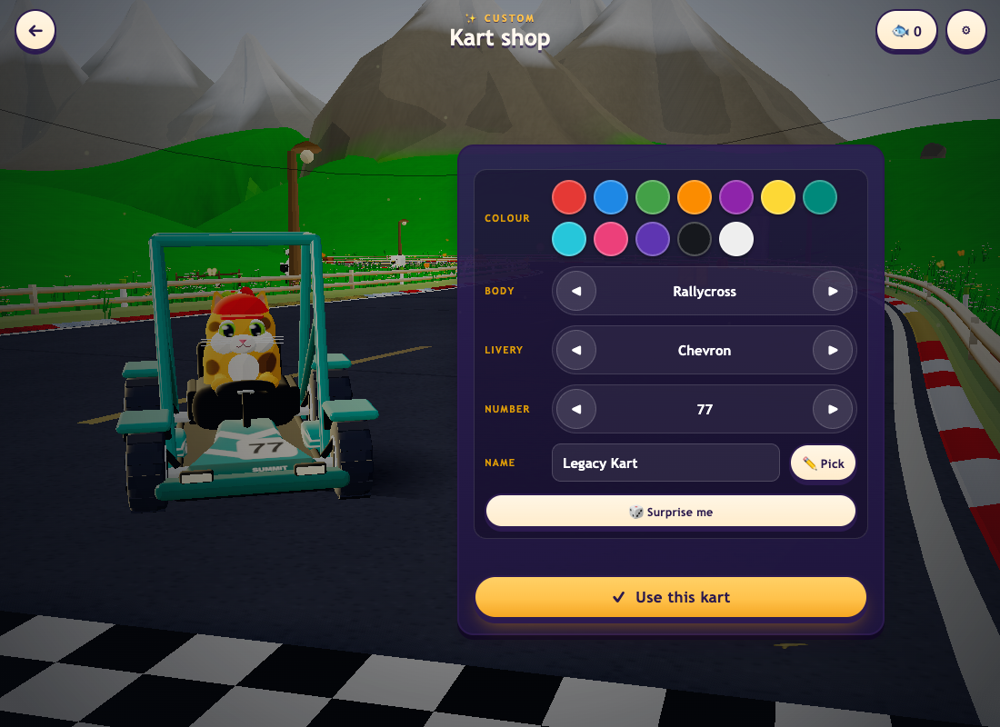

[Updated shapes and measurements from the refinement pass](../kart-refinements/README.md). The gallery and measurements below record the initial roster implementation.

# Twelve procedural racing chassis

Add 12 sturdy racing designs with two named team editions each: **34 garage presets across 17 chassis**, including the original ten presets/five styles. The new models retain the game's cel-shaded materials and existing driving behavior.



| Chassis | Defining features |
| --- | --- |
| Club Racer | Narrow nose, exposed chassis rails and tubular bumper |
| Sprint | Wide sloping nose and substantial side pods |
| Shifter | Compact fairings, radiator and exposed engine hardware |
| Endurance | Broad nose, perimeter guards and larger lamps |
| Rental Pro | Thick rubber bumpers and protective seat hoop |
| Vintage Racer | Rounded nose, small vents and contrasting seat back |
| Dirt Oval | Broad asymmetric side panels and rear bodywork |
| Flat Tracker | Narrow body, upright number plate and treaded tires |
| Rallycross | Braced cage, roof panel, fenders, mud flaps and lamps |
| Crosskart | Narrow fairings, braced cage and exposed suspension |
| Dune Racer | Treaded tires, exposed suspension and rear roll hoop |
| Streamliner | Tapered rear bodywork and rear-wheel fairings |

Each new chassis supports **Team Stripe, Twin Stripe and Chevron** in the custom creator. Numbers and fictional team marks are painted into procedural surfaces. The 24 named editions have their own colors, numbers and livery choices. They cost 260–410 treats; original prices, cup rewards and saved preset IDs remain intact.

The chassis share seat, steering, wheel and exhaust anchors. Larger cages leave room for the cat's head and tall accessories. Geometry is generated at construction time and reused across colors/liveries; existing steering, wheel rotation, brake lighting, headlights and round boost glows remain. Handling and collision rules are unchanged: these are cosmetic choices.

## Inspect and playtest

Use Garage → Custom Kart to cycle all 17 bodies, with the new livery control available on the 12 racing bodies. The viewer's **Karts** section contains all chassis; **Garage karts** contains all 34 presets. Its driving pose can combine cats/accessories with any preset.

- [All 34 presets](karts.png) · [rear](karts-rear.png) · [side](karts-side.png) · [top](karts-top.png)
- [Animated-driver clearance views](karts-driver.png)
- [Complete triangle/material table](roster.md) · [raw model metrics](metrics.json)
- [Desktop creator](ui-creator-rally.png) · [phone creator](ui-creator-phone.png) · [race](ui-race.png)



The showroom camera now scales its distance/pan with aspect ratio, keeping wheels and taller cages inside the available preview area on narrower windows.

## Performance approach

The new chassis use **5,904–7,912 triangles and 20–21 material batches**, compared with **10,096–12,468 triangles and 22–24 batches** for the original chassis. Counts include hidden effects meshes, exclude the cat, and are not whole-scene draw counts. Versus the original GP's 10,804 triangles, the new models use **27–45% fewer triangles**.

Savings come from simpler wheel/hub tessellation, closed low-poly shaped panels and merged rigid parts. Livery painting replaces separate transparent number decals on the new chassis. No new animation loops, real-time lights, transparent materials, shadow maps or physics bodies are added. A bounded 64-entry paint cache reuses 256×256 textures across chassis; different paint/number combinations still have a texture-memory cost. Existing models remain unchanged.

## Measured race performance

Sequential native Chrome 153 / WebGPU High samples on an Apple M3 Pro, 1100×700, six racers, seeded meadow track `RUNTIME`, eight seconds of race warmup followed by 40 seconds / 2,400 frames per sample. The GP baseline uses the unchanged original GP chassis in the current game; this is not a comparison against production's entire art pipeline.

| Field | Six original GP | Six new Rallycross | Normal mixed roster |
| --- | ---: | ---: | ---: |
| Mean FPS | 60.00 | 60.00 | 60.00 |
| 1% low FPS | 59.52 | 59.52 | 59.52 |
| p99 / worst frame, ms | 16.8 / 16.8 | 16.8 / 16.8 | 16.8 / 16.8 |
| Median CPU callback, ms | 5.0 | 5.0 | 5.1 |
| p99 CPU callback, ms | 6.8 | 6.8 | 7.1 |
| Mean renderer draws | 559.1 | 568.3 | 582.7 |
| Reported renderer allocation, MiB | 200.27 | 201.78 | 203.28 |
| Browser errors | 0 | 0 | 0 |

Rallycross is the largest new model by triangle count. Its six-kart sample saves about 90 KiB of reported geometry buffers, while paint and renderer resources increase total reported allocation by **1.51 MiB**. The mixed roster adds **3.01 MiB** compared with the all-GP field, including its wider variety of cached geometry.

These refresh-limited desktop samples show no observed frame-rate regression; they do not establish an FPS speedup or mobile/thermal guarantee. Race positions, sun state and visible scenery vary across samples, so whole-scene draw counts and callback timings do not isolate chassis cost. Renderer allocation is the renderer's accounting, not total browser/process memory. Mobile hardware remains unmeasured.

[Summary and allocation fields](race-summary.json) · Raw frames: [GP](race-before.json.gz), [Rallycross](race-after.json.gz), [mixed](race-mixed.json.gz).

## Compatibility and validation

- All **34 presets render on native WebGL and WebGPU**: 68 renders, plus **216** chassis/livery/color/backend combinations checking finite geometry, valid material groups, shared geometry, independent brake/boost resources and tire contact.
- Front, rear, side and top screenshots cover every preset, with an animated cat wearing a wizard hat to inspect cage/head clearance.
- Live UI checks cover all body choices, livery selection, desktop/phone controls, save/reload, AI roster variety and racing. [Results](ui-results.json).
- Garage save v3 preserves old custom karts: the former Custom slot at index 10 moves to 34, and legacy Cage style 6 becomes style 4. New Sprint style 6 and new preset index 10 remain stable after reload. Explicit `kartId: "custom"` supports future roster growth. Existing custom-cat migration is preserved.
- Player, AI, split-screen guests, preview warming and ghosts carry chassis/livery metadata. High split-screen checks use Rallycross and Crosskart, including an independently controlled Sphynx with space helmet, six racers, both camera layers, ranking and results. [Output](split-check.txt).
- Original art checks pass, including unchanged original kart geometry/batches. [Output](original-art-check.json).
- Roster/save migration, economy, deterministic simulation and web build pass. Roster invariants run in CI. Catalog thumbnails were generated for every preset; the original ten images remain byte-identical.

## Reproduce

```sh
npm run check:kart-roster
npm run check:progress
npm run check:sim
npm run build:web
PW_CHROME='/Applications/Google Chrome.app/Contents/MacOS/Google Chrome' npm run check:kart-roster-art
PW_CHROME='/Applications/Google Chrome.app/Contents/MacOS/Google Chrome' npm run check:kart-roster-ui
PW_CHROME='/Applications/Google Chrome.app/Contents/MacOS/Google Chrome' NATIVE=1 QUALITY=high P1_KART=26 P2_KART=28 P2_CAT=27 npm run check:split
```

Race probes run sequentially with other visual probes closed:

```sh
BIOMES=meadow QUALITIES=high BACKEND=webgpu SECONDS=40 KART_STYLE=0 OUT=/tmp/zoomies-kart-race-before node tools/race-perf.mjs
BIOMES=meadow QUALITIES=high BACKEND=webgpu SECONDS=40 KART_STYLE=13 OUT=/tmp/zoomies-kart-race-after node tools/race-perf.mjs
BIOMES=meadow QUALITIES=high BACKEND=webgpu SECONDS=40 OUT=/tmp/zoomies-kart-race-mixed node tools/race-perf.mjs
```
