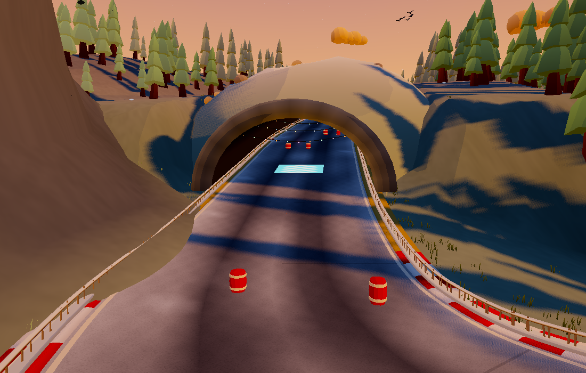
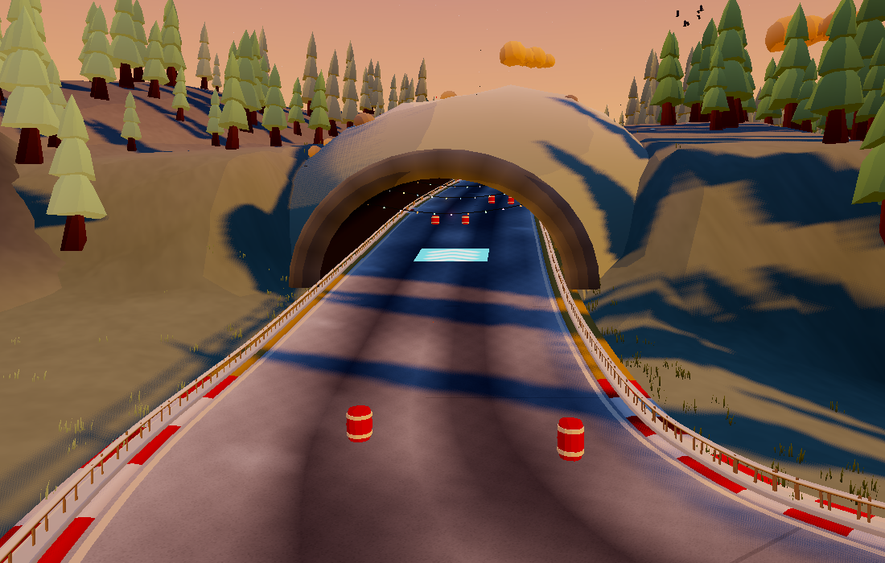

# Keep procedural terrain and mountain skirts off the road

Baseline: `fc24dae`. The geometry probe reproduced mountain faces over the asphalt on **Snowcap Sprint, Maple Falls, Willow Wash and RIDGE** (a maximum-hill/corner/size seed). The old nearby-peak check used the nominal cone radius, while sculpted aprons and subsidiary peaks extend further. The distant ranges also lacked a complete footprint check.

## Fix

Every mountain, including secondary summits and ring peaks, now measures the radius enclosing all its transformed vertices. A generation-time clearance check separates that footprint from every segment of the actual road centreline plus road width and an 8-unit margin. An unsafe mountain moves outward deterministically and is re-grounded. A bounded fallback places it outside the entire track envelope. Every triangle stays inside its vertex footprint, so long skirt triangles cannot bypass the check.

The terrain heightfield also receives a mesh-level safeguard. For every quad of the rendered road ribbon, all corners of the grid cells touched by its bounds are capped below that quad's lowest height. This handles interpolation between grid vertices and chooses the lower surface where roads cross. It only lowers ground; lake and bridge depressions remain. Existing landscape generation, road shape, driving physics and intentional tunnel shells are retained.

The fixed 1.2-unit terrain depression remains as the normal shaping pass. The new cap is a conservative final constraint, rather than relying on a sampled height offset alone. Nearby cell corners can be lowered too; normals and baked ambient shading are recomputed before the existing terrain tiles are built.

## Verification

`npm run check:terrain` runs adversarial grid/stacked-road/footprint fixtures, then samples the **rendered terrain triangles and mountain faces** over the actual road vertices and triangle centres. The regression matrix has all 11 featured tracks and four maximum-setting seeds, including one- and three-crossing layouts.

- Before: **433 sampled mountain overlaps** across four tracks.
- After: **zero terrain or mountain overlaps at 465,165 road samples** across 15 tracks.
- These are repeated geometry samples, not 433 independent defects. The sweep is regression evidence; the clearance construction supplies the geometric protection between samples.
- Fixed-camera before/after Snowcap Sprint render inspected, including the adjacent tunnel.
- Gameplay smoke, deterministic simulation, world-config codec and web build pass.

World audits use reduced prop detail; road, terrain and mountain geometry retain their full resolution. The probe targets the terrain sheet and freestanding mountain meshes. It excludes intentional tunnel roofs and other track structures.

## Rendering cost

Snowcap Sprint, seed PEAK, Medium, 1100×700, native Chrome WebGL2:

| Resource | Before | After |
| --- | ---: | ---: |
| Total scene triangles | 633,425 | 633,425 |
| Mountain triangles | 34,272 | 34,272 |
| Scene mesh/material batches | 784 | 784 |
| Renderer allocation after the view tour | 85,812,688 bytes | 85,812,688 bytes |
| Draws in the repaired view | 206 | 206 |

No added geometry, textures, lighting passes or per-frame checks. The clearance computations and temporary cap buffer exist during world construction; build-time timings in the raw audits are diagnostic, not a controlled benchmark. Visibility can change when a peak moves. These resource counts are not an FPS guarantee.

## Before and after

The skirt at the left covered the inside lane and barrier. It now clears the road, while the tunnel remains.

Reproduce the images with `NATIVE=1 PW_CHROME=/path/to/chrome RECIPE_FILE=docs/art-refresh/road-clearance/recipe.json FOCUS_FILE=docs/art-refresh/road-clearance/focus.json npm run check:landscape`. The `clearance.png` view targets the original intersection. Use `ART_ROOT=/path/to/baseline BASELINE=1 npm run check:terrain` to collect a comparison audit without enforcing the new clearance gate.
