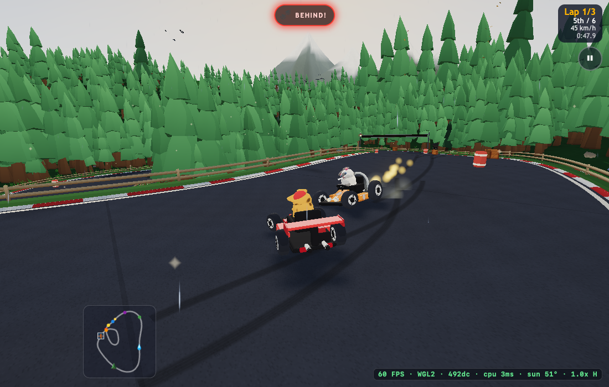
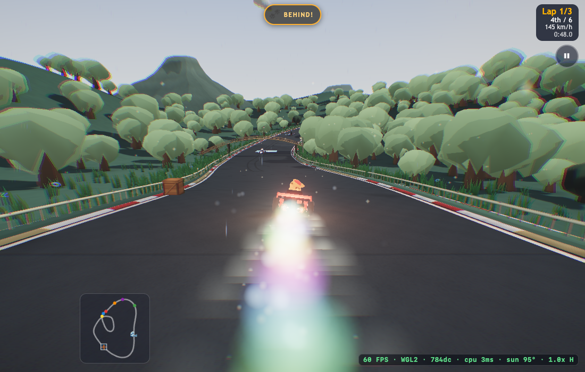

# More detailed baking and efficient distant scenery

Baseline: `1685da5`, the first local-occlusion pass. Priorities for this pass are racing frame time, visual quality, then generation time.

## Generation-time lighting

The local rigid-asset bake now uses 25 fixed cosine-weighted directions instead of seven. A second pass runs after scenery placement and before static batching. It samples neighbouring structure bounds and analytic tree-crown ellipsoids with 24 sky-facing directions, shading static props/buildings and the shared terrain color buffer. The regional BVH and rays are discarded after generation. The output uses the existing RGB attributes, adding no textures, lights or shader samples.

This is broad stylized sky occlusion, capped at 16%, combined with the existing detailed local bake. Tree bounds approximate average canopy cover; this is not a frozen directional sun shadow or physically accurate global illumination. Moving detail subtrees are excluded as receivers. The terrain uses its existing grid and cannot resolve tiny contact details. The procedural seed stream and track geometry are unchanged.

## Distant geometry

Generation prepares distant pine/acacia/blossom/willow crowns with fewer branch rings or canopy segments, matching the original crown extents and attachment heights. Opaque, untextured static structures use vertex clustering. That keeps hard normal groups and painted colors; a common position per spatial cluster prevents cracks at normal seams. Wind attributes remain present and per-instance wind roots stay shared. Each detail level has a stable renderer cache key through the public `passId` API. This avoids an r185 WebGPU bug where changing geometry on one render object could retain stale vertex bindings. It adds no scene meshes or draw calls. Regression checks exercise indexed and non-indexed sources with the game’s toon materials, and a full WebGPU race validates integration. Textured facade bodies, palms, racers and animated animals retain their geometry.

Each mesh retains one material and one instance batch. The existing mesh switches geometry only when the closest point of its conservative bounding sphere is roughly 300 units from **every** active camera. A 25-unit hysteresis band avoids threshold flicker; nearby scenery keeps full detail. Shadow passes always use the original geometry so a distant visual LOD change cannot change the shadow silhouette. Both variants are drawn during the existing loading warm-up before the splash retires, moving first-use buffer/pipeline work out of racing. No transparent cross-fades or per-object scene-graph LOD nodes are added.

The second geometry uses extra resident memory. It is an explicit exchange for fewer distant triangles, not a reduction in total stored geometry. Only candidates that remove at least 10% of their triangles receive a second geometry.

## Shadows: retain the faster path

High keeps its original PCF map and maximum 30 Hz updates. The small `SceneryShadow` override uses the pinned Three.js r185 `renderShadow` hook; rerun the cross-backend pixel check when upgrading the renderer. Shadow renders use the original geometry even when visual scenery switches to a distant mesh. Battery saver now restores projected kart shadows rather than leaving them hidden while the real shadow map is frozen.

We implemented and tested a separate static-depth cache, including matching moving-shadow pixels on WebGL2 and WebGPU. It reduced draw submissions but **increased native GPU time**: fixed-view shadow-update renders took roughly 2.6–6.5 ms with the cache versus 1.4–1.7 ms without it in this experiment. It would also have needed approximately 80 MiB extra storage at 4096². That candidate was removed. Fewer draw calls alone did not justify shipping a GPU regression. The shipped code allocates no additional shadow map.

[Rejected cache experiment measurements](rejected-cache-metrics.json) are retained for the decision record; they are not shipped-build race results.

## Measurements

Native Chrome 153.0.8010.53, Apple M3 Pro (18-core GPU, 36 GB), macOS 26.6.2. Each sample includes the real simulation, six racing karts, effects/weather, ordinary post-processing and dynamic resolution. The harness drives the human kart using the existing AI controller only in the test. Production controls are unchanged.

Seed `RUNTIME`, size 0.5, single-biome worlds, city at night and the others at midday. At 1100×700, each run measures 40 seconds after eight racing seconds; this tours most of a lap, not an entire three-lap race. Runs are sequential to avoid competing test workloads.

| Scene / quality | Mean FPS: before → after | Median CPU frame (ms) | Worst frame (ms) | Reported renderer allocation change |
| --- | ---: | ---: | ---: | ---: |
| Forest Medium | 60.00 → 60.00 | 3.3 → 3.4 | 16.8 → 16.8 | +0.55 MiB |
| Forest High | 60.00 → 59.83 | 3.6 → 3.6 | 16.8 → 133.4 | +0.60 MiB |
| City Medium | 59.75 → 60.00 | 4.3 → 4.5 | 150.0 → 16.8 | +2.48 MiB |
| City High | 60.00 → 60.00 | 4.7 → 4.9 | 16.8 → 16.8 | +2.48 MiB |
| Wetlands Medium | 60.00 → 60.00 | 3.3 → 3.4 | 16.8 → 16.8 | +0.63 MiB |
| Wetlands High | 60.00 → 60.00 | 3.6 → 3.6 | 16.8 → 16.8 | +0.61 MiB |

The 99th-percentile frame time was **16.8 ms across these before/after runs**. Brief isolated stalls occurred in both the baseline and final samples; the table deliberately retains the worst frames. These samples do not establish their cause or show that all occasional hitches are fixed. Both LOD variants now draw during loading so their first use need not happen during racing.

These runs are refresh-limited around 60 FPS. They establish broadly similar frame pacing in these samples, **not a demonstrated FPS speedup**. The geometry/controller/shadow override is not literally free. Resident geometry and cached rendering state increase memory modestly, while the stronger baked shading adds no textures or shader samples. Allocation counters are renderer-reported resources, not total process or device memory. Live race trajectories and effects vary, so draw counts are not a controlled geometry comparison.

At **2200×1400**, city High measured **60.00 → 60.00 FPS**, **4.8 → 4.7 ms** median CPU frame, with **16.8 ms** final p99. The full-game **WebGPU** wetlands High sample measured **60.00 FPS**, **16.8 ms** p99, **16.8 ms** worst frame and no validation/console errors. WebGPU is a compatibility/performance sample, not a before/after comparison.

[Race summaries and source hashes](race-metrics.json) and [all recorded race frames, gzip JSON](race-frames.json.gz) retain the baseline and final cohorts. Mobile hardware and sustained thermal behavior are unmeasured.

### Distant geometry budgets

| Fixture | Eligible batches | Full-detail triangles | Distant triangles | Reduction within eligible geometry |
| --- | ---: | ---: | ---: | ---: |
| Forest | 41 | 191,968 | 96,831 | 49.6% |
| City | 143 | 57,933 | 27,151 | 53.1% |
| Wetlands | 65 | 203,160 | 77,660 | 61.8% |

These totals describe geometry that **can** switch, not the entire scene or triangles saved in every frame. Nearby batches and all shadow renders retain full geometry. Actual visible savings depend on the camera.

### Controlled GPU workload

The same completed build at three fixed cameras, comparing full visual geometry with normal distant LOD. Each timed render also updates the full sun map; normal racing updates it at most 30 Hz. This excludes simulation, post-processing and ambient sprite fields. Nine batches of 20 renders per mode alternate order, with both variants warmed first. Native hardware GPU timers are required, and the probe asserts a shadow pass on every measured render.

| Biome / track fraction | GPU median batch-average (ms), full → LOD | Draws, full → LOD | Submitted triangles, full → LOD |
| --- | ---: | ---: | ---: |
| Forest / 0.06 | 1.636 → 1.499 | 391 → 391 | 666,949 → 664,207 |
| Forest / 0.38 | 1.483 → 1.578 | 369 → 369 | 687,311 → 683,279 |
| Forest / 0.72 | 1.450 → 1.544 | 291 → 291 | 622,661 → 622,661 |
| City / 0.06 | 1.516 → 1.477 | 485 → 485 | 369,251 → 366,828 |
| City / 0.38 | 1.263 → 1.248 | 442 → 442 | 420,391 → 420,317 |
| City / 0.72 | 1.171 → 1.171 | 376 → 376 | 362,785 → 362,785 |
| Wetlands / 0.06 | 1.369 → 1.607 | 406 → 406 | 686,820 → 683,702 |
| Wetlands / 0.38 | 1.503 → 1.524 | 377 → 377 | 748,843 → 744,579 |
| Wetlands / 0.72 | 1.376 → 1.572 | 306 → 306 | 691,333 → 691,333 |

Visible triangle savings are **0–0.66% in these conservative views**, much smaller than the eligible-geometry budgets above. GPU differences vary in direction and are present even in the third views where submitted counts are identical. This does not establish a reliable GPU speedup; the full-race measurements are the relevant frame-pacing check. The LOD is conservative about close-up quality, adds no draws, and prepares cheaper distant assets for views that expose them. [All GPU/CPU timing batches and device identity](render-metrics.json).

### Generation work

Five `SHADE` worlds at detail 1.0, measured with `tools/baked-world-check.mjs`. Total construction includes existing terrain, scenery, the stronger local bake, neighbouring shelter and LOD preparation. Repeat generation can reuse the bounded local-lighting cache; world shelter is recomputed for placement.

| Biome | Total build, first / repeat (ms) | First neighbouring-shelter pass (ms) | Vertices receiving neighbouring shade |
| --- | ---: | ---: | ---: |
| Meadow | 2321 / 1434 | 601 | 7,839 |
| Forest | 2607 / 1510 | 1101 | 30,613 |
| City | 4291 / 4340 | 3572 | 155,583 |
| Beach | 1248 / 891 | 402 | 6,395 |
| Volcanic | 986 / 664 | 380 | 4,413 |

[Generation measurements](generation-metrics.json). These are construction costs, not per-frame work, and do not include renderer startup or shader warm-up. The much longer first local bakes are deliberate under the requested priorities.

### Race views

## Verification

- `npm run check:runtime-art`: simplification, finite buffers, unchanged full-detail geometry, preserved colors/wind roots, multiple cameras, hysteresis, disposal, neighbouring shelter, distant exposure, seeded RNG and idempotence.
- `npm run check:scenery-shadows`: pixel comparisons on WebGL2 and WebGPU verify that distant visual geometry does not change shadow silhouettes, including moving casters, sun changes and map resizing.
- `npm run check:baked-lighting`: original local bake invariants.
- `check:scenery`: 118 catalogue entries satisfy finite-geometry/material budgets.
- `check:biomes`: all 15 individual biomes plus a mixed world preserve habitat rules.
- `check:terrain`: 465,165 road samples across 15 procedural fixtures have no terrain or mountain overlap.
- Native High `check:split`: two camera views, six racers, independent controls, LOD camera integration and race results.
- Simulation, item logic, world-config checks and the web build pass.

Run `ART_ROOT=/path/to/baseline OUT=/tmp/race-before node tools/race-perf.mjs`, then `OUT=/tmp/race-after node tools/race-perf.mjs`. Defaults are forest/city/wetlands on Medium and High, 1100×700, 40 measured seconds after eight racing seconds. `BACKEND=webgpu` selects WebGPU. `PW_CHROME` selects Chrome when it is not at the default macOS path. `VERIFY=1` also checks Battery saver after sampling.
