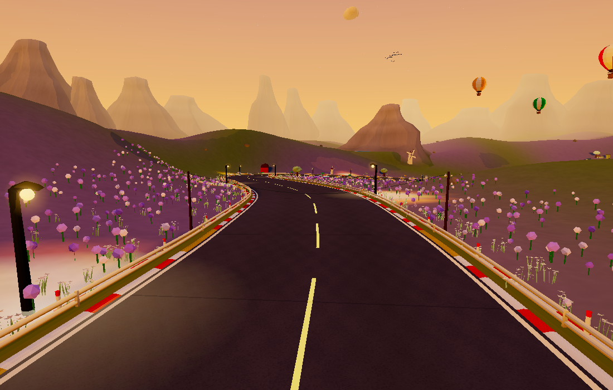
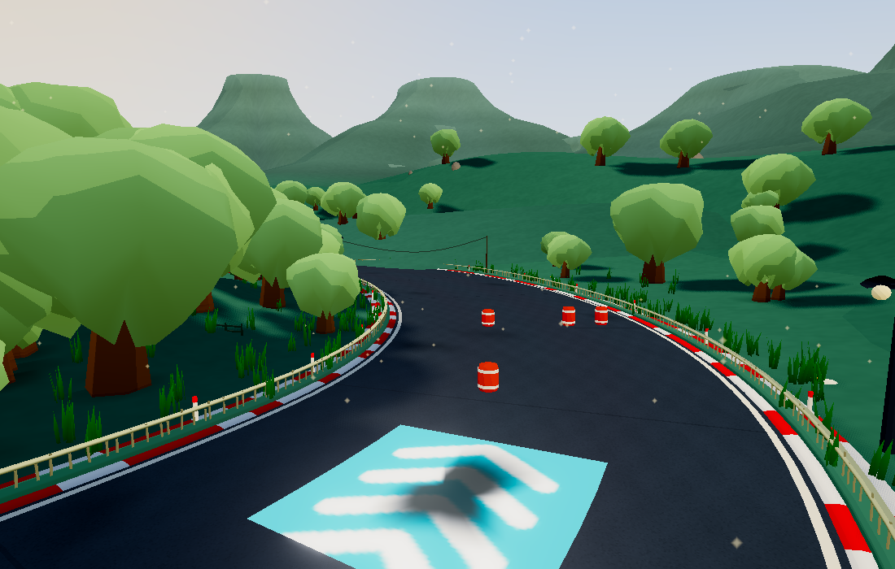
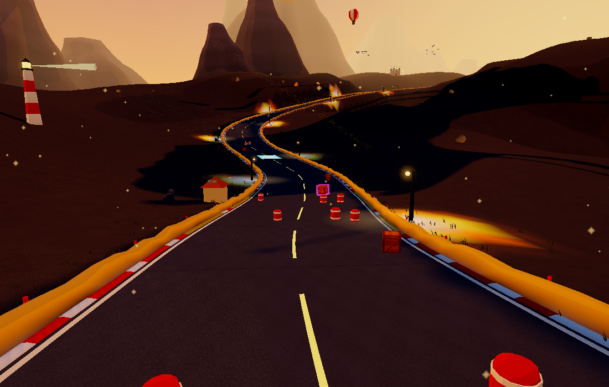
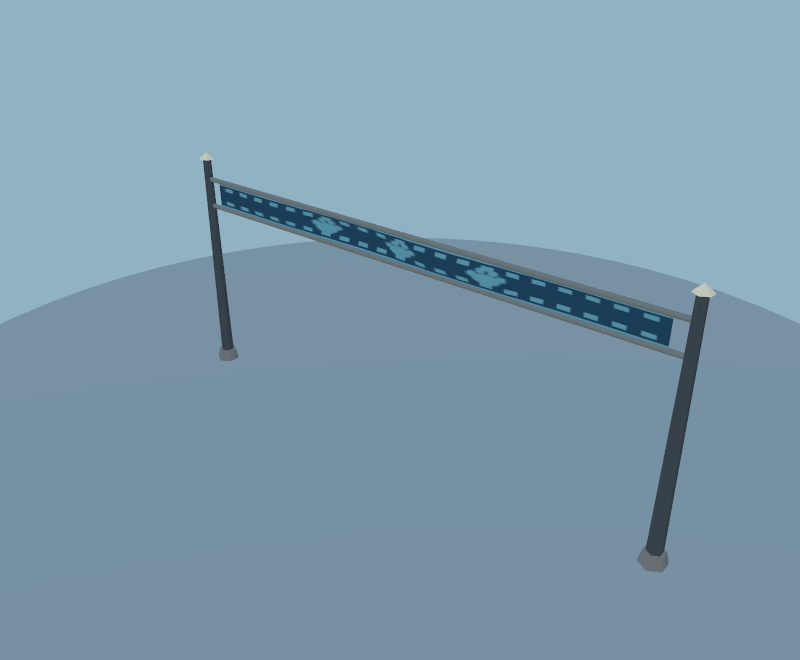
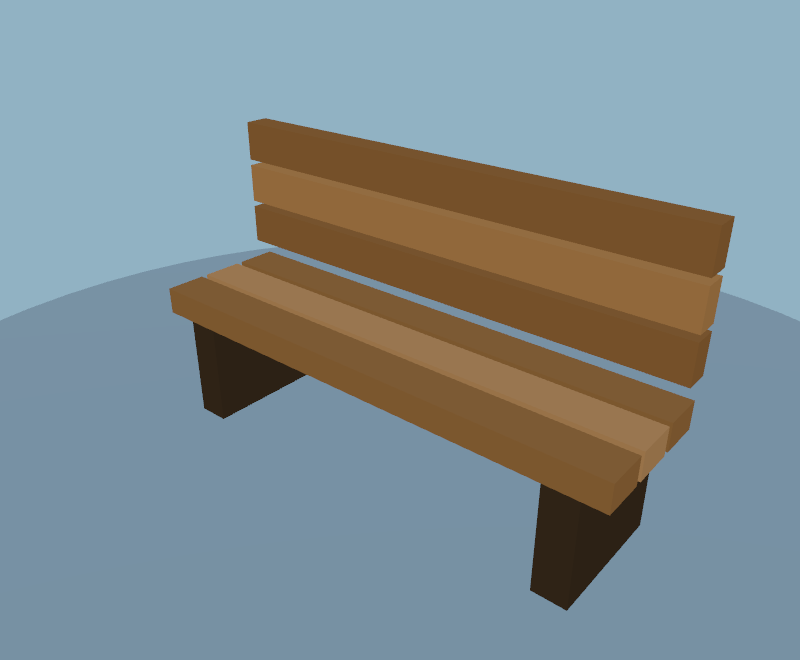
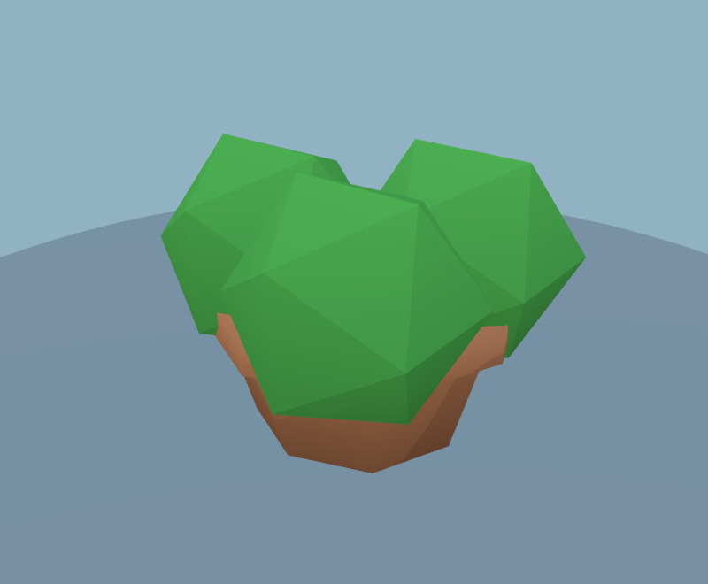
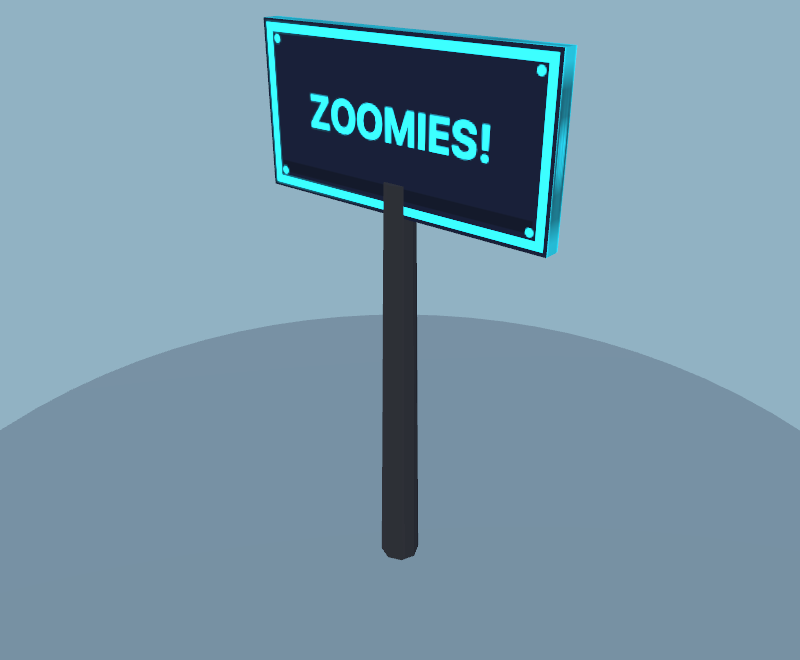
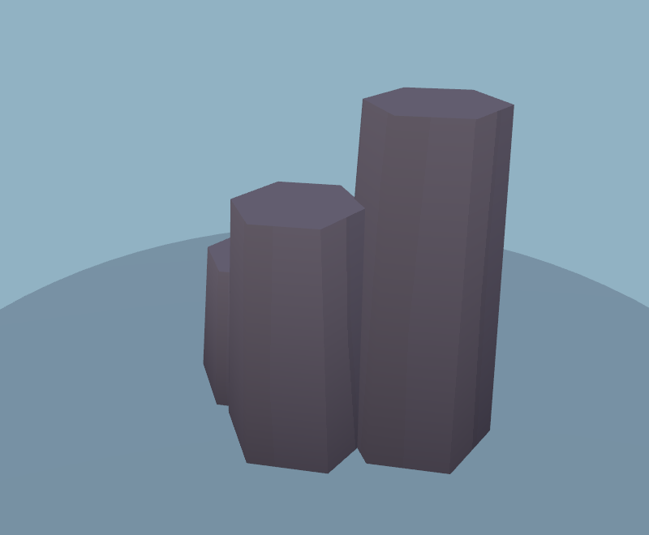
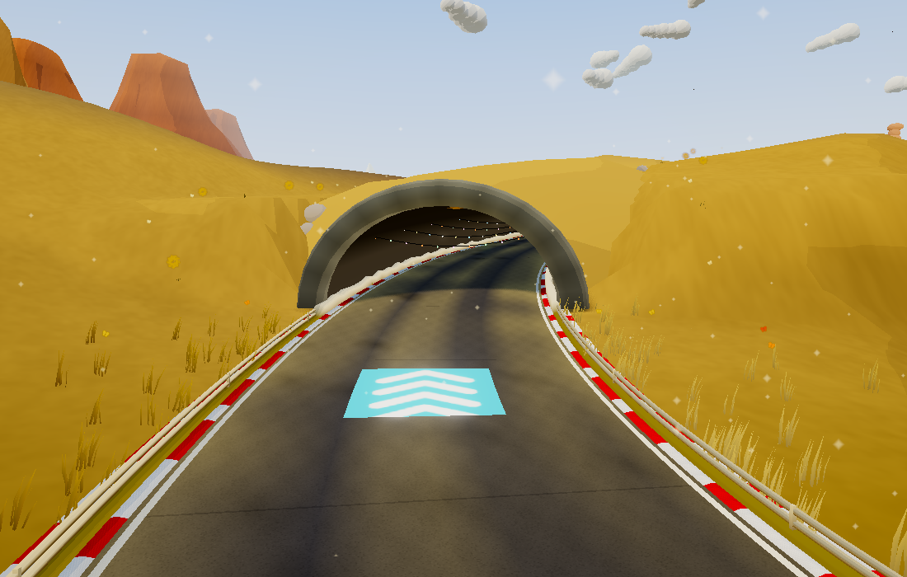
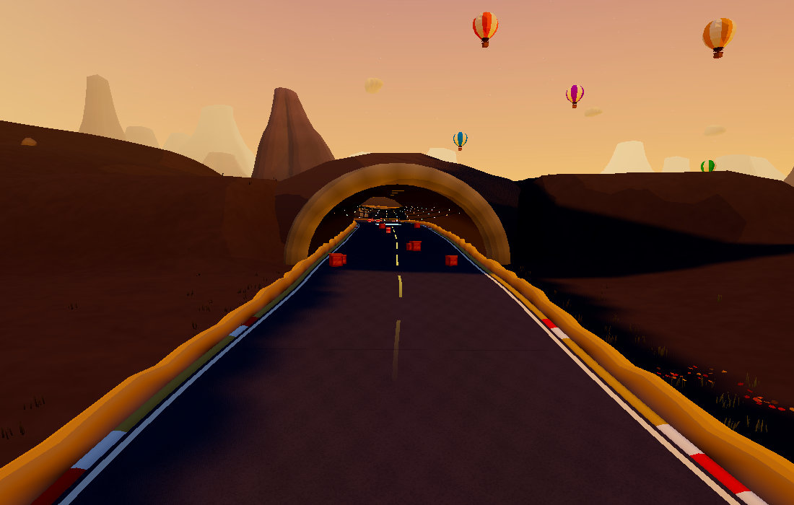

# Trackside structures and new biomes

This pass follows `ac5102e` (round kart glows). All art remains procedural and cel shaded. Kart particles remain round.

## What changed

- Timber footbridges have connected rails, painted timber faces, and support feet sampled against the terrain. Their rigid pieces remain one merged mesh; simple box faces replace heavily subdivided rounded boxes.
- Road-bridge beams have baked underside shading and shaped piers. Tunnel portals have recessed stone shading with fewer ring segments.
- Racing banners have pinned folds, checker hems and paw graphics, sharing one 256×32 procedural print. Supports merge into one mesh: seven meshes become two per banner. Steep locations that would bury the banner are rejected.
- Billboards have painted frames and fasteners; repeated designs share their material and texture. Road signs use a paw emblem rather than misleading directional arrows.
- Slatted benches, hollow terracotta planters, tapered fences and connected lamp brackets improve roadside furniture. Benches and fences each consolidate to one mesh.
- Build-time spacing reduces overlapping roadside props and keeps the inside verge of bends clearer. Existing feature/road/slope exclusions remain in place. This is approximate visual spacing, not a new collision system.

## Three new biomes

| Biome | Scenery | Featured track |
| --- | --- | --- |
| Lavender countryside | Purple planted hills, flower patches, muted trees, small village stretches, timber barriers | Lavender Loop — BLOOM |
| Wetlands | Drooping willow crowns, reeds, ducks, rain, damp road tint and causeway/river eligibility | Willow Wash — REED |
| Volcanic badlands | Dark crags, basalt columns, sparse ground cover, stone barriers and canyon/tunnel eligibility | Basalt Blast — BASALT |

Select the new cards in the track selector, or mix the biomes in the track maker. Random recipes can use all three. The default/classic biome roster and wedge seed layout retain the original twelve biomes.

## Rendering costs

Same classic world, seed 12345, Medium, 1100×700, native Chrome WebGL2. Before is `ac5102e`; after is this pass. The counts include the actual game's postprocessing. Snapshots are workload counts, not FPS measurements.

| View | Before triangles | After triangles | Before draws | After draws |
| --- | ---: | ---: | ---: | ---: |
| track-a | 381,504 | 351,703 | 425 | 426 |
| track-b | 288,778 | 275,270 | 292 | 285 |
| track-c | 468,060 | 408,025 | 517 | 462 |
| mountain | 273,238 | 273,456 | 250 | 260 |

Total scene triangles: **795,670 → 721,759 (−9.3%)**. Renderer allocation: **103,486,265 → 96,270,184 bytes (−7.0%)**. Placement changes affect what each camera sees; this is not a geometry-only microbenchmark. The mountain view adds ten draws, while Track C removes 55.

Per-asset triangle counts: bench 624 → 96; fence 1,800 → 88; planter 360 → 172; street lamp 200 → 184. The sign adds 25 triangles for its paw graphic but reduces two material batches to one. The new footbridge fixture has 1,632 triangles in one batch; banner 232 in two. Piers add vertical shaping; portal rings reduce radial subdivisions. No additional realtime lights, shadow maps, animation loops or postprocessing passes are introduced. The small banner print adds one shared texture and a sample on banner cloth.

New biome costs depend on the generated route and visibility; their counts are recorded separately and are not like-for-like speed comparisons against the classic route. Wetlands have a larger total scene than the classic fixture, but reuse existing tree instancing, rain and quality controls. Mobile and WebGPU performance still require device playtesting.

## Validation

- 90 scenery assets rendered: finite buffers, painted attributes and triangle/material budgets pass; repeated billboard material sharing checked.
- Art checks cover the new biome selections/weather, original default roster, track paint and shoulder seams, cat poses and kart budgets.
- Four full-world views per new featured track and a fixed classic before/after comparison; no browser errors or invalid geometry.
- All three new tracks raced for at least 30 simulated seconds at expert AI pace: no wedged karts, no invalid states, no audit failures. This is a bounded smoke audit, not exhaustive procedural seed coverage.
- Gameplay smoke, world codec, deterministic simulation, item logic and web build pass.

Raw world counts, asset census and race audit are in the JSON files alongside this document.

Reproduce with `PW_CHROME=/path/to/chrome NATIVE=1 BIOME=wetlands npm run check:landscape`; use `BIOME=lavender` or `BIOME=volcanic` for the other featured tracks. Omit BIOME for the classic comparison. `TRACKS="Lavender Loop,Willow Wash,Basalt Blast" npm run check:tracks` runs the race audit.

## Native GPU timing

One sequential before/after pair on Apple M3 Pro, Chrome WebGL2, 1100×700. Each value is the median of nine batches of 20 frozen scene renders. Gameplay, weather/ambient sprite fields and postprocessing are excluded; wind and time are fixed. This isolates scene rendering and does **not** measure full-game frame pacing.

| View | Before ms/render | After ms/render | Difference |
| --- | ---: | ---: | ---: |
| 0.06 | 0.735 | 0.737 | +0.002 ms |
| 0.38 | 0.485 | 0.562 | +0.078 ms |
| 0.72 | 0.915 | 0.752 | -0.164 ms |

These samples are evidence for this device/workload only, not a zero-impact guarantee or an FPS claim. See `native-before.json` and `native-after.json` for all batches. Run `ART_ROOT=/path/to/checkout OUT=/tmp/perf node tools/scenery-perf.mjs` with other rendering tests closed.
