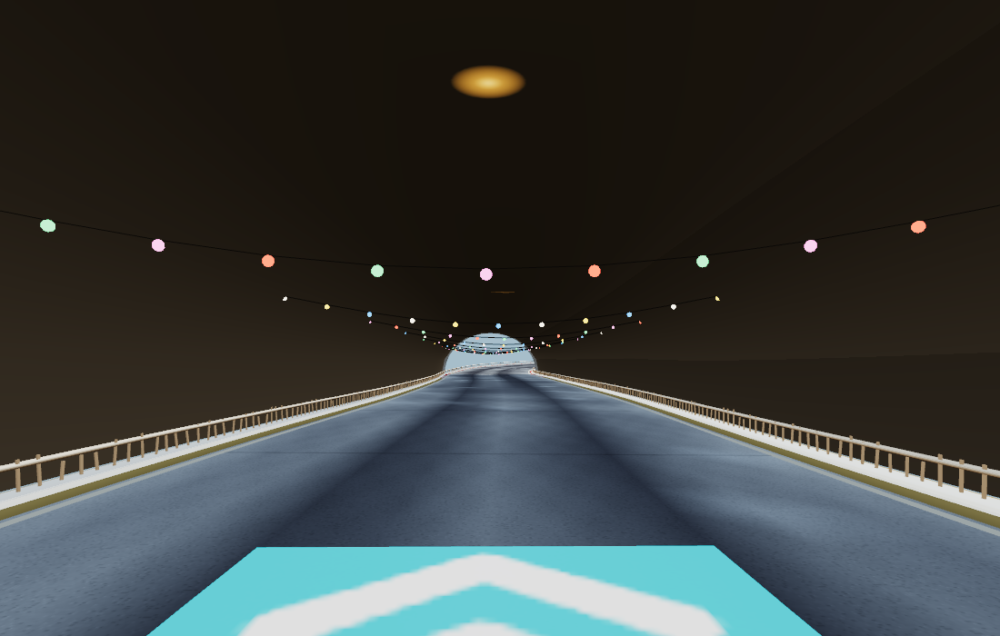
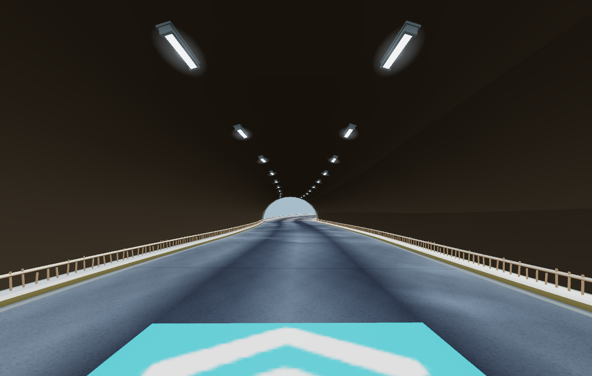
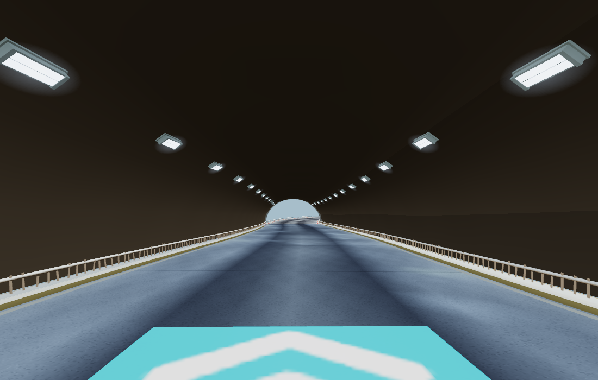
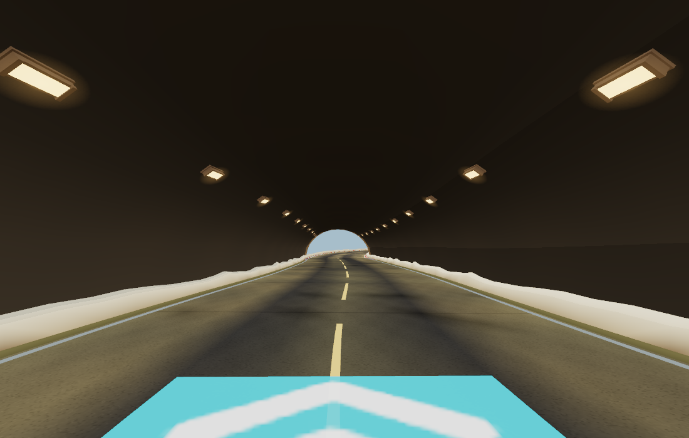
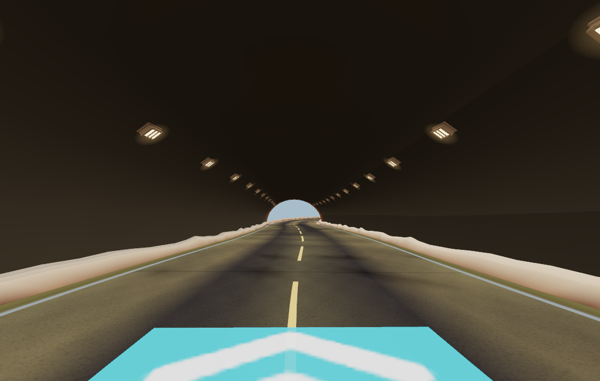
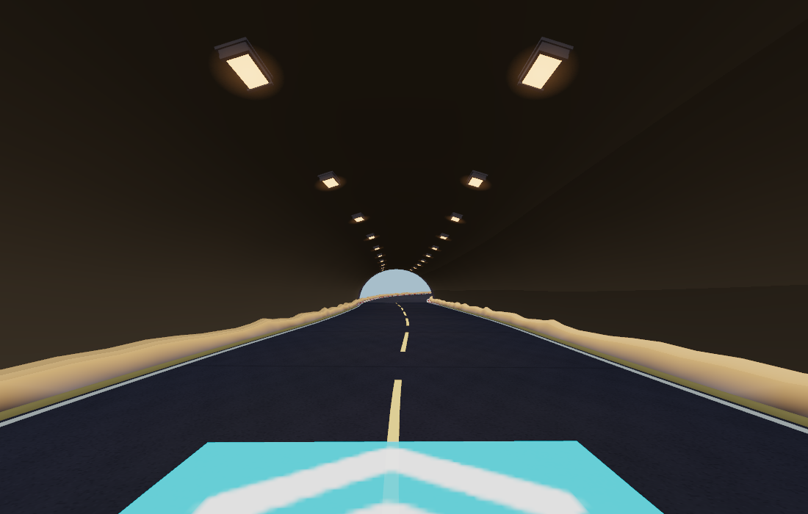

# Mounted tunnel lighting

Tunnel festoons, wires and floating crown discs are replaced with two rows of
ceiling-mounted fittings. Procedural placement follows the actual arch facets,
curves and elevation; backing plates sit against the shell. Outdoor festoons
also reject tunnel spans, including mixed-biome boundaries.

| Tunnel biome | Fittings | Light |
| --- | --- | --- |
| Alpine | Long ceiling LED strips | Cool white |
| Tundra | Wide sealed twin battens | Ice white |
| Desert | Enclosed sodium lamps | Warm gold |
| Mesa | Guarded bulkheads | Soft amber |
| Volcanic | Heavy segmented panels | Industrial amber |

These are the five biomes that currently generate tunnels. Housings, end caps,
lenses and guards are procedural geometry. Each tunnel has one housing batch,
one luminous-lens batch and one restrained halo batch. Spill on the lining and
road is baked into their existing vertex colors at generation time. It is an
art-directed approximation, not dynamic local illumination on passing racers.
No new real-time lights, shadow passes, animation callbacks or screen effects.

## Visual checks

Same seed (`TUNNELS`), camera and cel material conversion in each view. These
isolated set-piece renders include the real procedural road and tunnel, with
fixed sun/ambient lighting; they do not include the full game's postprocessing.

Before:

Alpine:

Tundra:

Desert:

Mesa:

Volcanic:

## Rendering cost and validation

Compared with `fffadf3`, the same tunnel's light geometry falls from **4,760
triangles** to **1,364–2,580** (46–71% fewer), depending on biome. Both versions
use **three lighting draw calls**. The small halo texture replaces the former
glow texture; the bake adds no runtime texture lookup. These counts describe
the lighting assembly, not a whole-frame FPS improvement. More fixtures and
larger halos can still change fragment work.

`npm run check:tunnel-lighting` renders all five actual procedural tunnels in
native WebGL and WebGPU, checks finite attributes, minimum road clearance,
batch budgets and bounded road spill, and fails on browser/validation errors.
A separate wrapped-span case verifies matching spill across the lap seam.
All ten renders passed. `check:runtime-art`, `check:worldcfg` and `build:web`
also pass. [Raw render/resource measurements](render-metrics.json).

Reproduce the before comparison with `ART_ROOT=<checkout-at-fffadf3> BASELINE=1
BACKENDS=webgl OUT=/tmp/tunnel-before node tools/tunnel-lighting-check.mjs`.
Use `PW_CHROME` to select a native Chrome binary on another host.

A native **WebGPU, High, six-kart volcanic race** at **1100×700** on an M3 Pro
held **60.00 FPS before and after**, with **16.8 ms p99 and worst frame time**
in each 40-second sample (2,400 frames each), and no browser/validation errors.
This is a refresh-limited desktop smoke test, not proof of a speedup or a mobile
performance guarantee. The racing paths and sun phase differ, so draw counts
and CPU timings should not be treated as an isolated lamp benchmark.
[Race summaries](race-metrics.json) and [raw frames](race-frames.json.gz).
