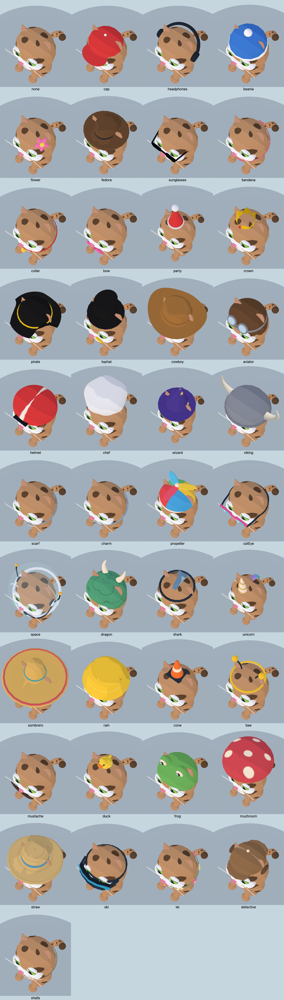

# Thinner ears and fitted accessories

This pass replaces thick slab ears with thin, cupped pinnae, then refits the procedural wardrobe around them. The five ear shapes remain distinct. Inner-ear coloring follows coat pigmentation: pale coats get a soft ivory fringe and muted skin, dark/point coats get subdued brown or charcoal interiors, and Sphynx has more exposed skin. Calico, tortie, cow and Van coats also receive appropriate contrasting outer-ear patches. These are stylized coat-aware treatments, not genetically exact breed simulations.

## Fit and surface detail

- Visible hat surfaces are fitted to the selected cat's skull during construction. Ear openings use the new shape's convex envelope; the attached ears remain anchored while the head moves.
- Crowns and party hats are narrower and sit between the ears. The mushroom's narrow white stem sits between them and its cap clears the tips.
- Opaque racing and Viking helmets consistently cover both ears when equipped. There is no frame-by-frame ear visibility test or popping. Other hats and hoods retain exposed ears through fitted openings; the transparent space helmet keeps the ears inside its dome.
- Cat-eye straps route behind the head and connect to the frames. Goggle straps get the same skull fit. Neckwear follows the selected body proportions, including its chest marking; flowers and shells sit on the cord's actual path.
- Wizard stars, mushroom spots, dragon scales, deerstalker stitching, straw weave, racing-helmet stripes and scarf hems are generated surface paint on the original geometry. They cannot float away from the accessory.
- The unicorn mane is one continuous strip of colored geometry. Sombrero trim motion stays small enough to preserve attachment, and shell grooves follow the shell's own orientation.
- Sphynx forehead wrinkles are shallow deformations of the skin, replacing floating arcs. Space-helmet and dragon-hood head motion is reduced to keep their low collar/long tail from swinging through the torso; ordinary head, ear and accessory animation remains.

## Galleries and checks



[Front](accessories.png) · [Side](accessories-side.png) · [Rear](accessories-back.png) · [Underside](accessories-under.png) · [Driving](accessories-drive.png) · [Animated pose](accessories-motion.png)

Ear-shape comparisons from above: [rounded](round-top.png), [wide](wide-top.png), [curled](curl-top.png), [folded](fold-top.png). [Updated 40-cat roster](../cat-roster/README.md).

The audit covers every wardrobe choice on Classic, Persian (rounded ears), Devon Rex (wide ears), American Curl and Scottish Fold, on native WebGL and WebGPU. Front, side, rear, overhead, underside, driving and combined celebration/lean/look-back views are captured. All 40 named cats are also rendered on both backends. Numeric compatibility checks supplement these visual reviews; they do not by themselves establish a convincing fit.

The **3,321** type/accessory/pose combinations remain below **10,773 triangles and 25 material batches** per complete cat (maximum 10,772 / 24, including hidden rig meshes). Classic ear depth is approximately **0.074 model units**, including curvature, versus the former approximately 0.245-unit ear (about 70% less depth). Folded/curled ears bend through a larger envelope while retaining the same thin wall. [Compatibility metrics](compatibility.json) · [Wardrobe metrics](metrics.json).

Across the 40 named cats, model triangle changes range from −527 to +922, with unchanged or lower material batch counts (the counts include hidden helmet ears). [Per-cat costs against `f89c6c1`](roster-costs.json).

The existing compatibility sweep now also checks thin-ear depth, consistent helmet ear coverage, and painted materials for decorated accessories. It covers all 27 types × 41 wardrobe selections × 3 poses. Separate accessory checks cover recoloring, shared resources and independent animations. Simulation, roster/save invariants and the web build pass.

## Performance

Fitting, ear paint, decoration atlases and geometric shaping occur during model construction and are cached. Racing adds no accessory collision detection, lights, clipping shaders or render passes. Painted details reuse one bounded atlas per palette; ear fronts use small 128 × 128 textures. Paint uses ordinary material sampling, so this trades some texture memory and shader sampling for fewer detached meshes.

Native Chrome on Apple M3 Pro, WebGPU High, 1100 × 700, six racers in Meadow. Each run used an 8-second racing warm-up and a 40-second sample (2,400 frames), with probes run sequentially.

| Run | Average FPS | 1% low FPS | CPU median / p99 | Mean draws |
| --- | ---: | ---: | ---: | ---: |
| Previous models and accessories (`f89c6c1`) | 60.00 | 59.52 | 4.9 / 6.6 ms | 545.0 |
| Fitted wardrobe, normal mixed roster | 60.00 | 59.52 | 5.1 / 6.8 ms | 580.1 |
| Six painted dragon hoods / Maine Coon shapes | 60.00 | 59.52 | 4.9 / 6.9 ms | 584.8 |

All three runs had 16.8 ms p99 and worst frame intervals, with no browser errors. The mixed-roster renderer snapshot rose **1.33 MiB**; median CPU callback time rose **0.2 ms**. These are whole-race observations, not isolated accessory costs. Visibility and trajectories varied, so the mean draw counts are reported rather than attributed entirely to the wardrobe.

[Before summary](race-before.json) · [After summary](race-after.json) · [Painted stress summary](race-painted.json). Raw frames: [before](race-before-raw.json.gz), [after](race-after-raw.json.gz), [painted](race-painted-raw.json.gz).

```sh
git show f89c6c1:src/models.js > /tmp/zoomies-fit-before-models.js
git show f89c6c1:src/cat-accessories.js > /tmp/zoomies-fit-before-accessories.js
MODELS=/tmp/zoomies-fit-before-models.js ACCESSORIES_FILE=/tmp/zoomies-fit-before-accessories.js BIOMES=meadow QUALITIES=high BACKEND=webgpu SECONDS=40 OUT=/tmp/zoomies-fit-race-before node tools/race-perf.mjs
BIOMES=meadow QUALITIES=high BACKEND=webgpu SECONDS=40 OUT=/tmp/zoomies-fit-race-after node tools/race-perf.mjs
ACCESSORY=dragon CAT_TYPE=maine BIOMES=meadow QUALITIES=high BACKEND=webgpu SECONDS=40 OUT=/tmp/zoomies-fit-race-painted node tools/race-perf.mjs
```


Measurements are refresh-limited desktop samples, not a mobile or thermal guarantee. CPU callback timing is not isolated GPU timing, and moving race trajectories/visibility differ slightly between runs. No FPS speedup is claimed.

## Reproduce

```sh
OUT=/tmp/wardrobe npm run check:accessories
CAT_TYPE=persian GALLERY_ONLY=1 OUT=/tmp/wardrobe-round npm run check:accessories
# Also use CAT_TYPE=devon, curl and fold to inspect the other ear shapes.
OUT=/tmp/cats npm run check:cat-roster-art
PW_CHROME='/Applications/Google Chrome.app/Contents/MacOS/Google Chrome' node tools/catalog-shots.mjs
```

`PW_CHROME` selects a native Chrome executable. `UPDATE_ACCESSORIES=catEye,ski` refreshes those views inside an existing accessory gallery while retaining its other entries. Run performance probes sequentially with visual probes closed.
